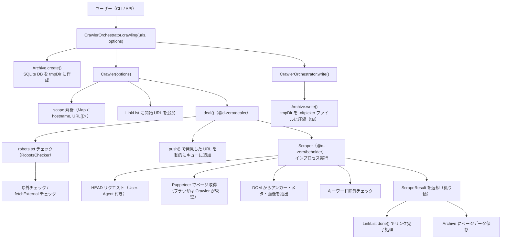
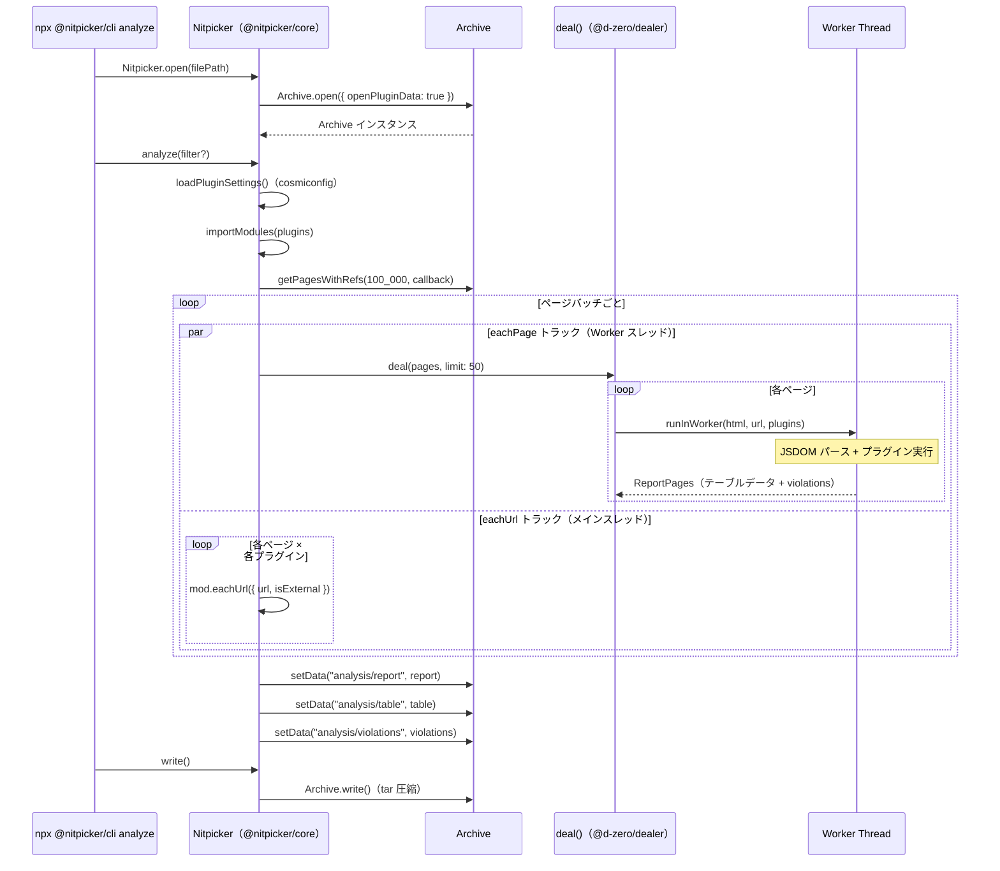
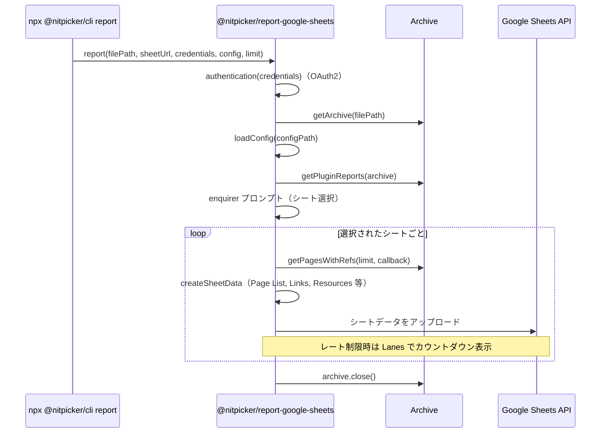
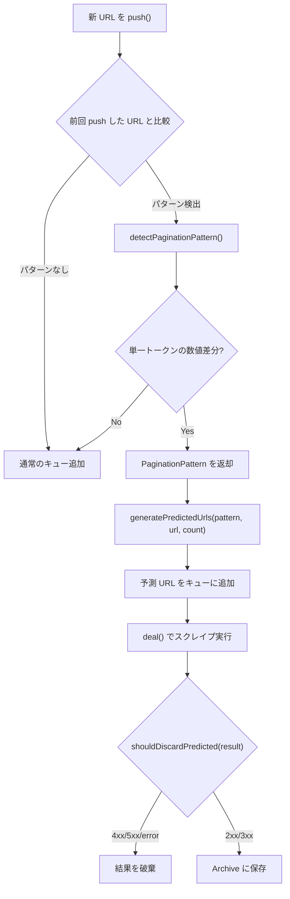

# Nitpicker アーキテクチャ

---

## 1. プロジェクト構成

Lerna + Yarn Workspaces によるモノレポ。

```
packages/
├── @nitpicker/
│   ├── cli          # 統合 CLI（crawl / analyze / report コマンド）
│   ├── crawler      # オーケストレーター + 型定義 + ユーティリティ + アーカイブ
│   ├── core         # Nitpicker プラグインシステム
│   ├── types        # 共有型定義
│   ├── analyze-*    # 各種 analyze プラグイン
│   └── report-google-sheets  # Google Sheets レポーター
└── test-server/     # E2Eテスト用 Hono サーバー
```

### 依存グラフ

```
@d-zero/beholder（外部）
      ↑
      └── crawler ── @nitpicker/cli ← @d-zero/roar（外部）
                       ↑      ↑
                      core   report-google-sheets
```

---

## 2. 全体データフロー



---

## 3. パッケージ詳細

### @d-zero/beholder

Puppeteer ベースのスクレイパー。インプロセスで実行され、戻り値ベースの API を提供。
自己完結型で、型定義・ユーティリティ関数を内部に持ち、`@d-zero/shared` に直接依存。

**主要クラス:**

- **`Scraper`**: スクレイピングロジック（`scrapeStart()` が `ScrapeResult` を返す）

**API の特徴:**

- `scrapeStart()` は `ScrapeResult` を直接返す（イベント経由ではない）
- ストリーミングイベント（`changePhase`, `resourceResponse`）のみ emit
- Page オブジェクトは外部から注入（ブラウザ管理は呼び出し元が担当）

**スクレイピングフェーズ:**

```
scrapeStart → openPage → loadDOMContent → getHTML → waitNetworkIdle
→ getAnchors → getMeta
→ extractImages → [setViewport → waitImageLoad → getImages]（デバイスプリセットごとにループ）
→ scrapeEnd
```

### @nitpicker/crawler

オーケストレーター + 型定義 + ユーティリティ + アーカイブストレージ。

**主要クラス:**

- **`CrawlerOrchestrator`**: エントリポイント。`CrawlerOrchestrator.crawling()`, `CrawlerOrchestrator.resume()`
- **`Crawler`**: リンク管理・スクレイプスケジューリング
- **`LinkList`**: URL キュー管理（pending → progress → done）
- **`Archive`**: アーカイブの作成・再開・書き出し
- **`ArchiveAccessor`**: 読み取り専用アクセサ（`getPages`, `getPagesWithRefs` など）
- **`Page`**: ページデータラッパー

**内部モジュール構造:**

```
crawler/src/
├── utils/                      # 型定義 + ユーティリティ
│   ├── types/                  # ExURL, PageData, ParseURLOptions 等
│   ├── array/                  # eachSplitted
│   ├── object/                 # cleanObject
│   └── error/                  # DOMEvaluationError, ErrorEmitter
├── archive/                    # SQLite アーカイブストレージ
│   ├── filesystem/             # 1関数1ファイル（14ファイル）+ tar, untar
│   └── ...                     # archive, archive-accessor, database, page, resource
├── crawler/                    # Crawler エンジン
│   ├── crawler.ts              # Crawler クラス
│   ├── link-list.ts            # URL キュー管理
│   ├── types.ts                # CrawlerOptions, CrawlerEventTypes, PaginationPattern
│   ├── should-skip-url.ts      # URL 除外判定
│   ├── is-external-url.ts      # 外部 URL 判定
│   ├── inject-scope-auth.ts    # スコープ認証注入
│   ├── find-best-matching-scope.ts  # スコープマッチング
│   ├── is-in-any-lower-layer.ts     # 下位レイヤー判定
│   ├── handle-scrape-end.ts    # スクレイプ成功ハンドラ
│   ├── handle-ignore-and-skip.ts    # スキップハンドラ
│   ├── handle-resource-response.ts  # リソースレスポンスハンドラ
│   ├── handle-scrape-error.ts  # スクレイプエラーハンドラ
│   ├── detect-pagination-pattern.ts # ページネーション検出
│   ├── generate-predicted-urls.ts   # 予測 URL 生成
│   ├── should-discard-predicted.ts  # 予測結果破棄判定
│   ├── decompose-url.ts        # URL トークン分解
│   ├── reconstruct-url.ts      # URL 再構築
│   ├── fetch-destination.ts    # HTTP HEAD/GET リクエスト
│   ├── clear-destination-cache.ts   # キャッシュクリア
│   ├── destination-cache.ts    # リクエストキャッシュ
│   ├── fetch-robots-txt.ts     # robots.txt 取得・パース
│   ├── robots-checker.ts       # robots.txt 準拠チェッカー（origin 別キャッシュ）
│   └── ...                     # link-to-page-data, protocol-agnostic-key, net-timeout-error
└── crawler-orchestrator.ts     # CrawlerOrchestrator
```

### @nitpicker/cli

`@d-zero/roar` ベースの統合 CLI。3つのサブコマンドを提供。

- **`npx @nitpicker/cli crawl <URL>`**: Webサイトをクロールして `.nitpicker` ファイルを生成
- **`npx @nitpicker/cli analyze <file>`**: `.nitpicker` ファイルに対して analyze プラグインを実行
- **`npx @nitpicker/cli report <file>`**: `.nitpicker` ファイルから Google Sheets レポートを生成

---

## 4. Crawler の詳細

### LinkList のライフサイクル

```
URL 発見 → add(url)     → pending セット
deal() で選択           → progress(url) → progress セット
スクレイプ完了          → done(url)     → done セット + Link オブジェクト生成
```

**`LinkList.done()` の処理:**

1. `isExternal` 判定: `!scope.has(url.hostname)`
2. `isLowerLayer` 判定: スコープ URL とのパス配列先頭一致
3. `isPage` 判定: `!isExternal && isLowerLayer && isHTTP && hasResponse && isHTML && !isError`
4. `isPage = true` → `completePages` カウント増加

**終了判定:** `deal()` が全アイテムの処理完了で resolve → `crawlEnd` イベント emit

### アンカー発見後のリンク追加ロジック

```
発見したアンカーについて:
├── recursive=true の場合:
│   ├── isLowerLayer → LinkList.add(url)        # フルスクレイプ
│   └── isExternal && fetchExternal → add(url, { titleOnly: true })
│
└── recursive=false の場合:
    └── add(url, { titleOnly: true })           # HEAD のみ
```

### deal() コールバック内の処理順序

```
URL を deal() で受け取り:
1. robots.txt チェック → 拒否なら skip イベント emit + return
2. shouldSkipUrl（excludes / excludeUrls）→ マッチなら skip
3. fetchExternal チェック → 外部 URL で無効なら externalPage emit + return
4. HEAD プリフライト → 到達不能なら error
5. metadataOnly / 非 HTML → ブラウザなしで結果返却
6. HTML → Puppeteer 起動（User-Agent 設定済み）→ スクレイプ
```

### dealer 統合

- `@d-zero/dealer` の `deal()` がスケジューリングと並列制御を担当
- `interval` オプションでリクエスト間の待機時間を設定可能
- スクレイピングはインプロセス（`@d-zero/beholder`）で実行。各 URL ごとにブラウザを起動・終了
- `push()` で発見した新 URL を動的にキューに追加
- `onPush` コールバックで `withoutHashAndAuth` による重複排除

### 主要定数

| 定数                 | 値  | 説明               |
| -------------------- | --- | ------------------ |
| `MAX_PROCESS_LENGTH` | 10  | 最大並列プロセス数 |

---

## 5. Scraper の詳細

### HEAD リクエスト（fetch-destination.ts）

```
fetchDestination({ url, isExternal, userAgent?, method?, options? })
  ├── キャッシュ確認（cacheMap）
  ├── 10秒タイムアウト
  └── follow-redirects で HTTP リクエスト
      ├── hostname + port を分離して指定
      ├── User-Agent ヘッダー付与（設定時のみ）
      ├── 405/501/503 → GET にフォールバック
      └── redirectPaths を記録
```

### ブラウザスクレイプ（scraper.ts）

```
scrapeStart(url, page, options)
  ├── #fetchData(url, page):
  │     ├── page.goto(url)
  │     ├── リダイレクトチェーン追跡（Puppeteer redirectChain）
  │     ├── contentType チェック → 非HTML なら早期リターン
  │     ├── waitForNavigation('domcontentloaded', 5s)
  │     ├── HTML + title 取得
  │     ├── metadataOnly=true → ここでリターン（アンカー・画像なし）
  │     ├── waitForNavigation('networkidle0', 5s)
  │     ├── getAnchorList(): <a>, <area> から href 抽出
  │     ├── getMeta(): メタ情報抽出
  │     └── #fetchImages()（オプション）:
  │           └── デバイスプリセットごとにループ（desktop-compact, mobile-small）:
  │                 ├── beforePageScan(): viewport 変更 + スクロール
  │                 ├── waitForFunction(): lazy 画像ロード完了待ち
  │                 └── getImageList(): 画像データ取得
  └── keywordCheck(): 除外キーワードチェック
```

### メタ情報抽出（dom-evaluation.ts:getMeta）

| フィールド                 | セレクタ                    | プロパティ         |
| -------------------------- | --------------------------- | ------------------ |
| title                      | `title`                     | `textContent`      |
| lang                       | `html`                      | `lang`             |
| description                | `meta[name="description"]`  | `content`          |
| keywords                   | `meta[name="keywords"]`     | `content`          |
| noindex/nofollow/noarchive | `meta[name="robots"]`       | `content` をパース |
| canonical                  | `link[rel="canonical"]`     | `href`             |
| alternate                  | `link[rel="alternate"]`     | `href`             |
| og:type, og:title, etc.    | `meta[property="og:*"]`     | `content`          |
| twitter:card               | `meta[name="twitter:card"]` | `content`          |

### キーワード除外（keyword-check.ts）

`excludeKeywords` の各文字列を `strToRegex()` で正規表現に変換し、HTML 全体に対して `test()` する。マッチしたら呼び出し元（`scraper.ts`）が `ScrapeResult` を `type: 'ignoreAndSkip'` で返却し、`changePhase`（`name: 'ignoreAndSkip'`）を emit する。

---

## 6. Archive DB スキーマ

### pages テーブル

| カラム                                                            | 型                    | 説明                            |
| ----------------------------------------------------------------- | --------------------- | ------------------------------- |
| id                                                                | INTEGER PK            | 自動採番                        |
| url                                                               | VARCHAR(8190) UNIQUE  | URL 文字列                      |
| redirectDestId                                                    | INTEGER FK → pages.id | リダイレクト先ページID          |
| scraped                                                           | BOOLEAN               | スクレイプ済みか                |
| isTarget                                                          | BOOLEAN               | ターゲットページか              |
| isExternal                                                        | BOOLEAN               | 外部ページか                    |
| status                                                            | INTEGER               | HTTP ステータスコード           |
| statusText                                                        | TEXT                  |                                 |
| contentType                                                       | TEXT                  |                                 |
| contentLength                                                     | INTEGER               |                                 |
| responseHeaders                                                   | TEXT (JSON)           |                                 |
| lang                                                              | TEXT                  | `<html lang>`                   |
| title                                                             | TEXT                  | `<title>`                       |
| description                                                       | TEXT                  | meta description                |
| keywords                                                          | TEXT                  | meta keywords                   |
| noindex                                                           | BOOLEAN               | robots noindex                  |
| nofollow                                                          | BOOLEAN               | robots nofollow                 |
| noarchive                                                         | BOOLEAN               | robots noarchive                |
| canonical                                                         | TEXT                  | link canonical                  |
| alternate                                                         | TEXT                  | link alternate                  |
| og_type, og_title, og_site_name, og_description, og_url, og_image | TEXT                  | Open Graph                      |
| twitter_card                                                      | TEXT                  | Twitter Card                    |
| html                                                              | TEXT                  | HTML スナップショットの相対パス |
| isSkipped                                                         | BOOLEAN               | スキップされたか                |
| skipReason                                                        | TEXT                  | スキップ理由                    |
| order                                                             | INTEGER               | Natural URL Sort 順序           |

### anchors テーブル

| カラム      | 型            | 説明                     |
| ----------- | ------------- | ------------------------ |
| id          | INTEGER PK    |                          |
| pageId      | FK → pages.id | アンカーが存在するページ |
| hrefId      | FK → pages.id | リンク先ページ           |
| hash        | TEXT          | フラグメント             |
| textContent | TEXT          | アンカーテキスト         |

### その他テーブル

- **images**: pageId, src, currentSrc, alt, width/height, naturalWidth/naturalHeight, isLazy, viewportWidth, sourceCode
- **resources**: url, isExternal, status, contentType, contentLength, compress, cdn, responseHeaders
- **resources-referrers**: resourceId → resources.id, pageId → pages.id
- **info**: 設定情報（単一レコード、`Config` 型のフィールドを JSON で保存）

### リダイレクトの保存

リダイレクトは独立テーブルではなく、`pages.redirectDestId` で表現:

```
updatePage(pageData) の処理:
  redirectPaths = [...pageData.redirectPaths]
  destUrl = redirectPaths.pop()          # 最後の要素 = 最終宛先
  redirectPaths.unshift(pageData.url)    # 元URL を先頭に追加

  # destUrl のページをINSERT/UPDATE（スクレイプ結果を保存）
  # redirectPaths の各URL に redirectDestId = destPageId を設定
```

### getPages() vs getPagesWithRefs()

| メソッド             | リダイレクト | アンカー         | リファラー       |
| -------------------- | ------------ | ---------------- | ---------------- |
| `getPages(filter?)`  | ロードする   | **ロードしない** | **ロードしない** |
| `getPagesWithRefs()` | ロードする   | ロードする       | ロードする       |

`getPages()` は `getRedirectsForPages()` で `redirectFrom` を一括ロードする。`getAnchors()` は DB に都度クエリする（遅い）。

### PageFilter

| フィルタ                    | 条件                                                     |
| --------------------------- | -------------------------------------------------------- |
| `'page'`                    | contentType='text/html' AND isTarget=1                   |
| `'page-included-no-target'` | contentType='text/html'                                  |
| `'internal-page'`           | contentType='text/html' AND isExternal=0                 |
| `'external-page'`           | contentType='text/html' AND isExternal=1                 |
| `'no-page'`                 | contentType IS NULL OR contentType != 'text/html'        |
| `'internal-no-page'`        | (contentType IS NULL OR != 'text/html') AND isExternal=0 |
| `'external-no-page'`        | (contentType IS NULL OR != 'text/html') AND isExternal=1 |
| なし                        | 全件                                                     |

---

## 7. Analyze の詳細

### データフロー



### 並列処理の設計

- **Worker スレッド**: DOM 重い解析（JSDOM + axe-core, markuplint 等）はワーカースレッドで隔離実行。プラグインのクラッシュがメインプロセスに波及しない
- **deal() (limit: 50)**: メモリ枯渇防止 + リアルタイム進捗表示のため `Promise.all` ではなく bounded concurrency
- **Cache**: URL 単位で結果をキャッシュ。部分失敗後の再実行時にスキップ可能

> 実装詳細は `@nitpicker/core` の JSDoc を参照（`Nitpicker.analyze()`, `runInWorker()`, `page-analysis-worker.ts`）。

---

## 8. Report の詳細

### データフロー



### 生成可能なシート

| シート名                   | 内容                                             |
| -------------------------- | ------------------------------------------------ |
| Page List                  | 全ページのメタデータ一覧                         |
| Links                      | 全ページの HTTP ステータス・リンク情報・備考一覧 |
| Resources                  | ネットワークリソース一覧                         |
| Images                     | 画像一覧（サイズ・alt・lazy 等）                 |
| Violations                 | analyze プラグインが検出した違反一覧             |
| Compares                   | analyze プラグインの比較データ                   |
| Summary                    | サマリー                                         |
| Referrers Relational Table | ページ → リファラーの関係テーブル                |
| Resources Relational Table | ページ → リソースの関係テーブル                  |

> 実装詳細は `@nitpicker/report-google-sheets` の JSDoc を参照（`report()`, `createSheets()`, 各 `create-*.ts`）。

---

## 9. Predictive Pagination

連番 URL（例: `/page/1`, `/page/2`, ...）を検出し、先読みで予測的にキューへ追加する仕組み。



### アルゴリズム

1. **パターン検出**: URL をトークン（パスセグメント + クエリ値）に分解し、前回 URL と比較。差分が**単一トークンかつ整数**の場合のみ検出
2. **URL 生成**: 検出したステップ（差分値）を元に、並列数分の未来ページ URL を生成
3. **結果フィルタ**: 予測 URL のスクレイプ結果が 4xx/5xx/error/skip なら破棄
4. **cascade 防止**: `paginationCtx` で予測 URL から更なる予測生成を抑制

> 実装詳細は `crawler/detect-pagination-pattern.ts`, `crawler/generate-predicted-urls.ts`, `crawler/should-discard-predicted.ts` の JSDoc を参照。

---

## 10. URL 処理の重要な仕様

> 実装詳細は `crawler/utils/url/` 配下の各関数の JSDoc を参照。

### isLowerLayer（スコープ判定）

`isLowerLayer(target, base)` はパス配列の**先頭一致**で判定する。

```
paths = URL の pathname を "/" で split した文字列配列

例:
  /meta/      → paths: ['meta', '']     (末尾スラッシュ)
  /meta/full  → paths: ['meta', 'full']

isLowerLayer('/meta/full',         '/meta/')     → true  (meta が一致, full は追加)
isLowerLayer('/meta/robots-noindex', '/meta/full') → false (full ≠ robots-noindex)
isLowerLayer('/meta/robots-noindex', '/meta/')     → true  (meta が一致)
```

> **重要:** 再帰クロールで子ページを発見するには、開始 URL をディレクトリパス（末尾 `/`）にする必要がある。ファイルパス（例: `/meta/full`）を開始 URL にすると、同階層の他ページは `isLowerLayer=false` となりスクレイプされない。

### parseUrl の特殊処理

- `disableQueries=true` → クエリ文字列を完全削除
- `PHPSESSID` パラメータは自動削除
- 複数スラッシュ（`//`）は単一に正規化
- `withoutHashAndAuth`: DB 保存用（認証情報・ハッシュなし）
- `withoutHash`: クローラー内部用（認証情報あり、ハッシュなし）

### excludeUrls（URL プレフィックス除外）

`excludeUrls` は URL プレフィックスのリストで、`url.href.startsWith(prefix)` による**先頭マッチ**で判定する。
デフォルトでソーシャルメディアの共有エンドポイント等が含まれ、`--exclude-url` で追加可能。
パスの glob パターンを使う `excludes` とは異なり、スキーム・ホスト名を含むフル URL に対してマッチする。

### pathMatch（除外パターン）

`micromatch` による glob マッチ。URL の `pathname` に対して適用。

```
pathMatch('/blog/2020/01', '/blog/*')    → true
pathMatch('/blog/2020/01', '/blog/**/*') → true
pathMatch('/about', '/blog/*')           → false
```

---

## 11. エラーハンドリング

| フェーズ        | エラー                              | 処理                                            |
| --------------- | ----------------------------------- | ----------------------------------------------- |
| HEAD リクエスト | タイムアウト(10s), ECONNREFUSED 等  | `ScrapeResult.type='error'`（shutdown=false）   |
| ブラウザ起動    | Puppeteer 起動失敗                  | `ScrapeResult.type='error'`（shutdown=true）    |
| page.goto()     | タイムアウト, ERR_NAME_NOT_RESOLVED | `@retryable` でリトライ後 `type='error'` で返却 |
| DOM 解析        | evaluate 失敗                       | catch でフォールバック値                        |

---

## 12. E2E テスト構成

```
packages/test-server/
├── src/
│   ├── index.ts              # createApp(), startServer()
│   ├── routes/
│   │   ├── basic.ts          # /, /about
│   │   ├── recursive.ts      # /recursive/**
│   │   ├── redirect.ts       # /redirect/**（301→302→200チェーン）
│   │   ├── meta.ts           # /meta/**（16メタフィールド）
│   │   ├── exclude.ts        # /exclude/**（パス・キーワード除外）
│   │   ├── options.ts        # /options/**（fetchExternal, disableQueries）
│   │   ├── error-status.ts   # /error-status/**（4xx/5xxステータス）
│   │   ├── scope.ts          # /scope/**（スコープ判定）
│   │   └── pagination.ts     # /pagination/**（ページネーション検出）
│   └── __tests__/e2e/
│       ├── global-setup.ts   # Hono サーバー起動/停止（port 8010）
│       ├── helpers.ts        # crawl(), cleanup() ヘルパー
│       ├── await-event-emitter-shim.ts  # CJS/ESM interop shim
│       ├── single-page.e2e.ts
│       ├── recursive.e2e.ts
│       ├── redirect.e2e.ts
│       ├── meta.e2e.ts
│       ├── exclude.e2e.ts
│       ├── options.e2e.ts
│       ├── archive-pipeline.e2e.ts
│       ├── error-status.e2e.ts
│       ├── scope.e2e.ts
│       ├── parallel-and-interval.e2e.ts
│       ├── snapshot.e2e.ts
│       └── pagination.e2e.ts
```

**テスト実行:** `yarn test:e2e`（`vitest.e2e.config.ts` 使用、`maxWorkers: 1`）

**テスト用 crawl ヘルパーのデフォルトオプション:**

```
interval: 0             # 待機なし
parallels: 1            # 直列実行
image: false            # 画像取得なし
```
