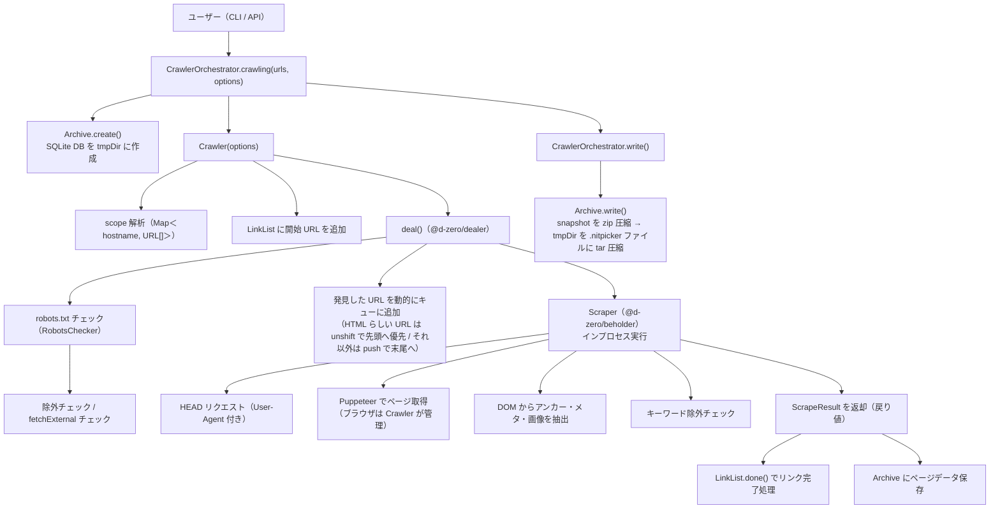
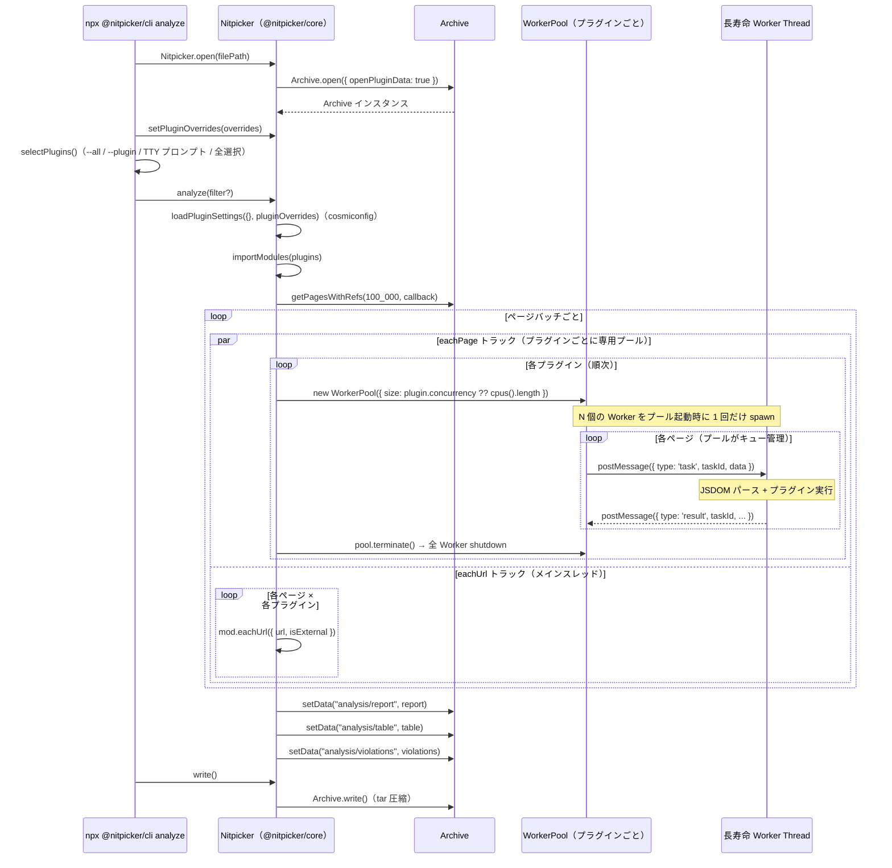
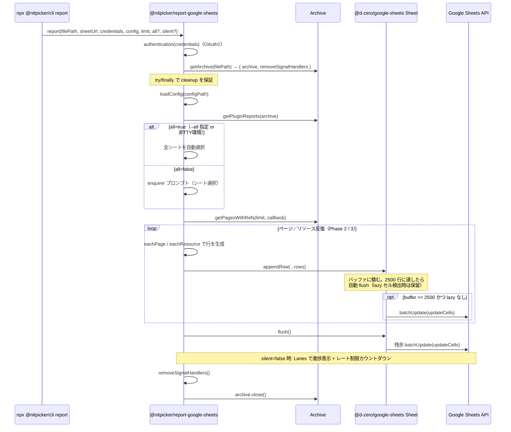
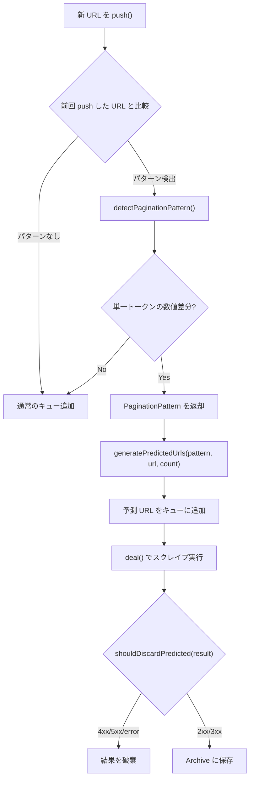

# Nitpicker アーキテクチャ

---

## 1. プロジェクト構成

Lerna + Yarn Workspaces によるモノレポ。

```
packages/
├── @nitpicker/
│   ├── cli          # 統合 CLI（crawl / analyze / report コマンド）
│   ├── crawler      # オーケストレーター + 型定義 + ユーティリティ + アーカイブ
│   ├── core         # Nitpicker プラグインシステム
│   ├── types        # 共有型定義
│   ├── query        # アーカイブクエリ API（SQL レベルのフィルタ・集計）
│   ├── mcp-server   # MCP サーバー（AI アシスタントからのアーカイブクエリ）
│   ├── analyze-*    # 各種 analyze プラグイン
│   └── report-google-sheets  # Google Sheets レポーター
└── test-server/     # E2Eテスト用 Hono サーバー
```

### 依存グラフ

```
@d-zero/beholder（外部）
      ↑
      └── crawler ── @nitpicker/cli ← @d-zero/roar（外部）
           ↑    ↑       ↑  ↑    ↑
           │    │       core │  report-google-sheets ← @d-zero/google-sheets（外部）
           │    │        ↑   │         ↑
           │    │  analyze-* プラグイン │
           │    └── query              │
           │         ↑                 │
           │    mcp-server ← @modelcontextprotocol/sdk
           └── @d-zero/dealer（外部）──┘
```

> **Note**: CLI は analyze プラグインに直接依存する（`npx` 実行時のモジュール解決のため）。新規 analyze プラグイン追加時は `@nitpicker/cli/package.json` の `dependencies` にも追加すること。
>
> **Note**: `@d-zero/dealer` は上図では crawler と report-google-sheets への接続のみ表示しているが、cli と core も `Lanes` 型のインポートのために依存している。

---

## 2. 全体データフロー


```mermaid
flowchart TD
    User["ユーザー（CLI / API）"] --> Crawling["CrawlerOrchestrator.crawling(urls, options)"]

    Crawling --> Archive["Archive.create()<br/>SQLite DB を tmpDir に作成"]
    Crawling --> Crawler["Crawler(options)"]

    Crawler --> Scope["scope 解析（Map＜hostname, URL[]＞）"]
    Crawler --> LinkList["LinkList に開始 URL を追加"]
    Crawler --> Deal["deal()（@d-zero/dealer）"]

    Deal --> RobotsCheck["robots.txt チェック（RobotsChecker）"]
    RobotsCheck --> Checks["除外チェック / fetchExternal チェック"]
    Deal --> Push["発見した URL を動的にキューに追加<br/>（HTML らしい URL は unshift で先頭へ優先 / それ以外は push で末尾へ）"]

    Deal --> Beholder["Scraper（@d-zero/beholder）<br/>インプロセス実行"]
    Beholder --> Head["HEAD リクエスト（User-Agent 付き）"]
    Beholder --> Puppeteer["Puppeteer でページ取得<br/>（ブラウザは Crawler が管理）"]
    Beholder --> DOM["DOM からアンカー・メタ・画像を抽出"]
    Beholder --> Keyword["キーワード除外チェック"]

    Beholder --> Result["ScrapeResult を返却（戻り値）"]
    Result --> Done["LinkList.done() でリンク完了処理"]
    Result --> Save["Archive にページデータ保存"]

    Crawling --> Write["CrawlerOrchestrator.write()"]
    Write --> ArchiveWrite["Archive.write()<br/>snapshot を zip 圧縮 → tmpDir を .nitpicker ファイルに tar 圧縮"]
```

---

## 3. パッケージ詳細

### @d-zero/beholder

Puppeteer ベースのスクレイパー。インプロセスで実行され、戻り値ベースの API を提供。
自己完結型で、型定義・ユーティリティ関数を内部に持ち、`@d-zero/shared` に直接依存。

**主要クラス:**

- **`Scraper`**: スクレイピングロジック（`scrapeStart()` が `ScrapeResult` を返す）

**API の特徴:**

- `scrapeStart()` は `ScrapeResult` を直接返す（イベント経由ではない）
- ストリーミングイベント（`changePhase`, `resourceResponse`）のみ emit
- Page オブジェクトは外部から注入（ブラウザ管理は呼び出し元が担当）

**スクレイピングフェーズ:**

```
scrapeStart → openPage → loadDOMContent → getHTML → waitNetworkIdle
→ getAnchors → getMeta
→ extractImages → [setViewport → waitImageLoad → getImages]（デバイスプリセットごとにループ）
→ scrapeEnd
```

### @nitpicker/crawler

オーケストレーター + 型定義 + ユーティリティ + アーカイブストレージ。

**主要クラス:**

- **`CrawlerOrchestrator`**: エントリポイント。`CrawlerOrchestrator.crawling()`（複数 URL で multi-root）, `CrawlerOrchestrator.resume()`（中断再開）, `CrawlerOrchestrator.append()`（既存アーカイブへの追加クロール）
- **`Crawler`**: リンク管理・スクレイプスケジューリング
- **`LinkList`**: URL キュー管理（pending → progress → done）
- **`Archive`**: アーカイブの作成・再開・書き出し
- **`ArchiveAccessor`**: 読み取り専用アクセサ（`getPages`, `getPagesWithRefs` など）。HTML スナップショットの読み取り（`getHtmlOfPage`）は `snapshot-html.zip` を物理展開せず、central directory を 1 度だけ読んでキャッシュし、エントリ単位でストリーミング取得する（zip はランダムアクセス可能なため O(該当エントリ) で済む。全展開方式は単一ページ取得で zip 全体の inflate + 書き戻し I/O を払い、ディスクにも展開ディレクトリが残るため採用しない）
- **`Page`**: ページデータラッパー

**内部モジュール構造:**

```
crawler/src/
├── utils/                      # 型定義 + ユーティリティ
│   ├── types/                  # ExURL, PageData, Link, CrawlerError 等
│   ├── array/                  # eachSplitted
│   ├── object/                 # cleanObject
│   └── error/                  # DOMEvaluationError, ErrorEmitter
├── archive/                    # SQLite アーカイブストレージ
│   ├── filesystem/             # 1関数1ファイル（16ファイル）+ tar, untar
│   ├── archive-lock.ts         # tmpDir 単位の advisory lock（mkdir + pid.txt + stale 検出）
│   ├── migrate-info-roots.ts   # info テーブルを現行スキーマに揃える冪等 migration（roots 追加・scope 削除）
│   ├── libsql-dialect.ts       # better-sqlite3 dialect の libsql 上書き
│   └── ...                     # archive, archive-accessor, database, init-schema, limited-page-ids, redirect-table, get-json, page, resource, safe-path, types
├── crawler/                    # Crawler エンジン
│   ├── crawler.ts              # Crawler クラス
│   ├── link-list.ts            # URL キュー管理
│   ├── types.ts                # CrawlerOptions, CrawlerEventTypes, PaginationPattern
│   ├── should-skip-url.ts      # URL 除外判定
│   ├── find-scope-entry.ts     # スコープ判定の単一エントリポイント（hostname+port+path で最深一致を返す or null）
│   ├── is-external-url.ts      # 外部 URL 判定（findScopeEntry の薄ラッパ）
│   ├── is-likely-html-url.ts   # URL 拡張子から HTML らしさを判定（キュー優先度用、HEAD 前）
│   ├── partition-urls-by-html.ts    # URL 群を HTML / 非 HTML に分割（unshift / push 振り分け）
│   ├── inject-scope-auth.ts    # スコープ認証注入（matchedScope を直接受け取る）
│   ├── handle-scrape-end.ts    # スクレイプ成功ハンドラ
│   ├── handle-ignore-and-skip.ts    # スキップハンドラ
│   ├── handle-resource-response.ts  # リソースレスポンスハンドラ
│   ├── handle-scrape-error.ts  # スクレイプエラーハンドラ
│   ├── detect-pagination-pattern.ts # ページネーション検出
│   ├── generate-predicted-urls.ts   # 予測 URL 生成
│   ├── should-discard-predicted.ts  # 予測結果破棄判定
│   ├── decompose-url.ts        # URL トークン分解
│   ├── reconstruct-url.ts      # URL 再構築
│   ├── fetch-destination.ts    # HTTP HEAD/GET リクエスト
│   ├── clear-destination-cache.ts   # キャッシュクリア
│   ├── destination-cache.ts    # リクエストキャッシュ
│   ├── fetch-robots-txt.ts     # robots.txt 取得・パース
│   ├── robots-checker.ts       # robots.txt 準拠チェッカー（origin 別キャッシュ）
│   ├── format-crawl-progress.ts # deal() 進捗表示のフォーマッタ
│   └── ...                     # link-to-page-data, protocol-agnostic-key, net-timeout-error
├── crawler.ts                  # バレルエクスポート（パッケージ公開 API）
├── crawler-orchestrator.ts     # CrawlerOrchestrator
├── debug.ts                    # デバッグログユーティリティ
├── resolve-output-path.ts      # 出力パス解決・検証
├── types.ts                    # CrawlEvent インターフェース
└── write-queue.ts             # Archive 書き込み直列化キュー
```

### @nitpicker/query

`.nitpicker` アーカイブファイルに対する SQL レベルのクエリ API。大規模データセット（10,000+ ページ、500,000+ レコード）向けに最適化。

**主要クラス・関数:**

- **`ArchiveManager`**: アーカイブのライフサイクル管理（open / get / close / closeAll）。同一ファイルの重複オープンは参照カウントで管理し、untar を再実行しない
- **`listPages`**: ページ一覧取得（ステータス・メタデータ欠損・URL パターンなどでフィルタ）
- **`getSummary`**: サイト全体の統計（ページ数、ステータス分布、メタデータ充足率）
- **`getPageDetail`**: 単一ページの詳細情報（メタデータ、アウトバウンド/インバウンドリンク、リダイレクト元）
- **`getPageHtml`**: HTML スナップショット取得（truncation サポート）
- **`listLinks`**: リンク分析（broken / external / orphaned）
- **`listResources`**: サブリソース一覧（CSS, JS, 画像、フォント）
- **`listImages`**: 画像一覧（alt 欠損、寸法欠損、オーバーサイズ検出）
- **`getViolations`**: 分析プラグインの違反データ取得
- **`findDuplicates`**: 重複タイトル・説明の検出
- **`findMismatches`**: メタデータ不一致の検出（canonical, og:title, og:description）
- **`getResourceReferrers`**: リソースを参照しているページの特定
- **`checkHeaders`**: セキュリティヘッダーチェック（CSP, X-Frame-Options, X-Content-Type-Options, HSTS）

**依存:** `@nitpicker/crawler`（`Archive`, `ArchiveAccessor` を使用）

### @nitpicker/mcp-server

[Model Context Protocol](https://modelcontextprotocol.io/) サーバー。AI アシスタント（Claude 等）から `.nitpicker` アーカイブを直接クエリするための 14 ツールを提供。

**構成:**

- **`mcp-server.ts`**: `createServer()` で MCP Server インスタンスを構築。低レベル `Server` API を使用（`McpServer` + Zod スキーマの深い型インスタンス化問題を回避）
- **`tool-definitions.ts`**: 14 ツールの JSON Schema 定義

**バイナリ:** `nitpicker-mcp`（stdio トランスポート）

**依存:** `@modelcontextprotocol/sdk`, `@nitpicker/query`

### @nitpicker/cli

`@d-zero/roar` ベースの統合 CLI。5つのサブコマンドを提供。全 analyze プラグインを `dependencies` に含んでおり、`npx` 実行時に `@nitpicker/core` の動的 `import()` がプラグインモジュールを解決できるようにしている。

- **`npx @nitpicker/cli crawl <URL>`**: Webサイトをクロールして `.nitpicker` ファイルを生成
- **`npx @nitpicker/cli analyze <file>`**: `.nitpicker` ファイルに対して analyze プラグインを実行。`--search-keywords`, `--axe-lang` 等のフラグで設定ファイルのプラグイン設定を上書き可能（`buildPluginOverrides()` → `Nitpicker.setPluginOverrides()` 経由）
- **`npx @nitpicker/cli report <file>`**: `.nitpicker` ファイルから Google Sheets レポートを生成
- **`npx @nitpicker/cli pipeline <URL>`**: crawl → analyze → report を直列実行。`startCrawl()` でアーカイブパスを取得し、そのパスを `analyze()` と `report()` に引き渡す。`--sheet` 指定時のみ report ステップを実行
- **`npx @nitpicker/cli query <file> <sub-command>`**: `.nitpicker` ファイルに対してクエリを実行し、結果を JSON で出力。`@nitpicker/query` の全関数を CLI から利用可能。12 のサブコマンド（`summary`, `pages`, `page-detail`, `html`, `links`, `resources`, `images`, `violations`, `duplicates`, `mismatches`, `headers`, `resource-referrers`）を提供

---

## 4. Crawler の詳細

### LinkList のライフサイクル

```
URL 発見 → add(url)     → pending セット
deal() で選択           → progress(url) → progress セット
スクレイプ完了          → done(url)     → done セット + Link オブジェクト生成
```

**`LinkList.done()` の処理:**

1. `isExternal` 判定: `findScopeEntry(url, scope, options) === null`。スコープエントリは `(hostname, port, path)` のトリプルで、いずれかのスコープエントリの下層に入れば internal、入らなければ external
2. `isLowerLayer` 判定: 同じスコープエントリ群に対する path 配列先頭一致
3. `isPage` 判定: `!isExternal && isLowerLayer && isHTTP && hasResponse && isHTML && !isError`
4. `isPage = true` → `completePages` カウント増加

**終了判定:** `deal()` が全アイテムの処理完了で resolve → `crawlEnd` イベント emit

**Archive 書き込みの直列化:** `CrawlerOrchestrator` は複数のイベントハンドラ（`page`, `externalPage`, `skip`, `response`, `responseReferrers`, `error`）から Archive に非同期書き込みを行う。高並列度で SQLite の書き込みロック競合を防ぐため、すべての書き込みは `WriteQueue`（Promise チェーンベースの FIFO キュー）で直列化される。`crawlEnd` 時には `WriteQueue.drain()` で未完了の書き込みを全て待機してからクロール完了とする。

### アンカー発見後のリンク追加ロジック

```
発見したアンカーについて、findScopeEntry() を 1 回だけ評価し、matchedScope を再利用する:
├── matchedScope !== null（スコープエントリの下層）:
│   ├── matchedScope の auth を anchor.href に注入（既に auth がない場合のみ）
│   └── recursive=true → LinkList.add(url)                    # フルスクレイプ
│       recursive=false → add(url, { metadataOnly: true })
│
└── matchedScope === null（外部 URL）:
    ├── recursive=true:
    │   └── fetchExternal=true → add(url, { metadataOnly: true })
    │       fetchExternal=false → 何もしない
    └── recursive=false → add(url, { metadataOnly: true })
```

### deal() コールバック内の処理順序

```
URL を deal() で受け取り:
1. robots.txt チェック → 拒否なら skip イベント emit + return
2. shouldSkipUrl（excludes / excludeUrls）→ マッチなら skip
3. fetchExternal チェック → 外部 URL で無効なら externalPage emit + return
4. キャプチャ済みリソースの再利用チェック → ヒットすればフェッチなしで結果返却
5. HEAD プリフライト → 到達不能なら error
6. metadataOnly / 非 HTML → ブラウザなしで結果返却
7. HTML → Puppeteer 起動（User-Agent 設定済み）→ スクレイプ
```

### キャプチャ済みリソースの再利用（resource-to-page-data.ts）

ページレンダリング中にサブリソース（`` 等）として既にキャプチャ済みの URL が
直リンク（`<a href>`）としてキューに積まれた場合、HEAD プリフライトを省略して
resources テーブルの記録（status / contentType / contentLength / responseHeaders）から
PageData を合成する。

```
#scrapePage(url)
  ├── #resources Set（メモリ）で一次フィルタ — ミス時のコストはゼロ
  ├── ヒット時のみ lookupResource()（orchestrator がコンストラクタで注入するコールバック）
  │     ├── まず SQLite を直接点引き（hit ならブロックなしで即返却）
  │     └── miss の場合のみ WriteQueue.enqueue 経由で再読
  │         （未 flush の resource insert の後ろに直列化され hit/miss が決定的になる。
  │          直列化待ちは miss パスに限定されるため dealer レーンをブロックしない）
  ├── status 2xx かつ contentType 非 HTML → PageData 合成して即返却
  └── それ以外（行なし / 非 2xx / HTML / null / lookup 失敗）→ HEAD プリフライトにフォールバック
```

- **2xx 限定の理由**: Puppeteer はリダイレクトの各ホップごとに response イベントを発火する
  ため、リダイレクトする URL は必ず 3xx 行として記録される。非 2xx をフォールバックさせる
  ことで、リダイレクト元 URL は従来どおり HEAD（follow-redirects）が完全な `redirectPaths`
  を取得し、再利用時の `redirectPaths: []` は常に正確な値になる
- **非 HTML 限定の理由**: HTML はアンカー抽出のため Puppeteer レンダリングが必須。
  MIME タイプ比較は `isHtmlContentType()`（大文字小文字非依存）で行う —
  Puppeteer 由来の値はサーバーの大文字小文字をそのまま保持するため
- **lookup 失敗は HEAD にフォールバック**: `getResourceByUrl` は意図的に `@ErrorEmitter` を
  付けない（DB `error` イベント → orchestrator の abort listener はクロール全体を中断するため）。
  crawler 側フックも try/catch で握り、読み取り失敗は「最適化なし」と同じ挙動に縮退する
- **注入はコンストラクタ DI**: `CrawlerOptions.lookupResource` として `new Crawler()` 時に
  渡す（セッターの呼び順依存を排除）。`null` なら最適化は無効
- 検証: `packages/test-server/src/__tests__/e2e/resource-reuse.e2e.ts`（画像エンドポイントへの
  リクエスト回数・メソッドを test-server 側で記録して検証）と
  `crawler.spec.ts` の `resource reuse via the lookupResource option`（ネットワーク不使用・
  lookup 失敗時フォールバックのユニットテスト）

### dealer 統合

- `@d-zero/dealer` の `deal()` がスケジューリングと並列制御を担当
- `interval` オプションでリクエスト間の待機時間を設定可能
- スクレイピングはインプロセス（`@d-zero/beholder`）で実行。各 URL ごとにブラウザを起動・終了（クローズのハング対策は下記「ブラウザクローズの安全策」参照）
- 発見した新 URL を動的にキューに追加する際、HTML らしい URL は `unshift()` でキュー先頭へ優先投入し、それ以外（画像・PDF・CSS/JS 等）は `push()` で末尾へ追加する。これにより HTML ページのクロールがアセット/ドキュメント取得より先に進む。バッチ（予測ページネーション等）は `partitionUrlsByHtml()`（`crawler/partition-urls-by-html.ts`）で HTML 群と非 HTML 群に分割し、HTML 群を 1 回の `unshift(...html)` で投入することで昇順を維持する（1 件ずつ unshift すると逆順になるため）
- HTML 判定は HEAD/GET 前の URL のみで行うため、実 `Content-Type` ではなく `isLikelyHtmlUrl()`（`crawler/is-likely-html-url.ts`）の拡張子ヒューリスティックを使う: 拡張子なし・ディレクトリ型 URL（`/`, `/about/`）と末尾ドット URL、`.html`/`.htm`/`.php`/`.aspx`/`.jsp`/`.ashx` 等を HTML 扱い、非 HTTP（`mailto:` 等）と `.jpg`/`.pdf`/`.css`/`.js` 等を非 HTML 扱い。**誤判定しても fetch 順が変わるだけで網羅性・正確性には影響しない**
- `onPush` コールバックで `withoutHashAndAuth` による重複排除（`push()` / `unshift()` どちらも通る）
- `signal` オプションで `AbortSignal` を渡し、中断時に新規ワーカーの起動を停止

> **更新手順（HTML 優先判定の拡張）**: HTML を返す拡張子が取りこぼされている場合は `crawler/is-likely-html-url.ts` の `HTML_EXTENSIONS` セット（ドット付きキー）に追記し、cspell が未知語を弾く拡張子は `cspell.json` の「HTML page file extensions」ブロックにも追加する。判定ロジックの単体テストは `is-likely-html-url.spec.ts`、優先投入の配線テストは `crawler.spec.ts` の「discovered-URL queue prioritisation」、分割の単体テストは `partition-urls-by-html.spec.ts`。
>
> **`unshift` API の所在**: キュー先頭への優先投入は `@d-zero/dealer` の `deal()` setup コールバック第 6 引数 `unshift` に依存する（**1.9.0 で追加**）。優先制御の挙動を変える場合は dealer 側（`d-zero-dev/tools` の `packages/@d-zero/dealer`、`Dealer.unshift` / `deal.js`）を参照すること。

### クロール中断メカニズム

```
CLI シグナルハンドラ（SIGINT / SIGHUP 等）
  → CrawlerOrchestrator.abort()
    → Crawler.abort()
      → AbortController.abort()
        → deal() の signal オプション経由で新規ワーカー起動を停止
        → 実行中のワーカーは正常完了まで継続
        → 全ワーカー完了後 deal() が resolve → crawlEnd イベント emit
```

- `Crawler` は内部に `AbortController` を保持し、`signal` getter で `AbortSignal` を公開
- `CrawlerOrchestrator` のコンストラクタで `archive` の `error` イベントを監視し、アーカイブエラー発生時にも `Crawler.abort()` を呼び出す
- CLI の `killed()` ハンドラでは `abort()` 後に `garbageCollect()` → `process.exit()` を実行。**ただし `Crawler.getUndeadPid()` は現アーキテクチャでは常に空配列を返すため `garbageCollect()` 自体は no-op**。Chromium プロセスの強制終了は per-URL の `closeBrowserSafely()`（下記「ブラウザクローズの安全策」）で完結している

### ブラウザクローズの安全策（close-browser-safely.ts）

各 URL のスクレイプ後、`Crawler.#launchBrowserAndScrape` の `finally` で `handleBrowserClose(browser, url.href, crawlerLog)` を呼び、内部で `closeBrowserSafely(browser)` がグレースフル close を 30 秒タイムアウトで実行する。

```
closeBrowserSafely(browser, timeoutMs = 30_000)
  ├── browser.process() を upfront capture（close 成功後は null になるため）
  ├── Promise.race([
  │     browser.close().then(()=>false).catch(()=>false),
  │     new Promise(resolve => setTimeout(resolve(true), timeoutMs))
  │   ]).finally(clearTimeout)        // 負け側 timer を必ず clear
  └── timedOut かつ未 kill なら childProcess.kill('SIGKILL')
```

**なぜ必要か:** viewport 切替（desktop-compact → mobile-small）でページ側の execution context が破壊されると、Chromium のセッションが detached 状態になり、`browser.close()` が CDP ハンドシェイクの応答を待ち続けて永久に settle しないケースがある。タイムアウトを設けず単に `await browser.close().catch(() => {})` だと、deal() ワーカーが完了せずクロール全体がハングする（症状: `📷 mobile-small: skipped — Attempted to use detached Frame` ログの後、CLI が終了しない）。

**SIGKILL の限界:** SIGKILL は Chromium 親プロセスのみに送られ、renderer/network/zygote の子プロセスツリーには伝播しない。puppeteer は `detached: false` で spawn するため process group kill は使えない（負の PID kill は Node プロセス自身も巻き込む）。子は broken IPC を検知してサブ秒で self-exit するため、短時間の orphan 残留は許容している。

**観測性:** タイムアウト発火時は `crawlerLog('Force-killed wedged Chromium browser for %s ...')` を出す。`DEBUG=Nitpicker:Crawler` で頻発を検知可能。`closeBrowserSafely` 自体が throw した場合（`browser.process()` が予期せず throw 等）も `handleBrowserClose` が握りつぶしてログするため、finally から例外が伝播することはない。

> **更新手順（タイムアウト値の変更）**: 30 秒という値は重いページや低速環境での余裕を取った設定。変更する場合は `close-browser-safely.ts` の `DEFAULT_CLOSE_TIMEOUT_MS` を編集し、`close-browser-safely.spec.ts` の「defaults to a 30-second timeout」テストを併せて更新。Promise.race の負け側 timer は **必ず `clearTimeout` で clear** すること（`fetch-destination.ts` と同じ規律。詳細は下記「CLI プロセス終了とリソース解放」）。
>
> **検証**: `close-browser-safely.spec.ts`（10 ケース: 正常 / hang / reject / null process / 既 killed / デフォルト timeout / 遅延 rejection / timeoutMs=0 / kill が false / 冪等性）と `handle-browser-close.spec.ts`（4 ケース: ログ無し / 強制 kill ログ / closeBrowserSafely throw / 二重故障 finally-safety）。puppeteer Browser 型との整合性は `close-browser-safely.spec.ts` 冒頭の compile-time assertion で担保。

### CLI プロセス終了とリソース解放

`commands/crawl.ts` の `startCrawl` / `resumeCrawl` では `try { write } finally { close + garbageCollect }` 構造で SQLite コネクションプール（Knex の `acquireTimeoutMillis: 600_000`）を `archive.close()` → `db.destroy()` で確実に解放する。これをサボると `.nitpicker` ファイルは生成されるがプロセスが終了しない（pool 内部の reaper timer が event loop を握る）。

さらに `cli.ts` 末尾で `process.exit(process.exitCode ?? ExitCode.Success)` を明示的に呼ぶ。理由は外部依存の timer leak で、特に `@d-zero/beholder` の `dom-evaluation.js#getProp` が `Promise.race(_getProp, setTimeout(fallback, 10_000))` の負け側 timer を clear しないため、`getMeta` 1 回あたり最大 ~13 個の 10 秒 timer が積み上がり、自然終了を 10 秒以上ブロックする。

自リポ内の同型パターン（`Promise.race` + cancellable `setTimeout`/`clearTimeout`）は 2 箇所:

1. **`crawler/fetch-destination.ts`**: HEAD/GET の 10 秒タイムアウト
2. **`crawler/close-browser-safely.ts`**: ブラウザクローズの 30 秒タイムアウト（上記「ブラウザクローズの安全策」参照）

どちらも `.finally()` で `clearTimeout` を呼び、`delay()` を race に使わない（`delay()` は signal を取らないため負け側 timer が clear できない）。

検証は `packages/test-server/src/__tests__/e2e/cli-process-exit.e2e.ts` が CLI を spawn して 60 秒以内に exit するかを継続的に保証する。

### 主要定数

| 定数                 | 値  | 説明               |
| -------------------- | --- | ------------------ |
| `MAX_PROCESS_LENGTH` | 10  | 最大並列プロセス数 |

---

## 5. Scraper の詳細

### HEAD リクエスト（fetch-destination.ts）

```
fetchDestination({ url, isExternal, userAgent?, method?, options? })
  ├── キャッシュ確認（cacheMap）
  ├── 10秒タイムアウト
  └── follow-redirects で HTTP リクエスト
      ├── hostname + port を分離して指定
      ├── User-Agent ヘッダー付与（設定時のみ）
      ├── 405/501/503 → GET にフォールバック
      └── redirectPaths を記録
```

### ブラウザスクレイプ（scraper.ts）

```
scrapeStart(url, page, options)
  ├── #fetchData(url, page):
  │     ├── page.goto(url)
  │     ├── リダイレクトチェーン追跡（Puppeteer redirectChain）
  │     ├── contentType チェック → 非HTML なら早期リターン
  │     ├── waitForNavigation('domcontentloaded', 5s)
  │     ├── HTML + title 取得
  │     ├── metadataOnly=true → ここでリターン（アンカー・画像なし）
  │     ├── waitForNavigation('networkidle0', 5s)
  │     ├── getAnchorList(): <a>, <area> から href 抽出
  │     ├── getMeta(): メタ情報抽出
  │     └── #fetchImages()（オプション、@retryable fallback:[]）:
  │           └── デバイスプリセットごとにループ（desktop-compact, mobile-small）:
  │                 ├── try-catch で各プリセットを独立実行（部分結果を許容）
  │                 ├── beforePageScan(): viewport 変更 + リロード + スクロール
  │                 ├── waitForFunction(): lazy 画像ロード完了待ち
  │                 └── getImageList(): 画像データ取得
  └── keywordCheck(): 除外キーワードチェック
```

### メタ情報抽出（dom-evaluation.ts:getMeta）

| フィールド                 | セレクタ                    | プロパティ         |
| -------------------------- | --------------------------- | ------------------ |
| title                      | `title`                     | `textContent`      |
| lang                       | `html`                      | `lang`             |
| description                | `meta[name="description"]`  | `content`          |
| keywords                   | `meta[name="keywords"]`     | `content`          |
| noindex/nofollow/noarchive | `meta[name="robots"]`       | `content` をパース |
| canonical                  | `link[rel="canonical"]`     | `href`             |
| alternate                  | `link[rel="alternate"]`     | `href`             |
| og:type, og:title, etc.    | `meta[property="og:*"]`     | `content`          |
| twitter:card               | `meta[name="twitter:card"]` | `content`          |

### キーワード除外（keyword-check.ts）

`excludeKeywords` の各文字列を `strToRegex()` で正規表現に変換し、HTML 全体に対して `test()` する。マッチしたら呼び出し元（`scraper.ts`）が `ScrapeResult` を `type: 'ignoreAndSkip'` で返却し、`changePhase`（`name: 'ignoreAndSkip'`）を emit する。

---

## 6. Archive DB スキーマ

### pages テーブル

| カラム                                                            | 型                    | 説明                            |
| ----------------------------------------------------------------- | --------------------- | ------------------------------- |
| id                                                                | INTEGER PK            | 自動採番                        |
| url                                                               | VARCHAR(8190) UNIQUE  | URL 文字列                      |
| redirectDestId                                                    | INTEGER FK → pages.id | リダイレクト先ページID          |
| scraped                                                           | BOOLEAN               | スクレイプ済みか                |
| isTarget                                                          | BOOLEAN               | ターゲットページか              |
| isExternal                                                        | BOOLEAN               | 外部ページか                    |
| status                                                            | INTEGER               | HTTP ステータスコード           |
| statusText                                                        | TEXT                  |                                 |
| contentType                                                       | TEXT                  |                                 |
| contentLength                                                     | INTEGER               |                                 |
| responseHeaders                                                   | TEXT (JSON)           |                                 |
| lang                                                              | TEXT                  | `<html lang>`                   |
| title                                                             | TEXT                  | `<title>`                       |
| description                                                       | TEXT                  | meta description                |
| keywords                                                          | TEXT                  | meta keywords                   |
| noindex                                                           | BOOLEAN               | robots noindex                  |
| nofollow                                                          | BOOLEAN               | robots nofollow                 |
| noarchive                                                         | BOOLEAN               | robots noarchive                |
| canonical                                                         | TEXT                  | link canonical                  |
| alternate                                                         | TEXT                  | link alternate                  |
| og_type, og_title, og_site_name, og_description, og_url, og_image | TEXT                  | Open Graph                      |
| twitter_card                                                      | TEXT                  | Twitter Card                    |
| html                                                              | TEXT                  | HTML スナップショットの相対パス |
| isSkipped                                                         | BOOLEAN               | スキップされたか                |
| skipReason                                                        | TEXT                  | スキップ理由                    |
| order                                                             | INTEGER               | Natural URL Sort 順序           |

### anchors テーブル

| カラム      | 型            | 説明                     |
| ----------- | ------------- | ------------------------ |
| id          | INTEGER PK    |                          |
| pageId      | FK → pages.id | アンカーが存在するページ |
| hrefId      | FK → pages.id | リンク先ページ           |
| hash        | TEXT          | フラグメント             |
| textContent | TEXT          | アンカーテキスト         |

### その他テーブル

- **images**: pageId, src, currentSrc, alt, width/height, naturalWidth/naturalHeight, isLazy, viewportWidth, sourceCode
- **resources**: url, isExternal, status, statusText, contentType, contentLength, compress, cdn, responseHeaders
- **resources-referrers**: resourceId → resources.id, pageId → pages.id
- **info**: 設定情報（単一レコード、`Config` 型のフィールドを JSON で保存）。`baseUrl`（先頭起点 URL、`roots[0]` と同値）と `roots`（位置引数で渡された全起点 URL の JSON 配列）を含む。スコープエントリは `roots` 1 本で表現する（独立した `scope` カラムは無い）

### リダイレクトの保存

リダイレクトは独立テーブルではなく、`pages.redirectDestId` で表現:

```
updatePage(pageData) の処理:
  redirectPaths = [...pageData.redirectPaths]
  destUrl = redirectPaths.pop()          # 最後の要素 = 最終宛先
  redirectPaths.unshift(pageData.url)    # 元URL を先頭に追加

  # destUrl のページをINSERT/UPDATE（スクレイプ結果を保存）
  # redirectPaths の各URL に redirectDestId = destPageId を設定
  #   ただし redirect === destUrl（自己リダイレクト）はスキップ
  #   → Basic認証チャレンジ等で同一URLへ302される場合の対策
```

### getPages() vs getPagesWithRefs()

| メソッド             | リダイレクト | アンカー         | リファラー       |
| -------------------- | ------------ | ---------------- | ---------------- |
| `getPages(filter?)`  | ロードする   | **ロードしない** | **ロードしない** |
| `getPagesWithRefs()` | ロードする   | ロードする       | ロードする       |

`getPages()` は `getRedirectsForPages()` で `redirectFrom` を一括ロードする。`getAnchors()` は DB に都度クエリする（遅い）。

### PageFilter

| フィルタ                    | 条件                                                     |
| --------------------------- | -------------------------------------------------------- |
| `'page'`                    | contentType='text/html' AND isTarget=1                   |
| `'page-included-no-target'` | contentType='text/html'                                  |
| `'internal-page'`           | contentType='text/html' AND isExternal=0                 |
| `'external-page'`           | contentType='text/html' AND isExternal=1                 |
| `'no-page'`                 | contentType IS NULL OR contentType != 'text/html'        |
| `'internal-no-page'`        | (contentType IS NULL OR != 'text/html') AND isExternal=0 |
| `'external-no-page'`        | (contentType IS NULL OR != 'text/html') AND isExternal=1 |
| なし                        | 全件                                                     |

---

## 7. Analyze の詳細

### データフロー


```mermaid
sequenceDiagram
    participant CLI as npx @nitpicker/cli analyze
    participant NP as Nitpicker（@nitpicker/core）
    participant Archive as Archive
    participant Pool as WorkerPool（プラグインごと）
    participant Worker as 長寿命 Worker Thread

    CLI->>NP: Nitpicker.open(filePath)
    NP->>Archive: Archive.open({ openPluginData: true })
    Archive-->>NP: Archive インスタンス

    CLI->>NP: setPluginOverrides(overrides)
    CLI->>CLI: selectPlugins()（--all / --plugin / TTY プロンプト / 全選択）
    CLI->>NP: analyze(filter?)
    NP->>NP: loadPluginSettings({}, pluginOverrides)（cosmiconfig）
    NP->>NP: importModules(plugins)
    NP->>Archive: getPagesWithRefs(100_000, callback)

    loop ページバッチごと
        par eachPage トラック（プラグインごとに専用プール）
            loop 各プラグイン（順次）
                NP->>Pool: new WorkerPool({ size: plugin.concurrency ?? cpus().length })
                Note over Pool,Worker: N 個の Worker をプール起動時に 1 回だけ spawn
                loop 各ページ（プールがキュー管理）
                    Pool->>Worker: postMessage({ type: 'task', taskId, data })
                    Note over Worker: JSDOM パース + プラグイン実行
                    Worker-->>Pool: postMessage({ type: 'result', taskId, ... })
                end
                NP->>Pool: pool.terminate() → 全 Worker shutdown
            end
        and eachUrl トラック（メインスレッド）
            loop 各ページ × 各プラグイン
                NP->>NP: mod.eachUrl({ url, isExternal })
            end
        end
    end

    NP->>Archive: setData("analysis/report", report)
    NP->>Archive: setData("analysis/table", table)
    NP->>Archive: setData("analysis/violations", violations)
    CLI->>NP: write()
    NP->>Archive: Archive.write()（tar 圧縮）
```

### 並列処理の設計

- **Worker プール per プラグイン**: プラグインごとに `WorkerPool` を 1 つ生成し、N 個の長寿命 Worker をプール起動時にまとめて spawn。各 Worker はメッセージループでタスクを次々受け取り、プラグイン実行が終わるまで再利用される。プラグイン切替時にプールを破棄して次プラグイン用に作り直す
- **プラグインごとの並列度宣言**: `AnalyzePlugin.concurrency` で並列度を宣言できる（省略時は `os.cpus().length`）。Chrome 起動など重いプラグインは小さく設定（例: `analyze-lighthouse` は 2）
- **HTML 蓄積防止**: メインスレッドの IIFE 並列度を `concurrency × 2` で bound し、ロードした HTML 文字列がプール待ちで積み上がらないようにする
- **Cache**: URL 単位で結果をキャッシュ。部分失敗後の再実行時にスキップ可能

> **設計判断の経緯**: 旧実装は 1 ページにつき 1 Worker を spawn する固定 50 並列の bounded Promise pool だった。750 ページ規模で同時 50 Worker boot による「boot wave」が繰り返し発生し、ピークメモリが 20GB 級まで膨らむ事故が発生したため、長寿命プールに置き換えた。詳細は `@nitpicker/core/src/worker/worker-pool.ts` の JSDoc を参照。

> 実装詳細は `@nitpicker/core` の JSDoc を参照（`Nitpicker.analyze()`, `WorkerPool`, `worker.ts`, `page-analysis-worker.ts`）。

---

## 8. Report の詳細

### データフロー


```mermaid
sequenceDiagram
    participant CLI as npx @nitpicker/cli report
    participant GS as @nitpicker/report-google-sheets
    participant Archive as Archive
    participant Sheet as @d-zero/google-sheets Sheet
    participant API as Google Sheets API

    CLI->>GS: report(filePath, sheetUrl, credentials, config, limit, all?, silent?)
    GS->>GS: authentication(credentials)（OAuth2）
    GS->>Archive: getArchive(filePath) → { archive, removeSignalHandlers }
    Note over GS: try/finally で cleanup を保証
    GS->>GS: loadConfig(configPath)
    GS->>Archive: getPluginReports(archive)

    alt all=true（--all 指定 or 非TTY環境）
        GS->>GS: 全シートを自動選択
    else all=false
        GS->>GS: enquirer プロンプト（シート選択）
    end

    GS->>Archive: getPagesWithRefs(limit, callback)
    loop ページ／リソース反復（Phase 2 / 3）
        GS->>GS: eachPage / eachResource で行を生成
        GS->>Sheet: appendRow(...rows)
        Note over Sheet: バッファに積む。2500 行に達したら<br/>自動 flush（lazy セル検出時は保留）
        opt buffer >= 2500 かつ lazy なし
            Sheet->>API: batchUpdate(updateCells)
        end
    end
    GS->>Sheet: flush()
    Sheet->>API: 残余 batchUpdate(updateCells)
    Note over GS,API: silent=false 時: Lanes で進捗表示 + レート制限カウントダウン

    GS->>GS: removeSignalHandlers()
    GS->>Archive: archive.close()
```

### 生成可能なシート

| シート名                   | 内容                                             |
| -------------------------- | ------------------------------------------------ |
| Page List                  | 全ページのメタデータ一覧                         |
| Links                      | 全ページの HTTP ステータス・リンク情報・備考一覧 |
| Resources                  | ネットワークリソース一覧（raw / dedupe 切替可）  |
| Images                     | 画像一覧（サイズ・alt・lazy 等）                 |
| Violations                 | analyze プラグインが検出した違反一覧             |
| Discrepancies              | analyze プラグインの比較データ                   |
| Summary                    | サマリー                                         |
| Referrers Relational Table | ページ → リファラーの関係テーブル                |
| Resources Relational Table | ページ → リソースの関係テーブル                  |

### 行送信戦略

`createSheets()` は Phase 2（eachPage）と Phase 3（eachResource）でページ／
リソースを反復しながら行を生成し、`sheet.appendRow(...rows)` でストリーミング
送信する。バッチ終端で `sheet.flush()` を呼んで残余を排出する。Phase 4
（addRows）も同じ `appendRow + flush` で送信する。

Phase 3 には逐次ループ終端の `finalizeResources` フックも用意されている。
`eachResource` 内で状態を蓄積したい factory（典型的には Resources シートの
dedupe 集約モード）が、ループ完了後にまとめて行を emit するために使う。
hook が登録されていれば `createSheets()` は Phase 3 の per-resource ループ
完了後・`sheet.flush()` 直前に 1 度だけ呼び、返ってきた行を `appendRow` で
送信する。Phase 3 の実装詳細（逐次 / 並列、`num` / `total` 等）に依存しない
ので、`eachResource` の呼ばれ方が将来変わっても集約ロジックは壊れない。

Resources シートは `--dedupe-resources` で **raw / dedupe** の 2 モードを
切り替えられる。raw モードは 6 列（URL / Status Code / Status Text /
Content Type / Content Length / Referrers）で 1 raw resource = 1 行。
dedupe モードは `(canonical URL, status, contentType)` で集約し、末尾に
**Count**（その canonical group の raw レコード数）と **Query Pattern**
（クエリキーごとのユニーク値数を `key=N` で並べる、例 `auid=27, capi=1`）
を加えた 8 列構成。Query Pattern は per-key の sample set（上限
`MAX_PARAM_VALUE_SAMPLES = 100`）と `overflowedCount` の 2 値で値の分布を
要約する：cap ジャスト（100 unique、overflow なし）は `key=100`、cap 後に
追加観測が来た場合は `key=100+`。値そのものは保存しない（プライバシーと
メモリの両方の観点で）。実装は `data/create-resources.ts`。

Phase 3 入り口では `getResources()` の結果を `sortResourcesByUrl()` で
URL の自然順に並び替える。実装は Martin Pool `strnatcmp.c`（Stuart
Cheshire, 1996 由来）の JS 移植で、`Array.prototype.toSorted` に
on-the-fly 比較関数を渡す。比較は Pool 由来の 2 path 構造を踏襲し、
両側に数値ランがある時に **どちらかが `'0'` で始まる場合は
compare_left（fractional 解釈、左から digit-by-digit で即決）**、
**そうでなければ compare_right（length-first、bias で同点解消）**
を呼び分ける。それ以外の文字は ASCII whitespace を skip し、ASCII
大文字を小文字に fold した UTF-16 code unit 比較を行う。派生文字列
を一切生成せず、`charCodeAt` と整数演算のみで完結するため、追加
メモリは O(1) per compare、V8 TimSort の auxiliary（N ポインタ分、
1.6M で約 13 MB）のみが上乗せされる。Lanes header に
`Sorting resources by URL` を一時表示する。実装は
`utils/sort-resources-by-url.ts` に集約されており、Pool 互換性
（Pool ドキュメントのリファレンスシーケンスと `compare_left` /
`compare_right` の path 分岐）、stable sort、ASCII case-insensitive
挙動、surrogate pair 含む URL の決定的比較、100K 件 sort の heap
増分 100 MB 未満であることは単体テストで固定。

参照: Martin Pool, "Natural Order String Comparison",
[sourcefrog.net/projects/natsort/](https://sourcefrog.net/projects/natsort/)。
オリジナル C ソース:
[github.com/sourcefrog/natsort/blob/master/strnatcmp.c](https://github.com/sourcefrog/natsort/blob/master/strnatcmp.c)。

ストリーミング・チャンク化のロジックは `@d-zero/google-sheets` の `Sheet`
クラスに集約されている。`appendRow()` は内部バッファに行を積み、2500 行
ごとに自動的に `addRowData()` を呼んでフラッシュする。これにより、巨大な
レポートでも呼び出し元側のメモリ滞留はチャンクサイズ分に抑えられる。

#### 進捗表示（onProgress 購読）

`finalizeResources` で集約された結果（dedupe Resources で典型的に
63K 行クラス）を `appendRow(...finalRows)` に一括で渡すと、内部の
chunk flush が逐次進む間、呼び出し元から見ると単一の `await` が
ブロックしているように見えるため、Lanes の進捗が止まったように
映る。`Sheet` は chunk flush ごとに `onProgress(sent, remaining)`
を発火するので、`createSheets()` はこれを購読して
`Sending ${sent}/${total} aggregated rows` を Lanes に反映する。
購読の設定とリセットは `sheets/run-finalize-resources.ts` に切り
出されており、`appendRow` が throw した場合でも `finally` で
`sheet.onProgress = undefined` がクリアされるため、ハンドラが
別シートの lane に漏れ込むことはない。

**手動検証手順**: 5 万行以上の resources を持つ archive を用意し、
`npx @nitpicker/cli report <archive>.nitpicker --dedupe-resources --sheet <url>`
を実行する。Phase 3 で `Resources: Sending N/M aggregated rows` の
`N` が `0` → 中間値 → `M` と刻々と更新されることを目視確認する
（chunk サイズ 2500 行刻みで遷移する）。

**既知の制約 (V8 引数制限)**: 集約後の `finalRows` は `appendRow(...finalRows)`
にスプレッドで渡されるため、配列長が V8 の関数引数上限（実用上 6.5 万件付近）
を超えると `RangeError: Maximum call stack size exceeded` で破綻する。1.6M
raw resources → 63K 集約までは実機で動作確認済みだが、将来サイト規模が
さらに大きくなり aggregate 後でも 6 万件を超えそうな場合は、`appendRow` を
chunk 単位で複数回呼ぶ実装（例: 1 万件ずつループ）に切り替える必要がある。
`Sheet.appendRow` の内部 2500 行バッファは呼び出し回数に依存しないので、
外側で分割しても順序保証と総送信回数は変わらない。テスト側 (`run-finalize-
resources.spec.ts`) では V8 制限を避けるため 100 件で挙動を固定している。

#### 遅延セルの自動検出

`createCellData(() => ...)` で生成された遅延セル（thunk）は `provide()`
評価時の共有状態を参照するため、評価タイミングが重要になる。`appendRow()`
は受け取った行が遅延セルを含むことを検出すると、自動 flush を停止して
明示的な `flush()` 呼び出しまでバッファ全件を保留する（FIFO 順保証）。

Page List の「Internal Referrers」列がこの仕組みに乗っており、バッチ内の
インデックスページが順次 `parentRefs` を mutate していくため、`appendRow`
は遅延セルを検出した時点でバッファリングモードに切り替わる。バッチ終端の
`flush()` で初めて thunk が評価されるので、参照元数が正しく計算される。

新規 `createX.ts` の実装者は通常この仕組みを意識する必要はない。各
`create-*.spec.ts` には「`eachPage`/`eachResource` が返すセルが
`Cell.prototype.provide` に揃っているか」のアサーションがあり、誤って
遅延セルを混入させると spec が落ちる。Page List の spec は逆向きで、
少なくとも 1 つの遅延セルが含まれることをアサートしている。

> 実装詳細は `@nitpicker/report-google-sheets` と `@d-zero/google-sheets` の JSDoc を参照（`report()`, `createSheets()`, `Sheet.appendRow`, `Sheet.flush`, 各 `create-*.ts`）。

---

## 9. Predictive Pagination

連番 URL（例: `/page/1`, `/page/2`, ...）を検出し、先読みで予測的にキューへ追加する仕組み。


```mermaid
flowchart TD
    A["新 URL を push()"] --> B{"前回 push した URL と比較"}
    B -->|パターン検出| C["detectPaginationPattern()"]
    B -->|パターンなし| D["通常のキュー追加"]

    C --> E{"単一トークンの数値差分?"}
    E -->|Yes| F["PaginationPattern を返却"]
    E -->|No| D

    F --> G["generatePredictedUrls(pattern, url, count)"]
    G --> H["予測 URL をキューに追加"]

    H --> I["deal() でスクレイプ実行"]
    I --> J{"shouldDiscardPredicted(result)"}
    J -->|4xx/5xx/error| K["結果を破棄"]
    J -->|2xx/3xx| L["Archive に保存"]
```

### アルゴリズム

1. **パターン検出**: URL をトークン（パスセグメント + クエリ値）に分解し、前回 URL と比較。差分が**単一トークンかつ整数**の場合のみ検出
2. **URL 生成**: 検出したステップ（差分値）を元に、並列数分の未来ページ URL を生成
3. **結果フィルタ**: 予測 URL のスクレイプ結果が 4xx/5xx/error/skip なら破棄
4. **cascade 防止**: `paginationCtx` で予測 URL から更なる予測生成を抑制

> 実装詳細は `crawler/detect-pagination-pattern.ts`, `crawler/generate-predicted-urls.ts`, `crawler/should-discard-predicted.ts` の JSDoc を参照。

---

## 10. URL 処理の重要な仕様

> 実装詳細は `crawler/utils/url/` 配下の各関数の JSDoc を参照。

### findScopeEntry（スコープ判定の単一エントリポイント）

スコープエントリは `(hostname, port, path)` のトリプル。`findScopeEntry(url, scope, options)` は対象 URL が含まれる **最深一致のスコープエントリ** を返し、どのエントリにも入らなければ `null` を返す。

判定条件:

1. `scope.get(url.hostname)` で同一ホスト名のエントリ群を取り出す（hostname 不一致なら即 null）
2. 各エントリについて `entry.port !== url.port` で **ポート一致**を要求（`localhost:3000` と `localhost:8080` は別 scope。WHATWG URL のデフォルトポート正規化で `:80`/`:443` は空文字に折り畳まれるため、明示・省略は同一視される）
3. `isLowerLayer(url.href, entry.href, options)` で path 階層先頭一致
4. 全ての条件を満たすエントリの中から `entry.depth` が最も深いものを返す

ドメインスコープとサブディレクトリスコープは別概念ではない。`https://example.com/`（path=`/`）は「ホスト全体」を意味する特殊ケース、`https://example.com/blog/` は「`/blog/` 配下のみ」を意味する一般ケース。両者を `Map<hostname, ExURL[]>` で同列に保持する。

```
paths = URL の pathname を "/" で split した文字列配列

例:
  /meta/      → paths: ['meta', '']     (末尾スラッシュ)
  /meta/full  → paths: ['meta', 'full']

isLowerLayer('/meta/full',         '/meta/')     → true  (meta が一致, full は追加)
isLowerLayer('/meta/robots-noindex', '/meta/full') → false (full ≠ robots-noindex)
isLowerLayer('/meta/robots-noindex', '/meta/')     → true  (meta が一致)
```

> **重要:** 再帰クロールで子ページを発見するには、開始 URL をディレクトリパス（末尾 `/`）にする必要がある。ファイルパス（例: `/meta/full`）を開始 URL にすると、同階層の他ページは `isLowerLayer=false` となりスクレイプされない。

### Multi-root crawl

`CrawlerOrchestrator.crawling(urls, options)` に位置引数 URL を複数渡すと、それぞれが「再帰クロールの起点」かつ「スコープエントリ」として扱われる。`info.roots` に元の位置引数リストがそのまま記録され、同じ配列が `Crawler` 構築時にも渡されるため、メモリ上の scope map と DB に保存される roots は常に同期する。スコープと起点は別概念ではなく、`info.roots` 1 本で表現される。

### Append crawl

`CrawlerOrchestrator.append(archivePath, newUrls, options, cb)` は既存 `.nitpicker` を開き、`newUrls` を追加の起点として再帰クロールを継続する。フロー:

```
Archive.open(archivePath)                       # tar 展開 + advisory lock 取得
archived = archive.getConfig()
archived.fromList === true → エラー（list-mode archive は append 不可）
copyFile(archivePath, archivePath + '.bak')     # 失敗時の復元用バックアップ
mergedRoots = unique(archived.roots, newUrls.withoutHash)
archive.updateConfig({ roots, fromList:false, recursive:true, baseUrl:roots[0] })
archive.repromoteExternalPages(scopeMap)        # 旧 external のうち新 scope 下層を pending に戻す
crawler.resume(pending, scraped, resources)     # 既存状態を crawler に流す
orchestrator.crawling(newParsed)                # 新 root + repromote 対象を再クロール
archive.setUrlOrder()
unlink(archivePath + '.bak')                    # 成功 → .bak 削除

例外時:
  copyFile(archivePath + '.bak', archivePath)   # 原本を復元
  unlink(archivePath + '.bak')
  restore 自体が失敗した場合は AggregateError([appendError, restoreError]) を投げ、
  .bak を残してオペレータが手動復旧できる状態にする
```

`repromoteExternalPages` は対象 page の `pages` 行を `scraped=0, isExternal=0, contentType=null, status=null, html=null, redirectDestId=null` などにクリアし、関連する `anchors` / `images` / `resources-referrers` 行を chunk (500件単位) で DELETE する。page id は維持されるため、他ページの `anchors.hrefId` 参照は壊れない。

### Archive lock（advisory）

`Archive.create` / `Archive.open` / `Archive.resume` は冒頭で `fs.mkdir(<tmpDir>.lock, { recursive: false })` の atomic 性を使って tmpDir 単位のロックを取得し、その中に `pid.txt`（プロセス ID）を書き込む。`Archive.close()` / `Archive.write()` の finally でロックを解放する。`Archive.connect`（read-only アクセサ）はロックを取らない。

別プロセスが同じ archive を開こうとした場合:

- ロックが存在 + `pid.txt` の PID が `process.kill(pid, 0)` で生存 → `ArchiveLockError` を投げる
- ロックが存在 + PID が死んでいる（stale lock）→ ロックを削除して 1 回だけ再取得を試みる

### info テーブル migration

`migrate-info-roots.ts` は `Database.connect` 直後に毎回呼ばれる冪等な migration。`info` テーブルが現行スキーマでない場合、(1) `roots` カラムを追加して `UPDATE info SET roots = json_array(baseUrl)` で seed し、(2) 不要になった `scope` カラムを `ALTER TABLE info DROP COLUMN scope` で削除する。`baseUrl` が NULL の場合は `roots = []` で初期化。実行時のみ stderr に 1 行 `[migrate] info table upgraded (roots seeded, scope dropped)` を出力する。

### parseUrl の特殊処理

- `disableQueries=true` → クエリ文字列を完全削除
- `PHPSESSID` パラメータは自動削除
- 複数スラッシュ（`//`）は単一に正規化
- `withoutHashAndAuth`: DB 保存用（認証情報・ハッシュなし）
- `withoutHash`: クローラー内部用（認証情報あり、ハッシュなし）

### excludeUrls（URL プレフィックス除外）

`excludeUrls` は URL プレフィックスのリストで、`url.href.startsWith(prefix)` による**先頭マッチ**で判定する。
デフォルトでソーシャルメディアの共有エンドポイント等が含まれ、`--exclude-url` で追加可能。
パスの glob パターンを使う `excludes` とは異なり、スキーム・ホスト名を含むフル URL に対してマッチする。

### pathMatch（除外パターン）

`micromatch` による glob マッチ。URL の `pathname` に対して適用。

```
pathMatch('/blog/2020/01', '/blog/*')    → true
pathMatch('/blog/2020/01', '/blog/**/*') → true
pathMatch('/about', '/blog/*')           → false
```

### normalizeToArray（カンマ区切り正規化）

`--exclude` 等の CLI フラグはカンマ区切りで複数パターンを指定可能。
`normalizeToArray()` がブレース展開（`{html,php}`）内のカンマを保持しつつ、トップレベルのカンマで分割する。

```
normalizeToArray('/blog/**/*,/facility/**/*')
  → ['/blog/**/*', '/facility/**/*']

normalizeToArray('/blog/*.{html,php},/admin/*')
  → ['/blog/*.{html,php}', '/admin/*']
```

---

## 11. エラーハンドリング

| フェーズ        | エラー                              | 処理                                                                         |
| --------------- | ----------------------------------- | ---------------------------------------------------------------------------- |
| HEAD リクエスト | タイムアウト(10s), ECONNREFUSED 等  | `ScrapeResult.type='error'`（shutdown=false）                                |
| ブラウザ起動    | Puppeteer 起動失敗                  | `ScrapeResult.type='error'`（shutdown=true）                                 |
| page.goto()     | タイムアウト, ERR_NAME_NOT_RESOLVED | `@retryable` でリトライ後 `type='error'` で返却                              |
| 画像抽出        | context 破壊, タイムアウト          | デバイスプリセット単位で try-catch、部分結果を返却。全失敗時は `fallback:[]` |
| DOM 解析        | evaluate 失敗                       | catch でフォールバック値                                                     |

### CLI 終了コード

`crawl` コマンドと `pipeline` コマンドはエラーの種類に応じて異なる終了コードを返す:

| コード | 定数 (`exit-code.ts`) | 意味                                                             |
| ------ | --------------------- | ---------------------------------------------------------------- |
| `0`    | `ExitCode.Success`    | 成功                                                             |
| `1`    | `ExitCode.Fatal`      | 致命的エラー（引数不足、内部エラー、スコープ内ページのエラー等） |
| `2`    | `ExitCode.Warning`    | 警告 — 外部リンクエラーのみ発生（クロール自体は成功）            |

### エラー分類フロー

```
CrawlerError.isExternal
  ├── true  → 外部エラー（DNS 失敗、証明書エラー等）
  └── false → 内部エラー（スコープ内ページの失敗）

CrawlAggregateError
  ├── hasOnlyExternalErrors = true  → exit 2（--strict 時は exit 1）
  └── hasOnlyExternalErrors = false → exit 1
```

`--strict` フラグを指定すると、外部リンクエラーのみの場合でも exit 1（致命的）として扱う。CI/CD パイプラインで外部リンクの一時的な障害を許容したい場合は `--strict` を省略する。

---

## 12. E2E テスト構成

```
packages/test-server/
├── src/
│   ├── server.ts             # createApp(), startServer()
│   ├── routes/
│   │   ├── basic.ts          # /, /about
│   │   ├── recursive.ts      # /recursive/**
│   │   ├── redirect.ts       # /redirect/**（301→302→200チェーン）
│   │   ├── meta.ts           # /meta/**（16メタフィールド）
│   │   ├── exclude.ts        # /exclude/**（パス・キーワード・URLプレフィックス除外）
│   │   ├── options.ts        # /options/**（fetchExternal, disableQueries）
│   │   ├── error-status.ts   # /error-status/**（4xx/5xxステータス）
│   │   ├── scope.ts          # /scope/**（スコープ判定）
│   │   ├── pagination.ts     # /pagination/**（ページネーション検出）
│   │   └── scroll-jack.ts   # /scroll-jack/**（viewport依存リダイレクト）
│   └── __tests__/e2e/
│       ├── global-setup.ts   # Hono サーバー起動/停止（port 8010）
│       ├── helpers.ts        # crawl(), cleanup() ヘルパー
│       ├── await-event-emitter-shim.ts  # CJS/ESM interop shim
│       ├── single-page.e2e.ts
│       ├── recursive.e2e.ts
│       ├── redirect.e2e.ts
│       ├── meta.e2e.ts
│       ├── exclude.e2e.ts
│       ├── options.e2e.ts
│       ├── archive-pipeline.e2e.ts
│       ├── cli-process-exit.e2e.ts  # CLI を spawn してプロセス終了を保証
│       ├── config-persistence.e2e.ts
│       ├── error-status.e2e.ts
│       ├── scope.e2e.ts
│       ├── parallel-and-interval.e2e.ts
│       ├── snapshot.e2e.ts
│       ├── output-path.e2e.ts
│       ├── pagination.e2e.ts
│       └── scroll-jack.e2e.ts
```

**テスト実行:** `yarn vitest run --config vitest.e2e.config.ts`（`maxWorkers: 1`）

**テスト用 crawl ヘルパーのデフォルトオプション:**

```
interval: 0             # 待機なし
parallels: 1            # 直列実行
image: false            # 画像取得なし
```

---

## 13. 外部依存パッケージ（`@d-zero/*`）

Nitpicker は D-ZERO が公開する以下の外部パッケージに依存している。
仕様変更やバグ調査時はこれらのパッケージを参照すること。バージョンは各パッケージの `package.json` を参照。

| パッケージ              | 用途                                                                          | 検索キーワード                        |
| ----------------------- | ----------------------------------------------------------------------------- | ------------------------------------- |
| `@d-zero/beholder`      | Puppeteer ベースのスクレイパーエンジン。`ScrapeResult` を返す                 | `"@d-zero/beholder" changelog`        |
| `@d-zero/dealer`        | 並列処理・スケジューリング。`deal()` 関数と `Lanes` 進捗表示を提供            | `"@d-zero/dealer" deal concurrent`    |
| `@d-zero/shared`        | 共有ユーティリティ（サブパスエクスポート形式: `@d-zero/shared/parse-url` 等） | `"@d-zero/shared" subpath exports`    |
| `@d-zero/roar`          | CLI フレームワーク                                                            | `"@d-zero/roar" command`              |
| `@d-zero/google-auth`   | OAuth2 認証（`credentials.json` → `token.json`）                              | `"@d-zero/google-auth" oauth2`        |
| `@d-zero/google-sheets` | Google Sheets API クライアント                                                | `"@d-zero/google-sheets" spreadsheet` |
| `@d-zero/fs`            | ファイルシステムユーティリティ                                                | `"@d-zero/fs"`                        |
| `@d-zero/readtext`      | テキスト読み取りユーティリティ                                                | `"@d-zero/readtext"`                  |

### 利用箇所マップ

```
@d-zero/beholder      → crawler（Scraper, ScrapeResult）
@d-zero/dealer         → crawler（deal() 並列制御）, core・cli・report-google-sheets（Lanes 進捗表示）
@d-zero/shared         → 全パッケージ（parseUrl, delay, isError, detectCompress, detectCDN）
@d-zero/roar           → cli（CLI コマンド定義）
@d-zero/google-auth    → report-google-sheets（OAuth2 認証）
@d-zero/google-sheets  → report-google-sheets（Sheets API）
@d-zero/fs             → crawler（ファイルシステムユーティリティ）
@d-zero/readtext       → cli（リストファイル読み込み）
```

### バージョン更新時の注意

- **`@d-zero/beholder`**: `ScrapeResult` の型が変わると crawler 全体に影響
- **`@d-zero/dealer`**: `deal()` の API が変わると crawler の並列処理に影響。`Lanes` の型が変わると core・cli・report-google-sheets の進捗表示に影響。**crawler は 1.9.0 で追加された `deal()` setup コールバックの第 6 引数 `unshift`（キュー先頭への優先投入）に依存するため、1.9.0 未満へのダウングレード不可**。ソースは `d-zero-dev/tools` の `packages/@d-zero/dealer`
- **`@d-zero/shared`**: サブパスエクスポートの追加・削除に注意。`@d-zero/shared/parse-url` 形式でインポートすること
