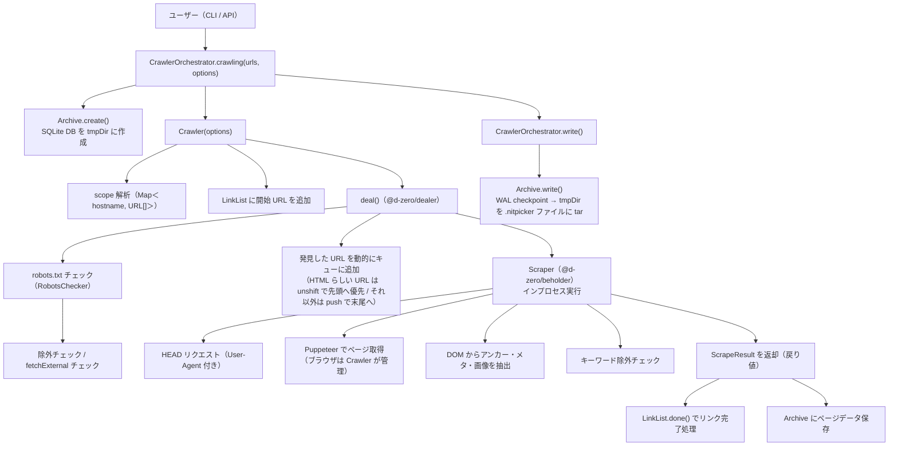
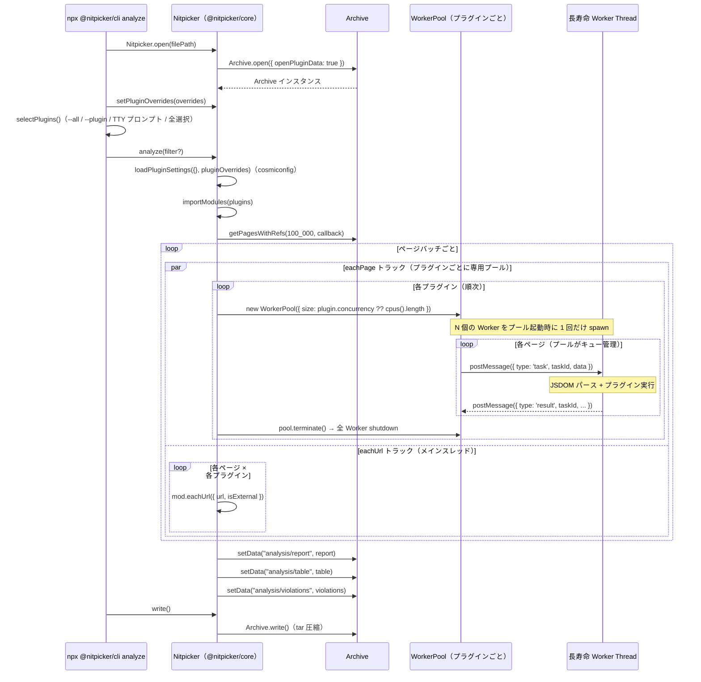
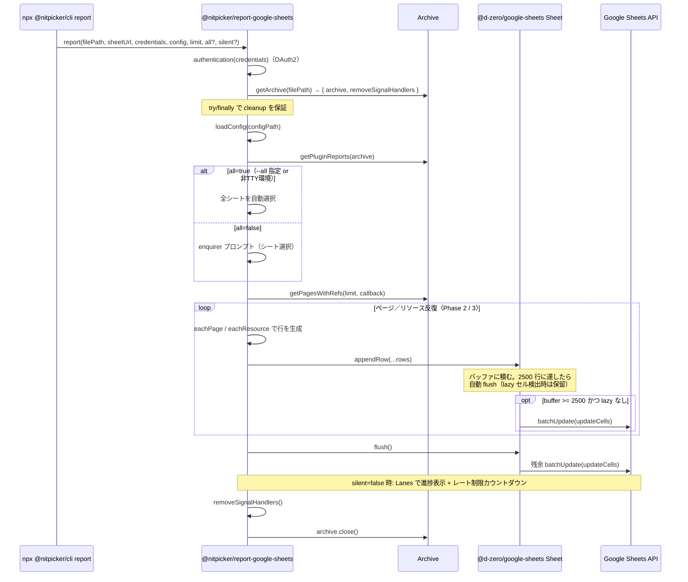
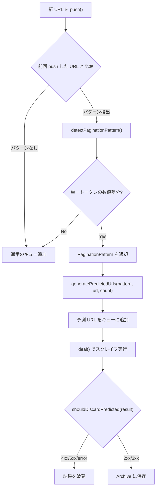

# Nitpicker アーキテクチャ

---

## 1. プロジェクト構成

Lerna + Yarn Workspaces によるモノレポ。

```
packages/
├── @nitpicker/
│   ├── cli          # 統合 CLI（crawl / analyze / report コマンド）
│   ├── crawler      # オーケストレーター + 型定義 + ユーティリティ + アーカイブ
│   ├── core         # Nitpicker プラグインシステム
│   ├── types        # 共有型定義
│   ├── query        # アーカイブクエリ API（SQL レベルのフィルタ・集計）
│   ├── mcp-server   # MCP サーバー（AI アシスタントからのアーカイブクエリ）
│   ├── analyze-*    # 各種 analyze プラグイン
│   ├── report-google-sheets  # Google Sheets レポーター
│   └── viewer       # ローカルブラウザビューア（Hono API + React SPA）
└── test-server/     # E2Eテスト用 Hono サーバー
```

### 依存グラフ

```
@d-zero/beholder（外部）
      ↑
      └── crawler ── @nitpicker/cli ← @d-zero/roar（外部）
           ↑    ↑       ↑  ↑    ↑
           │    │       core │  report-google-sheets ← @d-zero/google-sheets（外部）
           │    │        ↑   │         ↑
           │    │  analyze-* プラグイン │
           │    └── query              │
           │         ↑                 │
           │    mcp-server ← @modelcontextprotocol/sdk
           │    viewer ← @hono/node-server + react + @tanstack/*（外部）
           └── @d-zero/dealer（外部）──┘
```

> **Note**: CLI は analyze プラグインに直接依存する（`npx` 実行時のモジュール解決のため）。新規 analyze プラグイン追加時は `@nitpicker/cli/package.json` の `dependencies` にも追加すること。
>
> **Note**: `@d-zero/dealer` は上図では crawler と report-google-sheets への接続のみ表示しているが、cli と core も `Lanes` 型のインポートのために依存している。

---

## 2. 全体データフロー


```mermaid
flowchart TD
    User["ユーザー（CLI / API）"] --> Crawling["CrawlerOrchestrator.crawling(urls, options)"]

    Crawling --> Archive["Archive.create()<br/>SQLite DB を tmpDir に作成"]
    Crawling --> Crawler["Crawler(options)"]

    Crawler --> Scope["scope 解析（Map＜hostname, URL[]＞）"]
    Crawler --> LinkList["LinkList に開始 URL を追加"]
    Crawler --> Deal["deal()（@d-zero/dealer）"]

    Deal --> RobotsCheck["robots.txt チェック（RobotsChecker）"]
    RobotsCheck --> Checks["除外チェック / fetchExternal チェック"]
    Deal --> Push["発見した URL を動的にキューに追加<br/>（HTML らしい URL は unshift で先頭へ優先 / それ以外は push で末尾へ）"]

    Deal --> Beholder["Scraper（@d-zero/beholder）<br/>インプロセス実行"]
    Beholder --> Head["HEAD リクエスト（User-Agent 付き）"]
    Beholder --> Puppeteer["Puppeteer でページ取得<br/>（ブラウザは Crawler が管理）"]
    Beholder --> DOM["DOM からアンカー・メタ・画像を抽出"]
    Beholder --> Keyword["キーワード除外チェック"]

    Beholder --> Result["ScrapeResult を返却（戻り値）"]
    Result --> Done["LinkList.done() でリンク完了処理"]
    Result --> Save["Archive にページデータ保存"]

    Crawling --> Write["CrawlerOrchestrator.write()"]
    Write --> ArchiveWrite["Archive.write()<br/>WAL checkpoint → tmpDir を .nitpicker ファイルに tar"]
```

---

## 3. パッケージ詳細

### @d-zero/beholder

Puppeteer ベースのスクレイパー。インプロセスで実行され、戻り値ベースの API を提供。
自己完結型で、型定義・ユーティリティ関数を内部に持ち、`@d-zero/shared` に直接依存。

**主要クラス:**

- **`Scraper`**: スクレイピングロジック（`scrapeStart()` が `ScrapeResult` を返す）

**API の特徴:**

- `scrapeStart()` は `ScrapeResult` を直接返す（イベント経由ではない）
- ストリーミングイベント（`changePhase`, `resourceResponse`）のみ emit
- Page オブジェクトは外部から注入（ブラウザ管理は呼び出し元が担当）

**スクレイピングフェーズ:**

```
scrapeStart → openPage → loadDOMContent → getHTML → waitNetworkIdle
→ getAnchors → getMeta
→ extractImages → [setViewport → waitImageLoad → getImages]（デバイスプリセットごとにループ）
→ scrapeEnd
```

### @nitpicker/crawler

オーケストレーター + 型定義 + ユーティリティ + アーカイブストレージ。

**主要クラス:**

- **`CrawlerOrchestrator`**: エントリポイント。`CrawlerOrchestrator.crawling()`（複数 URL で multi-root）, `CrawlerOrchestrator.resume()`（中断再開）, `CrawlerOrchestrator.append()`（既存アーカイブへの追加クロール）
- **`Crawler`**: リンク管理・スクレイプスケジューリング
- **`LinkList`**: URL キュー管理（pending → progress → done）
- **`Archive`**: アーカイブの作成・再開・書き出し。`Archive.close()` は冪等（`#closeOnce` で破壊的プロローグも含めて1回だけ実行）、`Archive.releaseHandle()` は writer の DB ハンドルと lock だけを解放し tmpDir / `.nitpicker` には触れない代替 exit。`Archive.connect(tmpDir)` は **read-only モード**でアクセサを返し、`Database.connect({readOnly: true})` 経由で `initSchema` / `migrateInfoRoots` を **走らせない**（user の tmpDir を絶対に変更しない）。HTML スナップショットは SQLite BLOB なので `getHtmlOfPage` は read-only でも単純 SELECT で済む
- **`ArchiveAccessor`**: 読み取り専用アクセサ（`getPages`, `getPagesWithRefs` など）。`close()` は冪等 + 5 秒の `db.destroy()` timeout 付き（viewer Ctrl-C が live crawler の write lock で 10 分ハングするのを防ぐ）。HTML スナップショットの読み取りは `archive-accessor.ts` / `database.ts` の JSDoc を参照
- **`peekArchiveLockHolder(tmpDir)`**: `<tmpDir>.lock/pid.txt` を probe する read-only ヘルパ（lock を取りに行かない）。viewer footer の "Live crawl in progress" / "Interrupted crawl stub" バッジ判定に使用。crawler 側 `archive-lock.ts` と同じ alive 判定ロジックを共有
- **`Page`**: ページデータラッパー

**内部モジュール構造:**

```
crawler/src/
├── utils/                      # 型定義 + ユーティリティ
│   ├── types/                  # ExURL, PageData, Link, CrawlerError 等
│   ├── array/                  # eachSplitted
│   ├── object/                 # cleanObject
│   └── error/                  # DOMEvaluationError, ErrorEmitter
├── archive/                    # SQLite アーカイブストレージ
│   ├── filesystem/             # 1関数1ファイル（16ファイル）+ tar, untar
│   ├── archive-lock.ts         # tmpDir 単位の advisory lock（mkdir + pid.txt + stale 検出）
│   ├── peek-archive-lock.ts    # lock を取らずに pid.txt を probe する read-only ヘルパ（viewer / MCP 用）
│   ├── migrate-info-roots.ts   # info テーブルを現行スキーマに揃える冪等 migration（writer-only — Database.connect({readOnly:true}) では走らない）
│   ├── libsql-dialect.ts       # better-sqlite3 dialect の libsql 上書き
│   └── ...                     # archive, archive-accessor, database, init-schema, limited-page-ids, redirect-table, get-json, page, resource, safe-path, types
├── crawler/                    # Crawler エンジン
│   ├── crawler.ts              # Crawler クラス
│   ├── link-list.ts            # URL キュー管理
│   ├── types.ts                # CrawlerOptions, CrawlerEventTypes, PaginationPattern
│   ├── should-skip-url.ts      # URL 除外判定
│   ├── find-scope-entry.ts     # スコープ判定の単一エントリポイント（hostname+port+path で最深一致を返す or null）
│   ├── is-external-url.ts      # 外部 URL 判定（findScopeEntry の薄ラッパ）
│   ├── is-likely-html-url.ts   # URL 拡張子から HTML らしさを判定（キュー優先度用、HEAD 前）
│   ├── partition-urls-by-html.ts    # URL 群を HTML / 非 HTML に分割（unshift / push 振り分け）
│   ├── inject-scope-auth.ts    # スコープ認証注入（matchedScope を直接受け取る）
│   ├── handle-scrape-end.ts    # スクレイプ成功ハンドラ
│   ├── handle-ignore-and-skip.ts    # スキップハンドラ
│   ├── handle-resource-response.ts  # リソースレスポンスハンドラ
│   ├── handle-scrape-error.ts  # スクレイプエラーハンドラ
│   ├── detect-pagination-pattern.ts # ページネーション検出
│   ├── generate-predicted-urls.ts   # 予測 URL 生成
│   ├── should-discard-predicted.ts  # 予測結果破棄判定
│   ├── decompose-url.ts        # URL トークン分解
│   ├── reconstruct-url.ts      # URL 再構築
│   ├── fetch-destination.ts    # HTTP HEAD/GET リクエスト
│   ├── clear-destination-cache.ts   # キャッシュクリア
│   ├── destination-cache.ts    # リクエストキャッシュ
│   ├── fetch-robots-txt.ts     # robots.txt 取得・パース
│   ├── robots-checker.ts       # robots.txt 準拠チェッカー（origin 別キャッシュ）
│   ├── format-crawl-progress.ts # deal() 進捗表示のフォーマッタ
│   └── ...                     # link-to-page-data, protocol-agnostic-key, net-timeout-error
├── crawler.ts                  # バレルエクスポート（パッケージ公開 API）
├── crawler-orchestrator.ts     # CrawlerOrchestrator
├── debug.ts                    # デバッグログユーティリティ
├── resolve-output-path.ts      # 出力パス解決・検証
├── types.ts                    # CrawlEvent インターフェース
└── write-queue.ts             # Archive 書き込み直列化キュー
```

### @nitpicker/query

`.nitpicker` アーカイブファイルに対する SQL レベルのクエリ API。大規模データセット（10,000+ ページ、500,000+ レコード）向けに最適化。

**主要クラス・関数:**

- **`ArchiveManager`**: アーカイブのライフサイクル管理（open / get / close / closeAll）。同一ファイルの重複オープンは参照カウントで管理し、untar を再実行しない。`open()` は `.nitpicker` ファイルだけでなく **stub ディレクトリ** (`<dir>/db.sqlite` を含むディレクトリ)も受け付け、ファイル/ディレクトリは `fs.statSync` で自動判定。stub オープンは `Archive.connect` 経由の read-only モードで lock を取らず、close 時には DB ハンドルだけ解放（tmpDir は user の crawl 状態として残す）。`.nitpicker` ファイルの open は default で **`Archive.openCached`** (タールキャッシュ経由) に振られる: OS-temp スコープの `<os.tmpdir>/nitpicker/cache/<key>-<basename>/` に展開して keep、2回目以降の open は untar をスキップする。キャッシュ寿命は**誰も evict しない** — OS の temp cleanup (macOS reboot / Linux `systemd-tmpfiles` / Windows Disk Cleanup) に委ねる。同一プロセス内で同 path への concurrent `open()` は `#openInflight` Map で dedup し、loser のアクセサ leak を防ぐ。close と open は `entry.closing` Promise を介して serialise されるため、teardown 中の同一パスへの concurrent open は close 完了まで待ってから新規 open に進む（ArchiveLockError 競合を防ぐ）。`NITPICKER_DISABLE_TAR_CACHE=1` (or `true`/`yes`/`on`) を立てると旧 writer 経路 (`Archive.open` で `<cwd>/._nitpicker-*` に展開、close 時に tmpDir 削除 + 再 tar 化) にフォールバックする — クロール経路 (`crawl --append` / `--retry-failed`) は env と無関係に常に writer 経路を直接呼ぶ。`new ArchiveManager({onWarn})` で警告 sink を差し替え可能（既定は `console.warn`、MCP server は `process.stderr.write` 専用 sink を渡して JSON-RPC stdio framing を守る）。`open()` の戻り値には `mode: 'archive' | 'stub'` と `crawlerLockHolder: ArchiveLockHolder | null`（live PID 検出用、viewer footer が消費）と writer 経路時のみ `archive: Archive`（最初の opener が finalisation owner、refcount 共有される 2 回目以降は `undefined`）を含む
- **`listPages`**: ページ一覧取得（ステータス・メタデータ欠損・URL パターンなどでフィルタ）
- **`getSummary`**: サイト全体の統計（内部/外部のページ数とコンテンツ数、ステータス分布、Content-Type 分布、メタデータ充足率）
- **`getPageDetail`**: 単一ページの詳細情報（メタデータ、アウトバウンド/インバウンドリンク、リダイレクト元）
- **`getPageHtml`**: HTML スナップショット取得（truncation サポート）
- **`listLinks`**: リンク分析（broken / external）。anchor の dest は `pages.redirectDestId` 経由で canonical destination まで解決した上で broken/external 判定（`includeRedirectSources: true` で解決を無効化し literal を見る）
- **`listIsolatedPages`** / **`listIsolatedClusters`** / **`getIsolatedCluster`**: inventory subgraph の **完全孤立** (singleton) / **孤立集合** (connected component, size ≥ 2)。crawled-wins downgrade の不変量により crawled 行は定義上 isolated 判定から除外される。cluster の edge は redirect 解決済み anchor を無向で見た weakly connected component（共通ヘルパー `compute-isolated-clusters.ts` が `resolve-redirect-chain` + union-find で計算）
- **`listResources`**: サブリソース一覧（CSS, JS, 画像、フォント）
- **`listImages`**: 画像一覧（alt 欠損、寸法欠損、オーバーサイズ検出）
- **`getViolations`**: 分析プラグインの違反データ取得
- **`findDuplicates`**: 重複タイトル・説明の検出
- **`findMismatches`**: メタデータ不一致の検出（canonical, og:title, og:description）
- **`getResourceReferrers`**: リソースを参照しているページの特定
- **`checkHeaders`**: セキュリティヘッダーチェック（CSP, X-Frame-Options, X-Content-Type-Options, HSTS）
- **`classifyContentType`**: 生 MIME を 18 個の `ContentTypeCategory`（`html`/`pdf`/`csv`/`word`/`excel`/`powerpoint`/`image`/`css`/`javascript`/`json`/`xml`/`font`/`audio`/`video`/`archive`/`text`/`other`/`unknown`）に正規化する純関数。`getSummary` の `contentTypeDistribution` 集計と `listPages` の `contentTypeCategory` フィルタが同じカテゴリ境界を共有する単一の源泉。**カテゴリ統合**: `csv` は CSV + TSV、`word` は .doc + .docx、`excel` は .xls + .xlsx、`powerpoint` は .ppt + .pptx、`json` は JSON + YAML、`text` は .txt + .md を 1 カテゴリにまとめる（拡張子別の分散を避け、ユーザーが「文書ファイル」「データファイル」をまとめて評価できるようにする設計判断）
- **`applyCategoryFilter`**: `ContentTypeCategory` を Knex query に適用する SQL マッチャ。後述の「Content-Type ルール表」から派生し、JS classifier の優先順位を SQL に正確に投影する

**サブエクスポート:**

- `@nitpicker/query/categories` — `ContentTypeCategory` 型と `CONTENT_TYPE_CATEGORIES` 値だけを再エクスポートする browser-safe な leaf モジュール。`knex` 等の Node-only ランタイムを含まないため、viewer の React 側が Vite バンドルから安全にインポートできる

**依存:** `@nitpicker/crawler`（`Archive`, `ArchiveAccessor` を使用）

#### Content-Type ルール表（単一の源泉）

Content-Type カテゴリ判定は `packages/@nitpicker/query/src/content-type-rules.ts` の `CONTENT_TYPE_RULES` 配列が**唯一の源泉**になる。配列の順序が判定の優先順位を表し、上から順に最初にマッチしたルールがそのカテゴリを返す。`classifyContentType`（JS classifier）と `applyCategoryFilter`（SQL マッチャ）の両方がこの 1 表から派生するため、Summary チャートが「PDF: 3 件」を出すならば Pages を `contentTypeCategory='pdf'` で絞り込んだ結果も同じ 3 行になる、という整合性が構造的に保証される。

優先順位による棲み分けの例:

- `image/svg+xml` — `image/` プレフィックスのルールが先にマッチするため `'image'`（`+xml` サフィックスのルールには到達しない）
- `application/xhtml+xml` — `text/html` ルールの完全一致リストに含まれるため `'html'`
- `text/calendar+xml` — `+xml` サフィックスのルールが `text/` プレフィックスより先にあるため `'xml'`
- `text/x-foo+json` — 同様に `+json` サフィックスが先にあるため `'json'`

SQL マッチャ側はこの優先順位を「目的カテゴリの positive 節 AND それより前にある全ルールの negative 節」として自動生成する。`applyCategoryFilter(qb, 'xml')` は `(='application/xml' OR ='text/xml' OR LIKE '%+xml') AND NOT('text/html' or 'application/xhtml+xml') AND NOT LIKE 'image/%' AND ...` を出力する。

**新カテゴリ追加手順**:

1. `packages/@nitpicker/query/src/types.ts` の `ContentTypeCategory` ユニオン型に新しいリテラルを追加（TypeScript が全 switch 文の網羅性検査で残り箇所を教えてくれる）
2. `packages/@nitpicker/query/src/content-type-rules.ts` の `CONTENT_TYPE_RULES` 配列に新ルールを挿入（順序が優先順位）
3. `packages/@nitpicker/viewer/web/i18n/translations.ts` の `views.contentType` に新カテゴリの en / ja ラベルを追加
4. `packages/@nitpicker/viewer/web/styles.css` に `.bar-segment-<新カテゴリ>` ルールを追加（`--ct-color` の値 + 必要なら `background-image` パターン）。Summary 画面の Stacked bar 用
5. `packages/@nitpicker/cli/src/commands/query.ts` の `--contentTypeCategory` の `desc` と、`packages/@nitpicker/mcp-server/src/tool-definitions.ts` の `enum` リストを更新

`content-type-rules.spec.ts` の property-based テスト（JS classifier と SQL マッチャの一致）、`content-type-class.spec.ts` の CSS 網羅テスト（`.bar-segment-<cat>` ルール存在と `--ct-color` 一意性）、`translations.spec.ts` の i18n 網羅テスト（全カテゴリの en/ja ラベル存在）の三層で抜けが CI で必ず落ちる。

### @nitpicker/mcp-server

[Model Context Protocol](https://modelcontextprotocol.io/) サーバー。AI アシスタント（Claude 等）から `.nitpicker` アーカイブを直接クエリするための 14 ツールを提供。

**構成:**

- **`mcp-server.ts`**: `createServer()` で MCP Server インスタンスを構築。低レベル `Server` API を使用（`McpServer` + Zod スキーマの深い型インスタンス化問題を回避）
- **`tool-definitions.ts`**: 14 ツールの JSON Schema 定義

**バイナリ:** `nitpicker-mcp`（stdio トランスポート）

**依存:** `@modelcontextprotocol/sdk`, `@nitpicker/query`

### @nitpicker/viewer

`.nitpicker` アーカイブをローカルブラウザで閲覧する Web ビューア。`mcp-server` の HTTP/REST 版に相当し、`@nitpicker/query` の関数群をそのまま再利用する。

**構成（単一パッケージ、backend + frontend 同居）:**

- **backend（`src/` → `tsc` → `lib/`）**: Hono アプリ。`start-viewer.ts`（サーバ起動 + ブラウザオープン + SIGINT graceful shutdown）、`create-app.ts`（全ルート登録 + `serveStatic` + エラーハンドラ）、`archive-context.ts`（`ArchiveManager` で 1 アーカイブを常駐保持）、`routes/register-*-route.ts`（query 関数 1:1 の 12 ルート）
- **frontend（`web/` → `vite build` → `lib/public/`）**: React 19 SPA。`@tanstack/react-query` + `@tanstack/react-table` をベースに、**ページネーションモードを TopBar から切替**できる（`PagedTable` = MPA、`VirtualTable` = `@tanstack/react-virtual` 経由の仮想スクロール、`DataTable` がモードで dispatch）。BrowserRouter（History API、未マッチ GET は Hono が index.html を返す SPA フォールバック）ルーティング、`@nitpicker/query` の型を DTO として再利用。ダーク/ライトテーマ切替（`data-theme` + localStorage、`web/theme/`）、i18n（en/ja、`web/i18n/` の自前辞書 + Context）、列リサイズ（マウス + 矢印キー）、ローディングスケルトン + `aria-busy` + グローバル進捗バー、画像サムネイルプレビュー、Mismatches の赤緑文字差分（`web/utils/diff-text.ts`）を備える。アクセシビリティ（WCAG 2.1 AA）対応として、`PagedTable` / `VirtualTable` 両方への明示的 ARIA グリッドロール、スキップリンク（`web/components/skip-link.tsx`）、フォームコントロールのアクセシブルネーム、ライブリージョン、`prefers-reduced-motion`、AA コントラストを実装（README「アクセシビリティ」節 + 下記「設計注意」参照）

**データフロー:**

```
nitpicker viewer <file>
  → startViewer() → createArchiveContext()（ArchiveManager.open で 1 アーカイブ常駐）
  → createApp()（Hono: REST ルート + lib/public 静的配信）
  → serve()（@hono/node-server）+ openBrowser()
  → ブラウザ: SPA が /api/* を fetch → query 関数の結果を表示
  → SIGINT/SIGTERM: manager.closeAll() → server.close() → resolve（CLI が exit）
```

**REST API（アーカイブは起動時固定なので archiveId 不要）:** `GET /api/summary`, `/api/pages`, `/api/pages/detail?url=`, `/api/pages/html?url=`, `/api/links?type=`, `/api/resources`, `/api/resources/referrers?resourceUrl=`, `/api/images`, `/api/violations`, `/api/duplicates`, `/api/mismatches`, `/api/headers`, `/api/graph`（内部ページのリンクグラフ、`getLinkGraph`）, `/api/page-links`（全ページの status/referrers/headers 一覧、google-sheets「Links」シート相当、`listPageLinks`）, `/api/info`（開いているアーカイブの絶対パス、フッター表示用）。クエリパラメータ → query options 変換は `query-params/to-number.ts` / `to-boolean.ts`、エラーは `sanitize-error-message.ts` で絶対パスを伏せて JSON 返却（mcp-server と同方針）。

**バイナリ:** なし（CLI の `viewer` サブコマンド経由で起動）

**依存:** `@nitpicker/query`, `hono`, `@hono/node-server`, `react`, `react-dom`, `@tanstack/react-query`, `@tanstack/react-table`, `@tanstack/react-virtual`, `react-router`

> **設計注意（CLI 常駐コマンド）:** 他の 5 コマンドはバッチ型（実行→完了→`cli.ts` 末尾の `process.exit`）だが、`viewer` だけは常駐サーバ。`startViewer` は SIGINT/SIGTERM を受けるまで resolve せず、`process.exit` に到達しない。将来 `cli.ts` を変更する際は、この例外を壊さないこと（viewer のシャットダウン経路で `ArchiveManager.closeAll()` を必ず通すこと）。

> **設計注意（タールキャッシュは誰も evict しない）:** viewer / MCP / `query` CLI が `.nitpicker` を開くとき、`ArchiveManager.open()` は `Archive.openCached` を呼び `<os.tmpdir>/nitpicker/cache/<key>-<basename>/` に untar 結果を keep する（2 回目以降の open で untar をスキップ）。**キャッシュの evict は完全に OS の temp cleanup に委ねている** — macOS は再起動時、Linux は `systemd-tmpfiles` のデフォルト (`/tmp` 10 日、`/var/tmp` 30 日)、Windows は Disk Cleanup。**運用上のリスク**: 短期で大量に異なる `.nitpicker` を開くと cache が GB 単位で溜まる。手動で消すなら `rm -rf <os.tmpdir>/nitpicker/cache/` で安全（次回 open は cold untar に戻るだけ）。**検索キーワード**: 「nitpicker cache eviction」「キャッシュ 削除」「ディスク 埋まる」「NITPICKER_TAR_CACHE_DIR」。
>
> キャッシュキーは `size + mtimeNs + ctimeNs + 先頭 64 KiB sha256 + 末尾 64 KiB sha256`。`mtime + ctime` だけだと FAT/exFAT/NFSv3 の低解像 timestamp で in-place rewrite が誤って hit する事故が起きるので head/tail sha を追加した（cold cost ~1-5 ms / archive）。READY marker は `.nitpicker-cache-ready` (内部名)、これが無い cacheDir は次回 open 時に `.corrupt.<pid>.<n>` にリネームして避ける（rm-in-place しない理由は他リーダーが fd を握っている可能性、reader refcount を持っていないため）。**TOCTOU 対策**: untar 完了後に再 stat → key 不一致なら同時 writer 検出として abort + cacheDir 削除（古いキーで新コンテンツを landing させない）。
>
> **`Archive.openCached` の対称: writer 経路はキャッシュを通らない**。`crawl --append` / `--retry-failed` は `Archive.open` を直接呼んで `<cwd>/._nitpicker-*` に展開、close 時に再 tar 化 + tmpDir 削除する（既存挙動）。`NITPICKER_DISABLE_TAR_CACHE=1` で reader 経路もこの旧挙動にフォールバックできる（debug 用 / cache を完全に切りたい場合）。`NITPICKER_TAR_CACHE_DIR` で配置 override 可能だが、**`0` / `false` / `null` などの sentinel 風ワードは reject** して default に倒す（`NITPICKER_DISABLE_*` の感覚で空に近い値を入れた user が `$PWD/0/` を汚染する事故防止）。
>
> **libsql 0.5.x の read-only 強制は no-op**: `Database.connect({ readOnly: true })` は `#init` で migration をスキップする + `ArchiveAccessor.setData` の namespace ガード + `getKnex()` 経由の writes を内部 review で防ぐ — の 3 層で担保している。libsql 自体の `readonly: true` driver オプションは flag として accept されるが SQL 層では強制されない（known libsql limitation、将来のバンプで改善する可能性あり）。`accessor.getKnex().raw('INSERT ...')` のような ad-hoc 書き込みは現状 cacheDir を変更できてしまうので、新規開発時の自衛が必要。

> **設計注意（viewer プロセス側 precompute cache）:** 10 GB scale archive で **isolated-\* 系 (20-30 s)** と **page-links (~33 s)** の wall-clock を SQL 単独で詰めるのは denorm 列（`canonicalId` / `referrer_count` / `isolated_root`）導入が必須、しかし schema 変更は consistency / migration / archive 互換性リスクが大きく本 PR では避ける判断。代替として viewer プロセス側で per-archive の memoised computation を 2 つ持つ:
>
> - `packages/@nitpicker/viewer/src/isolated-clusters-cache.ts` (`getCachedIsolatedClusters`): `computeIsolatedClusters` 結果 (`IsolatedComponent[]`) を archive 単位で memoise。`/api/isolated-pages` / `/api/isolated-clusters` / `/api/isolated-clusters/:rep` の 3 endpoint が共有。10 GB archive 実 HTTP 計測: **初回 25 s (union-find 自体は速くなっていない、cache miss コスト) → 2 回目以降 1-7 ms** (Map から返るので確実な改善、~3000-24000x)。この PR の最も大きな実効果
> - `packages/@nitpicker/viewer/src/referrer-count-cache.ts` (`getCachedReferrerCounts`): `Map<pageId, referrerCount>` を 1 回の `GROUP BY` で構築。`/api/page-links` の per-row correlated subquery を Map lookup に置換。10 GB archive 実 HTTP 計測: **初回 32 s → 2 回目以降 12-13 s (2.5x)**。Map 化で per-row subquery は消えるが、`listPageLinks` の outer SELECT 自体が WHERE/ORDER で `idx_pages_listfilter` を踏めず (`isExternal` 制約なし) full scan に倒れているのが残コスト — 別 issue 級。in-process `app.request()` bench では 459 ms と出るが、これは SQLite page cache が異常に warm な状態の数字で実運用 (実 HTTP curl) とは乖離するため信用しない
>
> 両者とも共通 LRU helper `packages/@nitpicker/viewer/src/promise-lru.ts` (`createPromiseLru`) を使う。Promise 単位で cache (concurrent 初回 request 1 回 computation で済む)、**read promote-on-read で真の LRU** (`Map.set` の existing key は insertion order を更新しないので `delete` + 再 `set`)、rejected promise は cache から落として retry 可能、max 4 entry。
>
> **stub mode (live crawl) bypass**: `context.mode === 'stub'` の archive は writer が in-place で anchors / pages を書き続けるため、cache snapshot を返すと**永久 stale** になる (`/api/links` と数字が食い違う、新規 page の `referrerCount` が 0 に張り付く等)。
>
> - `getCachedIsolatedClusters` は stub mode で **cache を経由せず毎回 union-find** を再計算 (slow but live)
> - `getCachedReferrerCounts` は stub mode で **`null` を返し、route が `precomputedReferrerCounts` option を渡さず** `listPageLinks` の per-row correlated subquery 経路にフォールバック (slow but live)
>
> Query API 側は `listIsolatedPages` / `listIsolatedClusters` / `getIsolatedCluster` に `precomputedComponents?` option、`listPageLinks` に `precomputedReferrerCounts?` option を追加。viewer route が cache から取って渡す。CLI / MCP は option を渡さないので従来の SQL 経路を踏む (一回呼び切りなので precompute コストを payback できないため、これは意図通り)。`get-isolated-cluster` の 404 は singleton（`/api/isolated-pages` を使うべき URL）と collapsed cluster で別メッセージに分けて、deep-link / 共有 URL の混在で「実は singleton でした」を判別可能にしている。
>
> **scope 外**: `/api/links?type=broken` 19 s / `/api/summary` 3.6 s / `/api/duplicates` 3.5 s / `/api/images` 2.6 s は本 PR で改善せず accept。`listLinks` は anchor-scan bound (`SCAN anchors → rowid seek source / dest / canonical`)で、denorm 列 `canonicalId` を入れても JOIN 経路の dominant cost である anchor scan が残るため意味が薄い。残り 3 endpoint は covering index 追加で詰める余地ありだが、PR #96 教訓（status + anchor の 7 個 bulk 追加が listLinks/Graph を 30-50x 回帰させた）に従って index 追加は最大 2 個までと自制したい — 本 PR では加えず別 issue 候補。**検索キーワード**: 「viewer endpoint 遅い」「page-links 33s」「isolated 28s」「precomputed cache viewer」「referrer_count denorm」「stub mode stale」。

> **設計注意（ポート探索は serve と同じ host を probe する）:** `findFreePort(preferred, host)` は **`serve()` がバインドするのと同じ `host` で空きを確認しなければならない**。`localhost` は `::1`（IPv6）に解決される一方、host 未指定の bind は `0.0.0.0`/`::` を使うため、別インターフェースを probe すると「空き」と誤判定し、フォールバックが効かず banner 表示後に `EADDRINUSE` でクラッシュする。`start-viewer.ts` は必ず `host` を渡すこと。回帰テストは `find-free-port.spec.ts`（`net.createServer` をスパイし `listen` への host 転送を検証）。

> **設計注意（テーブルの ARIA ロールは必須）:** `web/components/virtual-table.tsx`（仮想スクロール）と `web/components/paged-table.tsx`（MPA）の両方が CSS で table 要素を `display: flex/block` にレイアウトしており、これがネイティブ table セマンティクスをアクセシビリティツリーから剥がす。明示的な ARIA ロール（`table`/`rowgroup`/`row`/`columnheader`/`cell`）+ `aria-row/colcount`/`index` で復元しているため、**これらを削除すると画面読み上げが「無構造なテキストの羅列」に退行する**。列ヘッダーのアクセシブルネームはリサイザーのラベル混入を避けるため `to-accessible-header-label.ts` で固定（両モード共有）。E2E（`e2e/viewer.spec.ts` の「アクセシビリティ」群）は両モードで回帰を検知する。

> **設計注意（ページネーションは MPA をデフォルト・仮想スクロールを opt-in にする）:** リスト系ビュー（pages / resources / images / links / page-links / violations / headers / isolated-pages / isolated-clusters）はすべて `DataTable` 経由で `usePaginationMode()` を読み、MPA（`PagedTable` + `?page=` / `?pageSize=` URL クエリ）と virtual scroll（`VirtualTable` + `useInfiniteQuery`）を切り替える。**MPA をデフォルトにしている理由は (a) deep-link / URL 共有 / ブラウザ戻る・進むが効くこと、(b) クライアント / ディレクター用途では特定ページに直行できる UX が好まれること**。virtual scroll は 10 万行規模の探索性が必要なときの opt-in。両モードとも backend は同じ `limit`/`offset` API で、view 側で `usePagedQuery` / `use-*-infinite` のどちらかを `enabled` フラグで起動する。

> **設計注意（page と pageSize は両方が URL クエリの正、localStorage は hint）:** `?page=` だけが URL に乗って `?pageSize=` が無いと、共有された `?page=5` は受け手の localStorage の窓サイズ次第で別の行を指す ─ deep-link / 共有の意義が崩れる。そのため `usePageSize` も `useSearchParams` 経由で URL を読み書きする（`?pageSize=N`、デフォルト値 100 は URL から省略してクリーンに保つ）。localStorage（`nitpicker-page-size`）は「URL 未指定で新規タブ訪問したときの hint」にしか使わない。フィルタ変更時の `?page=` リセットは `useUrlFilter` の副作用に集約、`?pageSize=` 変更時の `?page=` リセットは `usePageSize.setPageSize` の updater 内で同じ `setSearchParams` 一発で実行する（2 つに分けると一時的に矛盾状態を経由してフェッチが 2 回走る）。モード（mpa / virtual）は URL に乗せず localStorage のみ（`nitpicker-pagination-mode`、`useSyncExternalStore` で全 view に即時伝播）— モードは「閲覧スタイル」であって個別 URL の状態ではないため。

> **設計注意（Summary カードの "ページ" vs "コンテンツ"）:** Summary 画面の上部カードは 3 つで、それぞれ意味する分母が異なる。
>
> - **総コンテンツ数（内部）** = `internalContents` — 内部の全行（HTML + PDF + CSV + ZIP + Office docs + ...）。MIME フィルタなし。`SummaryResult.contentTypeDistribution` の internal 列の合計と等しい
> - **総ページ数（内部）** = `internalPages` — 内部の HTML 行のみ（`contentType IS NULL OR text/html`）。`getSummary` が「HTML ページ」と呼ぶ歴史的な数値
> - **外部リンク（外部コンテンツ）** = `externalContents` — 外部の全行（MIME 不問）
>
> `internalPages` ≤ `internalContents` が常に成り立つ。同じ archive に対して両方を提示することで「内部にはページが N 個ある、ただしリソース全体は M 個」をユーザーが一目で把握できる。`totalPages` / `externalPages` も API には残っている（CLI / MCP の後方互換）が viewer 上部カードでは使わない。「起点」カードは廃止（root URL リストが上のテキスト行で既出のため）。

> **設計注意（Summary バーの精度契約）:** Summary 画面のバーは全グループ（Status / Content-Type / Metadata）が「全体に対する割合」を表示する。
>
> - **% 表示の単一窓口は `web/utils/format-percent.ts`**: Status 行も Metadata 行も Stacked bar のツールチップ・凡例も `formatPercent(ratio)` を通る。`<0.1%` 表記（非ゼロだが小さい値）はここで決まっており、各呼び出し側で `toFixed` を散らさないこと（散らすと「非ゼロ件数 (0.0%)」のような矛盾表記が再発する）。
> - **Stacked bar の `min-inline-size` は CSS 側に置く**: `web/components/compute-stacked-bar-widths.ts` は `total / grandTotal × 100` を **再正規化せずに** 返し、サブピクセル分は `.bar-segment { min-inline-size: 4px }` で底上げする。再正規化を JS でやると floor 後の rescale で lifted セグメントが再び floor を下回り、凡例 % とバー幅が乖離する（旧実装のバグ）。**JS は raw proportional、CSS は final-width guarantee** の分担を逆転させないこと。
> - **カテゴリ同期はテストが強制する 3 箇所** ＋ **手動で同期する 2 箇所**: 新カテゴリ追加時は上記「新カテゴリ追加手順」の 5 ステップが必要だが、そのうち **CI が自動検出する**のは ① `content-type-rules.ts` の rule 追加（`content-type-rules.spec.ts` が SQL/JS パリティを検証）、② `web/styles.css` の `.bar-segment-<新カテゴリ>` ルール追加（`content-type-class.spec.ts` が CSS 網羅 + `--ct-color` 一意性を検証）、③ `web/i18n/translations.ts` の en/ja ラベル追加（`translations.spec.ts` が両ロケール網羅を検証）の **3 点同期のみ**。`types.ts` のユニオン型追加と、`cli/src/commands/query.ts` の `desc` / `mcp-server/src/tool-definitions.ts` の `enum` 更新は **TypeScript の網羅性検査と手動レビュー**で検出する（spec ではガードしていない）。

> **設計注意（`/api/pages` の viewer_pages fast path と legacy フォールバック）:** `register-pages-route.ts` は毎リクエスト、`urlPattern`/`directory`（LIKE ベースで index が効かない）が指定されていない、かつ `viewer_pages` read model が構築済み・スキーマ版が最新（`isViewerReadModelCurrent`）の場合のみ `listViewerPages`（`@nitpicker/query`、narrow indexed `viewer_pages` 経由の keyset cursor 実装）へ、それ以外は従来の `listPages`（wide `pages` テーブルを直接 offset scan）へディスパッチする。
>
> **read model のビルドタイミング（issue #112）は3経路**:
>
> 1. **crawl 完了時の自動ビルド（persistent）**: `packages/@nitpicker/cli/src/crawl/ensure-viewer-read-model-quietly.ts` が `ensureViewerReadModel` を `CrawlerOrchestrator.write()`（tar 化）の直前に呼ぶ。crawl / `--resume` / `--append` / `--retry-failed` / `--inventory` の全5経路が対象（`commands/crawl.ts` の各 `orchestrator.write()` 呼び出し直前に配線）。`@nitpicker/crawler` は `@nitpicker/query` に依存できない（逆方向の依存が既にあるため循環を作る）ので、このフックは crawler パッケージ内部ではなく CLI 層に置いている。build 失敗は stderr へ warn するだけでアーカイブ書き込み自体は止めない（read model 無しで書き出され、viewer 側が legacy fallback で動く）。
> 2. **明示 CLI コマンド（persistent）**: `nitpicker viewer-build <archive> [--force]`（`commands/viewer-build.ts`）。`.bak` バックアップ→`Archive.open()` で writable 再オープン→`--force` なら `buildViewerReadModel`／なければ `ensureViewerReadModel`→`archive.write()`→`.bak` 削除、失敗時は `.bak` から復元。#112 landing 前の実験的スタンドインだった `scripts/migrate-viewer-read-model.mjs` はこのコマンドに置き換えて削除済み。既存アーカイブを事前に `.nitpicker` 本体へ永続化したい場合（配布前など）に使う。
> 3. **on-open opportunistic build（cache/sidecar）**: `packages/@nitpicker/query/src/archive-manager.ts` の `#performOpen`（`Archive.openCached` を使う cache 有効パス）で、開いた直後に `isViewerReadModelCurrent` が false なら `ensureViewerReadModelOpportunistically`（`viewer-read-model/ensure-viewer-read-model-opportunistically.ts`）を呼ぶ。viewer・MCP サーバー・query CLI の**どのプロセスが最初に開いても等しく発火**する — タールキャッシュは元アーカイブの内容ハッシュ単位で共有される使い捨て展開先なので、書き込み先はキャッシュ dir の `db.sqlite` のみで元の `.nitpicker` は不変。競合防止に `acquireArchiveLock`（クロールロックとは別の、`<tmpDir>/.viewer-read-model.lock` を対象にした専用ロック）を再利用し、他プロセスが構築中なら待たずに即座にスキップして legacy fallback に委ねる（ブロックしない設計）。scope 1（crawl 完了時の自動 persistent ビルド）が入っているため、この経路が実際に発火するのは主に「#112 より前にクロールされた既存アーカイブ」を初めて開いた時に限られる。**stub mode（`Archive.connect` 経由、ライブ/中断中クロールの tmpDir を直接読む）はこの build 経路に一切乗らない** — 対象は `Archive.openCached` の cache-enabled 分岐のみ。`NITPICKER_DISABLE_TAR_CACHE=1` の legacy no-cache read path（`Archive.open` を使う）も対象外（旧挙動へのエスケープハッチとして意図的に据え置き）。
>
> **legacy 経路の `nextCursor` は素の10進数文字列オフセット**（fast path の opaque base64 keyset cursor とは別物、`buildLegacyPagesCursors`/`parseLegacyPagesCursor` が対）。理由: フロントの仮想スクロール（`usePagesInfinite`）は `nextCursor` の有無だけを見て継続要否を決める設計に変えたため、legacy 経路が常に `nextCursor: null` を返すと（read model 未構築のアーカイブや `urlPattern` 検索時）1 ページ目で無限スクロールが止まってしまう（PR #105 のコードレビューで発見された実バグ）。offset をそのまま cursor 文字列として使い回すことで、バックエンドがどちらの経路でも `nextCursor`-only の継続契約を満たす。
>
> **status 系フィルタは `status` ではなく `status_sort_key` を対象にする**（`apply-viewer-pages-filters.ts`）: `vp_status`/`vp_status_desc` index は `status_sort_key`/`status_desc_key` を先頭付近に持つが、素の `status` 列は先頭に持たないため、`status`/`statusMin`/`statusMax` フィルタを `status` 列に対して書くと同 index を seek できず、`is_external`/`content_category` だけで絞れる別 index（`vp_source` 等）にフォールバックして row-by-row 判定 + `TEMP B-TREE` ソートに劣化する。`status_sort_key` は null-status 行を遠く離れた sentinel（`NULL_STATUS_SENTINEL`）に正規化した非 null 列なので、意味論を変えずに index seek 対象にできる。
>
> **`viewer_pages` の total は `viewer_query_profiles` の seed 行を再利用しない**: `buildViewerReadModel` が種まきする `scope='pages', profile_key='default'` の `total` は `viewer_pages` の**無条件の**全件数（PDF 等の非 HTML ページも含む）であり、`listViewerPages` の「filter 未指定」時の暗黙 `content_category IN ('html', 'unknown')` 制約とは異なる母数になる。`countViewerPagesTotal` は常に `viewer_pages` への live `COUNT(*)`（indexed）を行う。**検索キーワード**: 「viewer_pages fast path」「/api/pages 遅い」「仮想スクロール 止まる」「status index 効かない」「viewer-build」「read model build timing」。

### @nitpicker/cli

`@d-zero/roar` ベースの統合 CLI。7つのサブコマンドを提供。全 analyze プラグインを `dependencies` に含んでおり、`npx` 実行時に `@nitpicker/core` の動的 `import()` がプラグインモジュールを解決できるようにしている。

- **`npx @nitpicker/cli crawl <URL>`**: Webサイトをクロールして `.nitpicker` ファイルを生成
- **`npx @nitpicker/cli analyze <file>`**: `.nitpicker` ファイルに対して analyze プラグインを実行。`--search-keywords`, `--axe-lang` 等のフラグで設定ファイルのプラグイン設定を上書き可能（`buildPluginOverrides()` → `Nitpicker.setPluginOverrides()` 経由）
- **`npx @nitpicker/cli report <file>`**: `.nitpicker` ファイルから Google Sheets レポートを生成
- **`npx @nitpicker/cli pipeline <URL>`**: crawl → analyze → report を直列実行。`startCrawl()` でアーカイブパスを取得し、そのパスを `analyze()` と `report()` に引き渡す。`--sheet` 指定時のみ report ステップを実行
- **`npx @nitpicker/cli query <file> <sub-command>`**: `.nitpicker` ファイルに対してクエリを実行し、結果を JSON で出力。`@nitpicker/query` の全関数を CLI から利用可能。12 のサブコマンド（`summary`, `pages`, `page-detail`, `html`, `links`, `resources`, `images`, `violations`, `duplicates`, `mismatches`, `headers`, `resource-referrers`）を提供
- **`npx @nitpicker/cli viewer <file>`**: `.nitpicker` ファイルをローカルブラウザで閲覧する Web ビューアを起動（`@nitpicker/viewer`）。常駐サーバなので `Ctrl-C` まで動き続ける（詳細は `@nitpicker/viewer` セクション）
- **`npx @nitpicker/cli viewer-build <archive> [--force]`**: `.nitpicker` アーカイブの永続 viewer read model を明示的に(再)ビルド（issue #112）。`.bak` バックアップ→失敗時ロールバックのパターンは `crawl --append`/`--retry-failed` と同じ。既存アーカイブを事前に永続化したい場合や、強制リビルドしたい場合に使う

---

## 4. Crawler の詳細

### LinkList のライフサイクル

```
URL 発見 → add(url)     → pending セット
deal() で選択           → progress(url) → progress セット
スクレイプ完了          → done(url)     → done セット + Link オブジェクト生成
```

**`LinkList.done()` の処理:**

1. `isExternal` 判定: `findScopeEntry(url, scope, options) === null`。スコープエントリは `(hostname, port, path)` のトリプルで、いずれかのスコープエントリの下層に入れば internal、入らなければ external
2. `isLowerLayer` 判定: 同じスコープエントリ群に対する path 配列先頭一致
3. `isPage` 判定: `!isExternal && isLowerLayer && isHTTP && hasResponse && isHTML && !isError`
4. `isPage = true` → `completePages` カウント増加

**終了判定:** `deal()` が全アイテムの処理完了で resolve → `crawlEnd` イベント emit

**Archive 書き込みの直列化:** `CrawlerOrchestrator` は複数のイベントハンドラ（`page`, `externalPage`, `skip`, `response`, `responseReferrers`, `error`）から Archive に非同期書き込みを行う。高並列度で SQLite の書き込みロック競合を防ぐため、すべての書き込みは `WriteQueue`（Promise チェーンベースの FIFO キュー）で直列化される。`crawlEnd` 時には `WriteQueue.drain()` で未完了の書き込みを全て待機してからクロール完了とする。

### アンカー発見後のリンク追加ロジック

```
発見したアンカーについて、findScopeEntry() を 1 回だけ評価し、matchedScope を再利用する:
├── matchedScope !== null（スコープエントリの下層）:
│   ├── matchedScope の auth を anchor.href に注入（既に auth がない場合のみ）
│   └── recursive=true → LinkList.add(url)                    # フルスクレイプ
│       recursive=false → add(url, { metadataOnly: true })
│
└── matchedScope === null（外部 URL）:
    ├── recursive=true:
    │   └── fetchExternal=true → add(url, { metadataOnly: true })
    │       fetchExternal=false → 何もしない
    └── recursive=false → add(url, { metadataOnly: true })
```

### deal() コールバック内の処理順序

```
URL を deal() で受け取り:
1. robots.txt チェック → 拒否なら skip イベント emit + return
2. shouldSkipUrl（excludes / excludeUrls）→ マッチなら skip
3. fetchExternal チェック → 外部 URL で無効なら externalPage emit + return
4. キャプチャ済みリソースの再利用チェック → ヒットすればフェッチなしで結果返却
5. HEAD プリフライト → 到達不能なら error
6. metadataOnly / 非 HTML → ブラウザなしで結果返却
7. HTML → Puppeteer 起動（User-Agent 設定済み）→ スクレイプ
```

### キャプチャ済みリソースの再利用（resource-to-page-data.ts）

ページレンダリング中にサブリソース（`` 等）として既にキャプチャ済みの URL が
直リンク（`<a href>`）としてキューに積まれた場合、HEAD プリフライトを省略して
resources テーブルの記録（status / contentType / contentLength / responseHeaders）から
PageData を合成する。

```
#scrapePage(url)
  ├── #resources Set（メモリ）で一次フィルタ — ミス時のコストはゼロ
  ├── ヒット時のみ lookupResource()（orchestrator がコンストラクタで注入するコールバック）
  │     ├── まず SQLite を直接点引き（hit ならブロックなしで即返却）
  │     └── miss の場合のみ WriteQueue.enqueue 経由で再読
  │         （未 flush の resource insert の後ろに直列化され hit/miss が決定的になる。
  │          直列化待ちは miss パスに限定されるため dealer レーンをブロックしない）
  ├── status 2xx かつ contentType 非 HTML → PageData 合成して即返却
  └── それ以外（行なし / 非 2xx / HTML / null / lookup 失敗）→ HEAD プリフライトにフォールバック
```

- **2xx 限定の理由**: Puppeteer はリダイレクトの各ホップごとに response イベントを発火する
  ため、リダイレクトする URL は必ず 3xx 行として記録される。非 2xx をフォールバックさせる
  ことで、リダイレクト元 URL は従来どおり HEAD（follow-redirects）が完全な `redirectPaths`
  を取得し、再利用時の `redirectPaths: []` は常に正確な値になる
- **非 HTML 限定の理由**: HTML はアンカー抽出のため Puppeteer レンダリングが必須。
  MIME タイプ比較は `isHtmlContentType()`（大文字小文字非依存）で行う —
  Puppeteer 由来の値はサーバーの大文字小文字をそのまま保持するため
- **lookup 失敗は HEAD にフォールバック**: `getResourceByUrl` は意図的に `@ErrorEmitter` を
  付けない（DB `error` イベント → orchestrator の abort listener はクロール全体を中断するため）。
  crawler 側フックも try/catch で握り、読み取り失敗は「最適化なし」と同じ挙動に縮退する
- **注入はコンストラクタ DI**: `CrawlerOptions.lookupResource` として `new Crawler()` 時に
  渡す（セッターの呼び順依存を排除）。`null` なら最適化は無効
- 検証: `packages/test-server/src/__tests__/e2e/resource-reuse.e2e.ts`（画像エンドポイントへの
  リクエスト回数・メソッドを test-server 側で記録して検証）と
  `crawler.spec.ts` の `resource reuse via the lookupResource option`（ネットワーク不使用・
  lookup 失敗時フォールバックのユニットテスト）

### 進捗表示フォーマット（format-crawl-progress.ts）

`deal()` の `header` コールバックでクロール中に表示される 1 行サマリ。`Crawler.#runDeal` が `formatCrawlProgress({ done, total, resumeOffset, externalTotal, externalDone, pagesScraped, limit })` を返す。

**完成形の例:**

```
Crawling: 130(85) done / 250 found URLs (+12/20 ext) (56%) [108 remaining] [10 parallel]
```

**各フィールドの意味:**

| 表記                  | 意味                                                                                                                                    |
| --------------------- | --------------------------------------------------------------------------------------------------------------------------------------- |
| `Crawling: X(Y) done` | `X` = internal の処理済 URL 数（HEAD のみ・skip 含む通算）。`Y` = `X` のうち **ブラウザで HTML をレンダーしてアーカイブに保存**した件数 |
| `/ Z found URLs`      | `Z` = internal で発見済の総 URL 数（クロール進行中も増える）                                                                            |
| `(+a/b ext)`          | external URL の進捗。`a` = 完了、`b` = 発見済                                                                                           |
| `(N%)`                | `(allDone) / (allTotal)` のパーセント。total=0 のときは 0%                                                                              |
| `[R remaining]`       | internal 残り + external 残り                                                                                                           |
| `[L parallel]`        | 並列ワーカー数（`--parallels` または `MAX_PROCESS_LENGTH`）                                                                             |

**`Y` が `X` より小さい状態は正常:**

- `X` は CSS / image / フォントなど HEAD だけで完了する非HTMLリソースも含む通算カウント
- `Y` は `#scrapePage` で `#launchBrowserAndScrape` が `type: 'success'` で resolve した件のみ加算（**predicted-discard・launch エラー・scraper 内部 error result は除外**）
- 非HTMLリソースが多いサイトでは `Y` は `X` より大幅に小さくなる

**`--resume` / `--append` 時の挙動:**

- `X`（internalDone）と `Z`（internalTotal）には `resumeOffset = #resumedScraped.length` が加算される
- `Y`（pagesScraped）には `Archive.getScrapedHtmlPageCount()` の戻り値（`pages` テーブルの `isTarget=1 AND scraped=1 AND contentType='text/html'` 件数）が初期値として加算される。`contentType='text/html'` で絞るのは、in-scope な非HTMLリソース（PDF 等は `isTarget=1`）を「描画済みHTMLページ」として数えないため（→「ページ性の判定」参照）
- そのため通算値で表示され、resume 跨ぎでも `Y` と `X` の意味的整合が保たれる

> **更新手順（フォーマット変更）**: 表示文字列を変える場合は `format-crawl-progress.ts` の return 文を編集し、`format-crawl-progress.spec.ts` の「完成形のフォーマット文字列を 1 文字ズレなく組み立てる」テスト（`expect(result).toBe(...)` のリテラル）を併せて更新する。`pagesScraped` のセマンティクスを変える場合（例: launch エラーを含める）は `crawler.ts:#scrapePage` の `markBrowserScrape()` 呼び出し位置と worker 側の `renderedInBrowser` 判定の両方を編集し、`should-discard-predicted.spec.ts` と新規 worker レベルテストの追加を検討する。
>
> **検索キーワード**: 進捗行が想定外の値を表示する場合は `formatCrawlProgress` / `pagesScraped` / `getScrapedHtmlPageCount` でコードを grep し、`DEBUG=Nitpicker:Crawler` を有効化すると `#scrapePage` の各分岐がログに出る。

### dealer 統合

- `@d-zero/dealer` の `deal()` がスケジューリングと並列制御を担当
- `interval` オプションでリクエスト間の待機時間を設定可能
- スクレイピングはインプロセス（`@d-zero/beholder`）で実行。各 URL ごとにブラウザを起動・終了（クローズのハング対策は下記「ブラウザクローズの安全策」参照）
- 発見した新 URL を動的にキューに追加する際、HTML らしい URL は `unshift()` でキュー先頭へ優先投入し、それ以外（画像・PDF・CSS/JS 等）は `push()` で末尾へ追加する。これにより HTML ページのクロールがアセット/ドキュメント取得より先に進む。バッチ（予測ページネーション等）は `partitionUrlsByHtml()`（`crawler/partition-urls-by-html.ts`）で HTML 群と非 HTML 群に分割し、HTML 群を 1 回の `unshift(...html)` で投入することで昇順を維持する（1 件ずつ unshift すると逆順になるため）
- HTML 判定は HEAD/GET 前の URL のみで行うため、実 `Content-Type` ではなく `isLikelyHtmlUrl()`（`crawler/is-likely-html-url.ts`）の拡張子ヒューリスティックを使う: 拡張子なし・ディレクトリ型 URL（`/`, `/about/`）と末尾ドット URL、`.html`/`.htm`/`.php`/`.aspx`/`.jsp`/`.ashx` 等を HTML 扱い、非 HTTP（`mailto:` 等）と `.jpg`/`.pdf`/`.css`/`.js` 等を非 HTML 扱い。**誤判定しても fetch 順が変わるだけで網羅性・正確性には影響しない**
- `onPush` コールバックで `withoutHashAndAuth` による重複排除（`push()` / `unshift()` どちらも通る）
- `signal` オプションで `AbortSignal` を渡し、中断時に新規ワーカーの起動を停止

> **更新手順（HTML 優先判定の拡張）**: HTML を返す拡張子が取りこぼされている場合は `crawler/is-likely-html-url.ts` の `HTML_EXTENSIONS` セット（ドット付きキー）に追記し、cspell が未知語を弾く拡張子は `cspell.json` の「HTML page file extensions」ブロックにも追加する。判定ロジックの単体テストは `is-likely-html-url.spec.ts`、優先投入の配線テストは `crawler.spec.ts` の「discovered-URL queue prioritisation」、分割の単体テストは `partition-urls-by-html.spec.ts`。
>
> **`unshift` API の所在**: キュー先頭への優先投入は `@d-zero/dealer` の `deal()` setup コールバック第 6 引数 `unshift` に依存する（**1.9.0 で追加**）。優先制御の挙動を変える場合は dealer 側（`d-zero-dev/tools` の `packages/@d-zero/dealer`、`Dealer.unshift` / `deal.js`）を参照すること。

### クロール中断メカニズム

```
CLI シグナルハンドラ（SIGINT / SIGHUP 等）
  → CrawlerOrchestrator.abort()
    → Crawler.abort()
      → AbortController.abort()
        → deal() の signal オプション経由で新規ワーカー起動を停止
        → 実行中のワーカーは正常完了まで継続
        → 全ワーカー完了後 deal() が resolve → crawlEnd イベント emit
```

- `Crawler` は内部に `AbortController` を保持し、`signal` getter で `AbortSignal` を公開
- `CrawlerOrchestrator` のコンストラクタで `archive` の `error` イベントを監視し、アーカイブエラー発生時にも `Crawler.abort()` を呼び出す
- CLI の `killed()` ハンドラでは `abort()` 後に `garbageCollect()` → `process.exit()` を実行。**ただし `Crawler.getUndeadPid()` は現アーキテクチャでは常に空配列を返すため `garbageCollect()` 自体は no-op**。Chromium プロセスの強制終了は per-URL の `closeBrowserSafely()`（下記「ブラウザクローズの安全策」）で完結している

### ブラウザクローズの安全策（close-browser-safely.ts）

各 URL のスクレイプ後、`Crawler.#launchBrowserAndScrape` の `finally` で `handleBrowserClose(browser, url.href, crawlerLog)` を呼び、内部で `closeBrowserSafely(browser)` がグレースフル close を 30 秒タイムアウトで実行する。

```
closeBrowserSafely(browser, timeoutMs = 30_000)
  ├── browser.process() を upfront capture（close 成功後は null になるため）
  ├── Promise.race([
  │     browser.close().then(()=>false).catch(()=>false),
  │     new Promise(resolve => setTimeout(resolve(true), timeoutMs))
  │   ]).finally(clearTimeout)        // 負け側 timer を必ず clear
  └── timedOut かつ未 kill なら childProcess.kill('SIGKILL')
```

**なぜ必要か:** viewport 切替（desktop-compact → mobile-small）でページ側の execution context が破壊されると、Chromium のセッションが detached 状態になり、`browser.close()` が CDP ハンドシェイクの応答を待ち続けて永久に settle しないケースがある。タイムアウトを設けず単に `await browser.close().catch(() => {})` だと、deal() ワーカーが完了せずクロール全体がハングする（症状: `📷 mobile-small: skipped — Attempted to use detached Frame` ログの後、CLI が終了しない）。

**子プロセスツリーの kill:** Chromium は親プロセスから renderer / network / zygote / GPU などの子プロセスを fork するため、親プロセスのみへの SIGKILL では子が orphan として残ることがある（puppeteer は `detached: false` で spawn するため process group kill 不可。負の PID kill は Node 自身を巻き込む）。`closeBrowserSafely` は `childProcess.kill('SIGKILL')` で Node 側のハンドルを kill した直後に `killProcessTree(pid, 'SIGKILL')`（`crawler/kill-process-tree.ts`）を呼び、POSIX では `ps -A -o pid=,ppid=` を spawn して PPID マップを構築 → BFS で全子孫を列挙 → 葉から順に signal、Windows では `taskkill /T /F /PID <pid>` を spawn して OS レベルで再帰 kill する。`ps`/`taskkill` の呼び出し失敗・ESRCH（既に消滅した PID）は best-effort としてすべて握りつぶし、関数は必ず resolve する。

**観測性:** タイムアウト発火時は `crawlerLog('Force-killed wedged Chromium browser for %s ...')` を出す。さらに `killProcessTree` 内の best-effort 失敗（`process.kill` の ESRCH/EPERM / `ps` 起動失敗・非 0 exit / `taskkill` 起動失敗・非 0 exit）も DI された logger 経由でログされる。`closeBrowserSafely` は `crawlerLog` を渡すので **`DEBUG=Nitpicker:Crawler` を有効にすると本番の tree-kill 失敗が観測可能**。`closeBrowserSafely` 自体が throw した場合（`browser.process()` が予期せず throw 等）も `handleBrowserClose` が握りつぶしてログするため、finally から例外が伝播することはない。

> **更新手順（タイムアウト値の変更）**: 30 秒という値は重いページや低速環境での余裕を取った設定。変更する場合は `close-browser-safely.ts` の `DEFAULT_CLOSE_TIMEOUT_MS` を編集し、`close-browser-safely.spec.ts` の「defaults to a 30-second timeout」テストを併せて更新。Promise.race の負け側 timer は **必ず `clearTimeout` で clear** すること（`fetch-destination.ts` と同じ規律。詳細は下記「CLI プロセス終了とリソース解放」）。
>
> **検証**: `close-browser-safely.spec.ts`（13 ケース: 正常 / hang / reject / null process / 既 killed / デフォルト timeout / 遅延 rejection / timeoutMs=0 / kill が false / 冪等性 / tree-kill / pid 無し / close 成功時の no-op）、`handle-browser-close.spec.ts`（4 ケース）、`kill-process-tree.spec.ts`（**15 ケース**: POSIX BFS 順 / signal 透過 / 列挙 0 件 / killer throw 伝播 / Windows 委譲 / runTreeKill 失敗 / プラットフォーム既定 / **Spawner 注入で Windows taskkill 引数検証 / POSIX ps 引数検証 / 4 つの失敗パス（ps 起動失敗 / ps 非 0 exit / taskkill 起動失敗 / taskkill 非 0 exit）の log 検証 / process.kill ESRCH の log 検証**）。puppeteer Browser 型との整合性は `close-browser-safely.spec.ts` 冒頭の compile-time assertion で担保。

### 部分失敗の archive 記録（page_errors）

`#fetchImages` で viewport 切替が失敗するなど、ページ自体は取れたが二次的なスクレイプ手順が失敗するケースは、beholder の `@retryable` が最終的に `changePhase` イベントを `name='retryExhausted'` で emit する。これを stdout に流して捨てるのではなく、archive (SQLite) の **`page_errors` テーブル**にレコードとして残す。

```
page_errors:
  id        INTEGER PK
  pageId    INTEGER FK → pages.id
  phase     VARCHAR (e.g. 'retryExhausted')
  message   TEXT (e.g. '📷 mobile-small: skipped — Attempted to use detached Frame')
  createdAt INTEGER (unix ms)
  INDEX (pageId)
```

イベントフロー（関連ファイルは `crawler/` 配下に集約）:

```
beholder.Scraper#fetchImages catch
  → emit changePhase { name: 'retryExhausted', message, url: null, ... }

createChangePhaseHandler  (create-change-phase-handler.ts)
  → forward as 'changePhase' event
  → name === 'retryExhausted' なら #pendingPhaseErrors Map に url.href キーで buffer

Crawler #runDeal の worker
  → scrapePage 完了 → #handleResult が 'page' / 'externalPage' を emit
  → drainPhaseErrors  (drain-phase-errors.ts) で buffer を flush し 'pageError' を emit
  → 失敗 path（catch）でも同様に drain
  → 最後に logUndrainedPhaseErrors  (log-undrained-phase-errors.ts) で
     finally の取りこぼし（predicted-discard 等）を `DEBUG=Nitpicker:Crawler`
     にログしつつ Map から delete（leak 防止）

CrawlerOrchestrator
  → on('pageError') で writeQueue 経由で archive.addPageError(url, phase, message, isExternal)
  → 'page' が先に enqueue されているため WriteQueue 上で setPage → insertPageError の順序保証
```

`Database.#getIdByUrl` は URL から pages.id を upsert で解決するため、`insertPageError` は setPage より先に走っても FK が満たされ、エラーがロストすることはない。

**関連ヘルパー**（純粋関数として extract、各々独立して単体テスト可能）:

| ファイル                         | 役割                                                                                        |
| -------------------------------- | ------------------------------------------------------------------------------------------- |
| `create-change-phase-handler.ts` | scraper.on('changePhase') 用の listener factory。emit/update/formatLog/buffer/urlHref を DI |
| `drain-phase-errors.ts`          | buffer の per-URL flush。emit + delete を idempotent に実行                                 |
| `log-undrained-phase-errors.ts`  | finally で残った buffer エントリをログして削除（predicted-discard 等の取りこぼし観測）      |

**既存 archive の自動マイグレーション:** `Database.#init` で `migratePageErrors`（`archive/migrate-page-errors.ts`）を呼び、`page_errors` テーブルが無ければ作成する（idempotent）。`pages` テーブルすら無い空 archive は `initSchema` 経路に任せる。マイグレーションが実走した場合のみ stderr に `[migrate] page_errors table created` を出す。

**downstream の未実装**: 本 PR の射程は `page_errors` への記録まで。`query` / `report-google-sheets` / `mcp-server` から表示する仕組みは未実装で、現状は `sqlite3 file.nitpicker 'SELECT * FROM page_errors'` で直接見るしかない。次の PR で expose 予定。

> **更新手順（新しい phase を記録する）**: `retryExhausted` 以外の phase（例: `setViewport`、`getImages` など）を保存対象に増やす場合は、`crawler/create-change-phase-handler.ts` の `if (event.name === 'retryExhausted')` 判定を拡張する。phase 名は文字列のまま `page_errors.phase` 列に入るので、新しい phase 種別をクエリで区別する場合は値を decide してから入れること。
>
> **検証**: `migrate-page-errors.spec.ts`（3 ケース: 作成 / 冪等性 / 空 archive スキップ）、`database.spec.ts > insertPageError`（3 ケース）、`archive.spec.ts > addPageError`（separate Database 接続で row 検証）、`crawler-orchestrator.spec.ts > pageError ハンドラ`（archive.addPageError の呼び出し + 失敗時の reject 伝播）、`drain-phase-errors.spec.ts`（6 ケース）、`create-change-phase-handler.spec.ts`（9 ケース）、`log-undrained-phase-errors.spec.ts`（5 ケース）。**worker → drain wiring の直接 e2e テストは puppeteer mock コストの兼ね合いで意図的に省略**（`Crawler.#drainPhaseErrors` の JSDoc に known gap として明記）。

### inventory_runs 監査ログ（Phase 1）

`crawl --inventory <urls.txt>` の **成功 path** で `inventory_runs` テーブルに 1 行追加する監査ログ。クライアント・ディレクター対応で頻発する「先月もらった list 反映しました？」「同じ list 2 度 apply してないですよね」を archive 単体で答えるための durable な記録。`.bak` は成功時に消えるので、それ以外に provenance が残らない問題への対策。

```
inventory_runs:
  id                  INTEGER PK AUTOINCREMENT
  ran_at              TEXT NOT NULL   ISO 8601 timestamp (UTC または local TZ 文字列)
  list_label          TEXT            人間可読 ID。未指定なら `inventory-${ran_at}` 自動命名
  source_file_sha256  TEXT            stream hash で算出 (O(1) メモリ)、失敗時は NULL
  total_lines         INTEGER         入力 URL 総数
  new_pages           INTEGER         HTML seed として新規 page 化された件数
  new_resources       INTEGER         非 HTML として新規 resources 行になった件数
  scope_skipped       INTEGER         scope 外で skip した件数
  notes               TEXT            自由記述 (将来用予約、Phase 1 では空)
  INDEX (ran_at)
```

**`source_file_path` は永続化しない**: absolute path に user-home / OS 構造が混入し、archive 共有時に環境が漏れる。同一ファイル 2 度反映の検出は `source_file_sha256` (content identity) で完結する。CLI / orchestrator は依然 path を受け取り `computeFileSha256` の入力に使うが、DB の行には書かない。

イベントフロー:

```
CLI inventoryCrawl
  → resolveListFile (absolute path, sha256 計算用)
  → readList (parse txt → URL[])
  → CrawlerOrchestrator.inventory(archivePath, urls, options, callback, sourceFilePath)
       → orchestrator.crawling(htmlSeeds, ...) で render + ingest
       → archive.setUrlOrder()
       → #writeInventoryRunRow(archive, aggregates)
            → computeFileSha256(sourceFilePath)  (stream hash, null on error)
            → archive.recordInventoryRun(meta)   (path は meta に含めない)
                 → Database.recordInventoryRun → INSERT INTO inventory_runs
       → unlinkFile(<archive>.bak)
       → return orchestrator
```

**ストレージ契約**:

- **append-only**: UPDATE 経路なし、`source_file_sha256` に UNIQUE 制約なし。同じ list を 2 度 apply すれば 2 行。重複検知は Phase 3 (`--refresh`) で `source_file_sha256` を pre-flight key として使う領域
- **ran_at だけ NOT NULL**: 残り 7 列はすべて NULL 可。post-merge backfill (Phase 1 deploy 前の initial inventory pass を後付け記録するための1回限り raw SQL INSERT) で集計値を欠損させたままでも記録できる
- **Strategy A (orphan column 容認)**: pre-update archive (= `source_file_path` 列を持つ Phase 1 直後の archive) は当該列を残置したまま新コードで開ける。READ / WRITE 経路は SELECT / INSERT に列を含めないので JSON 出力には現れず、orphan として残るだけ。`ALTER TABLE ... DROP COLUMN` migration は打たない (SQLite version 制約回避 + 実書き込み 0 件)。物理削除したい運用者は手動 `sqlite3 db.sqlite "ALTER TABLE inventory_runs DROP COLUMN source_file_path"` を打てる
- **`.bak` 削除直前で INSERT**: 失敗時は `.bak` から復元され、run 行も巻き戻る (transaction atomicity ではなく `.bak` revert semantics)
- **noop early-return path (`novelUrls.length === 0`) は run 行を書かない**: 現実装では novel = 0 で `.bak` を作らず即 return するため、ここで DB write すると tar 書き戻し中断時の archive 破損リスクが出る。全 URL が既存だった run の audit は console log `[inventory] N already in archive, 0 new` でしか残らない (Phase 2 候補: `.bak` 取得拡張と合わせて noop 記録対応)
- **list_label 自動命名**: `--label` CLI フラグは Phase 1 で実装しない。orchestrator が `inventory-${ran_at}` を自動付与

**読み出し**:

- `nitpicker query <archive> inventory-runs [--limit N] [--offset M]` で `ran_at DESC` 順
- 関数: `@nitpicker/query` の `listInventoryRuns(accessor, { limit?, offset? })`
- ArchiveAccessor 経由なので **read-only / stub mode でも動く** が、migration が走らない read-only 接続では `inventory_runs` テーブルが不在 → `hasTable` フォールバックで空配列を返す (`get-error-kinds.ts` の error.log フォールバックと同型)

**既存 archive の自動マイグレーション**: `Database.#init` で `migrateInventoryRuns` を呼び、テーブルがなければ作成する (idempotent)。Phase 1 deploy 前の archive を新 CLI で開くと、最初の writer 接続 (= `--inventory` / `--retry-failed` / `--resume` / `--append` のいずれか) で migration が走る。`pages` テーブルすら無い空 archive は `initSchema` 経路に任せる。

**Phase 1 で意図的に未実装**:

- `--register-run` CLI: 1 回限りの backfill には raw SQL INSERT で足りるので CLI 追加しない。再帰的な手動登録ユースケースが Phase 2/3 で見えてきたら実装
- MCP tool / viewer UI: CLI で run 一覧が見えれば Phase 1 のユースケースは満たすので、AI/UI 露出は実運用フィードバック待ち
- `inventory_memberships` (run × page/resource の M:N): Phase 2 で diff 機能の基盤として導入
- `--diff <new.txt>` / `--apply <new.txt>` / `--refresh <new.txt>`: 旧 list との差分適用は Phase 3

> **更新手順（カラム追加）**: 新規列を加える場合、(1) `init-schema.ts` の `inventory_runs` createTable に追加、(2) `migrate-inventory-runs.ts` には追加列の `hasColumn` チェックと `alterTable` を追加 (新規 archive と既存 archive の両方をカバーするため)、(3) `InventoryRunMeta` / `InventoryRunEntry` interface に追加、(4) `Database.recordInventoryRun` の INSERT object に追加、(5) `listInventoryRuns` の SELECT columns に追加。
>
> **検証**: `migrate-inventory-runs.spec.ts`（3 ケース: 作成 / 冪等性 / 空 archive スキップ）、`compute-file-sha256.spec.ts`（4 ケース: 空ファイル / 既知バイト列 / >1MB streaming / 存在しないファイル `null` 返し）、`database.spec.ts > inventory run audit log`（5 ケース: 全フィールド / NULL省略 / 自動採番 / ran_at DESC ソート / 同 sha256 で 2 行）、`list-inventory-runs.spec.ts`（5 ケース: ソート / pagination / 全列 / テーブル不在フォールバック / 空テーブル）、`inventory.e2e.ts` の追加 describe（成功 path で run 行が書かれる + sha256 が 64 文字 hex + noop run では書かれない）。

### CLI プロセス終了とリソース解放

`commands/crawl.ts` の `startCrawl` / `resumeCrawl` では `try { write } finally { close + garbageCollect }` 構造で SQLite コネクションプール（Knex の `acquireTimeoutMillis: 600_000`）を `archive.close()` → `db.destroy()` で確実に解放する。これをサボると `.nitpicker` ファイルは生成されるがプロセスが終了しない（pool 内部の reaper timer が event loop を握る）。

さらに `cli.ts` 末尾で `process.exit(process.exitCode ?? ExitCode.Success)` を明示的に呼ぶ。理由は外部依存の timer leak で、特に `@d-zero/beholder` の `dom-evaluation.js#getProp` が `Promise.race(_getProp, setTimeout(fallback, 10_000))` の負け側 timer を clear しないため、`getMeta` 1 回あたり最大 ~13 個の 10 秒 timer が積み上がり、自然終了を 10 秒以上ブロックする。

自リポ内の同型パターン（`Promise.race` + cancellable `setTimeout`/`clearTimeout`）は 2 箇所:

1. **`crawler/fetch-destination.ts`**: HEAD/GET の 10 秒タイムアウト
2. **`crawler/close-browser-safely.ts`**: ブラウザクローズの 30 秒タイムアウト（上記「ブラウザクローズの安全策」参照）

どちらも `.finally()` で `clearTimeout` を呼び、`delay()` を race に使わない（`delay()` は signal を取らないため負け側 timer が clear できない）。

検証は `packages/test-server/src/__tests__/e2e/cli-process-exit.e2e.ts` が CLI を spawn して 60 秒以内に exit するかを継続的に保証する。

### 主要定数

| 定数                 | 値  | 説明               |
| -------------------- | --- | ------------------ |
| `MAX_PROCESS_LENGTH` | 10  | 最大並列プロセス数 |

---

## 5. Scraper の詳細

### HEAD リクエスト（fetch-destination.ts）

```
fetchDestination({ url, isExternal, userAgent?, method?, options? })
  ├── キャッシュ確認（cacheMap）
  ├── 10秒タイムアウト
  └── follow-redirects で HTTP リクエスト
      ├── hostname + port を分離して指定
      ├── User-Agent ヘッダー付与（設定時のみ）
      ├── 405/501/503 → GET にフォールバック
      └── redirectPaths を記録
```

### ブラウザスクレイプ（scraper.ts）

```
scrapeStart(url, page, options)
  ├── #fetchData(url, page):
  │     ├── page.goto(url)
  │     ├── リダイレクトチェーン追跡（Puppeteer redirectChain）
  │     ├── contentType チェック → 非HTML なら早期リターン
  │     ├── waitForNavigation('domcontentloaded', 5s)
  │     ├── HTML + title 取得
  │     ├── metadataOnly=true → ここでリターン（アンカー・画像なし）
  │     ├── waitForNavigation('networkidle0', 5s)
  │     ├── getAnchorList(): <a>, <area> から href 抽出
  │     ├── getMeta(): メタ情報抽出
  │     └── #fetchImages()（オプション、@retryable fallback:[]）:
  │           └── デバイスプリセットごとにループ（desktop-compact, mobile-small）:
  │                 ├── try-catch で各プリセットを独立実行（部分結果を許容）
  │                 ├── beforePageScan(): viewport 変更 + リロード + スクロール
  │                 ├── waitForFunction(): lazy 画像ロード完了待ち
  │                 └── getImageList(): 画像データ取得
  └── keywordCheck(): 除外キーワードチェック
```

### メタ情報抽出（dom-evaluation.ts:getMeta — beholder 3.0.0）

beholder 3.0.0 で `Meta` は flat key (`'og:type'`, `noindex`, `canonical`) から `frontmatter-keys.md` ベースのネスト構造 (`meta.og.type`, `meta.robots.noindex`, `meta.link.canonical`) に再構築された。`<head>` 内の各要素を `collectHead()` でシリアライズし、Node 側で `classify()` が typed Meta に組み立てる流れ。

nitpicker は `crawler/src/archive/meta/derive-flat-from-meta.ts` で nested Meta → pages テーブル ~47 flat カラム に展開する。URL 系列 (`canonical`, `og_url`, `og_image`, `amphtml`, `manifest`, `icon_href`, `appleTouchIcon_href`, `twitter_image`) は `<base href>` + ページ URL を基準に絶対化される（beholder 自体は属性値生のまま返すので nitpicker 側の責務）。

JSON-LD / SpeculationRules は `page_jsonld` テーブル、Wappalyzer 検出は `page_tags` テーブルに分離。残った nested 構造（`meta.referrer` / `meta.viewport` 等）は `pages.meta_extras` JSON にダンプ。詳細フィールド一覧は `archive/meta/types.ts` の `FlatPageMetaColumns` を参照。

### キーワード除外（keyword-check.ts）

`excludeKeywords` の各文字列を `strToRegex()` で正規表現に変換し、HTML 全体に対して `test()` する。マッチしたら呼び出し元（`scraper.ts`）が `ScrapeResult` を `type: 'ignoreAndSkip'` で返却し、`changePhase`（`name: 'ignoreAndSkip'`）を emit する。

---

## 6. Archive DB スキーマ

### pages テーブル (0.10)

beholder 3.0.0 アップグレードで pages のメタカラムは ~47 列の flat 化された beholder Meta フィールド + `meta_extras` JSON 1 列に再構築された。代表的なカラムを抜粋（網羅的な定義は `crawler/src/archive/init-schema.ts` と `crawler/src/archive/meta/types.ts` の `FlatPageMetaColumns` を正とする）:

| カラム群                                                                                                                                                                                    | 型                     | 説明                                                                                                                                                                                                              |
| ------------------------------------------------------------------------------------------------------------------------------------------------------------------------------------------- | ---------------------- | ----------------------------------------------------------------------------------------------------------------------------------------------------------------------------------------------------------------- |
| id / url / redirectDestId / scraped / isTarget / isExternal                                                                                                                                 | …                      | 基本属性（pre-0.10 から踏襲）                                                                                                                                                                                     |
| status / statusText / contentType / contentLength / responseHeaders                                                                                                                         | …                      | HTTP 応答メタ                                                                                                                                                                                                     |
| lang / dir / charset / baseHref / viewport_raw / themeColor                                                                                                                                 | TEXT                   | Document basics                                                                                                                                                                                                   |
| applicationName / author / generator / publisher                                                                                                                                            | TEXT                   | 編集者情報                                                                                                                                                                                                        |
| title / description / keywords                                                                                                                                                              | TEXT                   | top-level Meta                                                                                                                                                                                                    |
| robots_raw / robots_noindex / robots_nofollow / robots_noarchive / robots_noimageindex / googlebot                                                                                          | TEXT/INT               | `meta[name="robots"]` の raw + 各フラグ                                                                                                                                                                           |
| canonical / amphtml / manifest / icon_href / appleTouchIcon_href                                                                                                                            | TEXT (URL absolutised) | `<link rel="*">` の 1:1 マッピング（URL 系は絶対化済み）                                                                                                                                                          |
| og_type / og_title / og_url / og_site_name / og_description / og_image / og_image_alt / og_image_width / og_image_height / og_locale / og_article_published_time / og_article_modified_time | TEXT                   | Open Graph 系                                                                                                                                                                                                     |
| twitter_card / twitter_site / twitter_creator / twitter_title / twitter_description / twitter_image                                                                                         | TEXT                   | Twitter Card 系                                                                                                                                                                                                   |
| fb_app_id / verification_google / formatDetection_telephone                                                                                                                                 | TEXT/INT               | 単発フィールド                                                                                                                                                                                                    |
| firstCrawledAt / lastCrawledAt                                                                                                                                                              | INTEGER (UNIX ms)      | within-archive 観測軸。`--append` / `--retry-failed` で書き換えるとき `firstCrawledAt` は保護される                                                                                                               |
| tag_count / jsonld_count / tags_providers_csv                                                                                                                                               | INTEGER / TEXT         | denormalised aggregates（書き込み時に集計、Sheets / page-detail 読み出しで GROUP BY 不要）                                                                                                                        |
| meta_extras                                                                                                                                                                                 | JSON                   | flat 化されない nested Meta サブオブジェクト（referrer / viewport(parsed) / apple / msapplication / verification.{bing\|yandex\|...} / geo / citation / link.alternateHreflang[] / others.\* / originTrial / 等） |
| isSkipped / skipReason / order                                                                                                                                                              | …                      | クロール状態                                                                                                                                                                                                      |

**追加 INDEX**: `pages(robots_noindex)`, `pages(og_type)`。`lang` はモノリンガルサイトで cardinality 低く無効なので skip。

**追加 INDEX 群 (viewer 高速化)**: `init-schema.ts` 末尾で 3 つの perf index を raw SQL で追加。428k 行 / フィルタ後 168k 行の実 archive 計測:

| Index                                                                                                                                                    | 対象 query            | Before | After       |
| -------------------------------------------------------------------------------------------------------------------------------------------------------- | --------------------- | ------ | ----------- |
| `idx_pages_listfilter` — `pages(isExternal, scraped, redirectDestId, url, contentType)` (PR #96 では 4 列、本 PR で先頭に `isExternal` を追加。詳細下記) | `listPages`           | 15s    | 45ms (368x) |
| `idx_resources_internal_url` — `resources(isExternal, url)` covering                                                                                     | `listUnusedResources` | 66s    | 7.5s (8.8x) |
| `idx_images_covering` — `images(pageId, src, alt, width, height, naturalWidth, naturalHeight, isLazy)` covering                                          | `listImages`          | 32s    | 16s (2.0x)  |

加えて `find-duplicates` を N+1 SQL (代表値ごとに別 `SELECT url` ループ) から `GROUP_CONCAT(url, X'1F')` の単発 query に書換 (414s → 8s, 49.6x、`scripts/bench-find-duplicates.mjs`)。`get-link-graph` の `pageRows` + `edgeRows` を `Promise.all` に統合 (sequential 38s → parallel 30s ish、JS aggregation はそのまま — SQL push-down を試した結果 10x 悪化したため不採用、根拠は `get-link-graph.ts` の JSDoc)。

> **設計注意（`idx_pages_listfilter` の column 順は `isExternal` 先頭）:** PR #96 では 4 列 `(scraped, redirectDestId, url, contentType)` だったが、本 PR で先頭に `isExternal` を追加した。Pages view のデフォルト「Include external 無し」フィルタは WHERE に `isExternal=0` を入れ、これは paginate-query の COUNT と SELECT の両方に効く。**SELECT は `ORDER BY url` のおかげで listfilter index が選ばれていたが、COUNT には ORDER BY が無いので planner が単一列 `pages_isexternal_index` を選んで scan + per-row filter に倒れ、165k internal page archive で COUNT だけで ~8.7 秒消費していた**。`isExternal` を先頭に置くと COUNT も SELECT も同じ covering 構成で完結し、COUNT は ~33ms に短縮 (264x)。確認スクリプト: `scripts/try-isexternal-first-index.mjs`。**Include external を ON にした場合は依然 8s 級** (`pages_scraped_index` への fallback、partial index で別途解決可能)。既存 archive 側は `scripts/add-perf-indexes.mjs` が `DROP INDEX IF EXISTS` 経由で 4 列版を 5 列版に張り替える。

> **設計注意（.nitpicker archive に `ANALYZE` を絶対に走らせない）:** `idx_pages_listfilter` は SQLite の planner heuristics に依存して動作する。`ANALYZE` で per-index 統計が生成されると、planner は同 index を `listLinks` / `getLinkGraph` / `listPageLinks` の JOIN paths でも source/dest seek に流用しはじめ、これらが ~15s → ~500s (33x worse) に回帰する。実証: `scripts/bench-partial-listfilter.mjs` の no-ANALYZE / +ANALYZE pass 比較。crawler / viewer / MCP / migration の**いかなる経路でも** `ANALYZE` / `PRAGMA optimize` を実行しないこと。既存 archive への手動適用は `scripts/add-perf-indexes.mjs` で行う (このスクリプトも ANALYZE しない、3 index 一括追加)。

> **受容済みの遅い query**: `listLinks` 13-16s (anchor SCAN + 3-way JOIN + COALESCE、SQL-first push-down 不能、`canonicalId` 列の denormalisation 待ち), `listPageLinks` 22s (correlated subquery × 2 per row、`referrer_count` 列の denormalisation 待ち), `getSummary` 22s (4 並列 COUNT、既に SQL-optimal、pre-aggregated summary 待ち), `computeIsolatedClusters` 17s (66k inventory pages + 5M anchors、SQL-side filter 試したが 11.6s で改善なし、`isolated_root` 列の denormalisation 待ち)。各 query.ts の JSDoc に「push-down 不能の根拠」と「次のステップ (schema 変更)」を記載。

**pre-0.10 互換性**: clean-break。`archive/meta/assert-compatible-version.ts` が `info.version` を読んで `REQUIRED_FORMAT_VERSION = "0.10.0"` と semver 比較し、古い archive を `Database.connect` で開いた時点で `IncompatibleArchiveError` を throw する。`v0.x` 系の breaking 容認方針（MEMORY: `v0-x-breaking-changes`）に基づく。移行は `scripts/migrate-to-0.10.mjs`。

### page_tags テーブル (0.10 新規)

Wappalyzer 検出を構造化。1 行 = 1 (provider × external-id) タプル × 1 ページ。compound INDEX `(provider, externalId)` / `(provider, pageId)` を Phase 1 で先取り済み — 「同一 ID 別ページ検出」「provider 絞り込みリスト」が SQL レベルで stream 化される。

| カラム               | 型                      | 説明                                                                  |
| -------------------- | ----------------------- | --------------------------------------------------------------------- |
| id                   | INTEGER PK              |                                                                       |
| pageId               | FK → pages.id (CASCADE) |                                                                       |
| provider             | TEXT NOT NULL           | Wappalyzer provider 名 (例: `Google Tag Manager`)                     |
| category             | TEXT                    | `categories[0]` の便宜的射影                                          |
| externalId           | TEXT                    | GTM-XXXX / G-XXXX / null                                              |
| version / confidence | TEXT / INTEGER          | Wappalyzer 由来                                                       |
| categories / sources | JSON                    | full list & detection sources (script-src / inline / iframe-src / 等) |

### page_jsonld テーブル (0.10 新規)

`<script type="application/ld+json">` および `<script type="speculationrules">` を 1 行 1 エントリで保存。compound INDEX `(type, pageId)` を Phase 1 で先取り。

| カラム     | 型                      | 説明                                               |
| ---------- | ----------------------- | -------------------------------------------------- |
| id         | INTEGER PK              |                                                    |
| pageId     | FK → pages.id (CASCADE) |                                                    |
| kind       | TEXT NOT NULL           | `'ld+json'` または `'speculationrules'`            |
| type       | TEXT                    | top-level `@type` を `classifyJsonLdType` で正規化 |
| raw        | TEXT NOT NULL           | 非圧縮（SQLite overflow page に任せる）            |
| parsed     | JSON                    | `JSON.parse(raw)` 結果（parseError 時は null）     |
| parseError | TEXT                    | beholder が記録した parse error メッセージ         |

### anchors テーブル

| カラム      | 型            | 説明                     |
| ----------- | ------------- | ------------------------ |
| id          | INTEGER PK    |                          |
| pageId      | FK → pages.id | アンカーが存在するページ |
| hrefId      | FK → pages.id | リンク先ページ           |
| hash        | TEXT          | フラグメント             |
| textContent | TEXT          | アンカーテキスト         |

### その他テーブル

- **images**: pageId, src, currentSrc, alt, width/height, naturalWidth/naturalHeight, isLazy, viewportWidth, sourceCode
- **resources**: url, isExternal, status, statusText, contentType, contentLength, compress, cdn, responseHeaders
- **resources-referrers**: resourceId → resources.id, pageId → pages.id
- **info**: 設定情報（単一レコード、`Config` 型のフィールドを JSON で保存）。`baseUrl`（先頭起点 URL、`roots[0]` と同値）と `roots`（位置引数で渡された全起点 URL の JSON 配列）を含む。スコープエントリは `roots` 1 本で表現する（独立した `scope` カラムは無い）
- **page_html_blobs / page_html_ref**: HTML スナップショットを SHA-256 hash PK の content-addressable BLOB として持つ。詳細スキーマと WHY は `init-schema.ts` の JSDoc を参照（同期は実装側を正とする）

### リダイレクトの保存

リダイレクトは独立テーブルではなく、`pages.redirectDestId` で表現:

```
updatePage(pageData) の処理:
  redirectPaths = [...pageData.redirectPaths]
  destUrl = redirectPaths.pop()          # 最後の要素 = 最終宛先
  redirectPaths.unshift(pageData.url)    # 元URL を先頭に追加

  # destUrl のページをINSERT/UPDATE（スクレイプ結果を保存）
  # redirectPaths の各URL に redirectDestId = destPageId を設定
  #   ただし redirect === destUrl（自己リダイレクト）はスキップ
  #   → Basic認証チャレンジ等で同一URLへ302される場合の対策
  #   リダイレクト元になった各URLの旧 anchors / images は削除（本文を持たないため）
  # destPageId の anchors / images は「置き換え」で保存（→「再スクレイプ時の…」参照）
```

### 被リンク/参照の redirect 透過解決（#71）

被リンク（incoming links / referrers）は **読み取り時に redirect を透過解決**する。アンカーがリダイレクト元（例: `http://x` が `https://x` に 301）を指していても、そのリンクは最終宛先（canonical ページ）の被リンクとして集約される。これにより `http`/`https` の別や、同一ページへ至る複数のリダイレクト経路があっても、被リンクが正規ページに合算され分裂しない。

**解決規則:** `redirectDestId` は `#linkRedirectSources` が常に**最終宛先まで pre-flatten** する（`A → B → X` のとき A も B も `redirectDestId = X`）。そのため再帰的なチェーン走査は不要で、`COALESCE(target.redirectDestId, target.id)` の **1 ホップ**で最終宛先が求まる。これは `redirectTable()`（`A.redirectDestId = B.id` UNION identity）と同一セマンティクス。

**読み取り経路間の一貫性:** 以下はすべて同じ規則で解決する。

| 関数                                                    | パッケージ | 用途                                             |
| ------------------------------------------------------- | ---------- | ------------------------------------------------ |
| `getPagesWithRels`（`redirect.from`/`fromId` = 経由元） | crawler    | report（Google Sheets）                          |
| `getReferrersOfPage`（`through`/`throughId` = 経由元）  | crawler    | `Page.getReferrers`/`getRequests` フォールバック |
| `getPageDetail.inboundLinks`                            | query      | viewer / mcp / cli                               |
| `listPageLinks.referrerCount`                           | query      | viewer                                           |

`through` / `throughId` は「アンカーが実際に指した URL（= リダイレクト元）」で、report の `[REDIRECTED FROM]` 注記に使う。

**意図的な非対称性（発リンクは解決しない）:** **inbound（被リンク）**は redirect 透過で canonical に集約する一方、**outbound（発リンク）**は `getPageDetail.outboundLinks` がアンカーの **raw な指し先**（例: `http://x`）をそのまま返す。これは「このページは古い/リダイレクトする URL にリンクしている」という監査シグナルを保持するための設計。**この非対称性を「統一」しようとしないこと**（発リンク側を解決すると監査情報が失われる）。

### 再スクレイプ時の anchors / images（置き換えセマンティクス）

同一ページは 1 クロール内でも複数回 `updatePage` されうる。最も多いのは **多対一リダイレクト**: 多数の旧 URL が 301 で 1 つの宛先ページ D に集約されると、クローラはリダイレクト元 URL を 1 つずつスクレイプし、そのたびに D を再取得して D の anchors / images を保存する（`crawl --resume` で実行をまたいでも同様）。

そのため `updatePage`（`database.ts`）は anchors / images を **追記ではなく置き換え**で書く:

- 新しい `anchorList` / `imageList` が **非空のときだけ**、その `pageId` の既存行を DELETE してから INSERT する（＝最新スクレイプ 1 回分で置換）。挿入経路はここ 1 箇所なので、何回 `updatePage` されても・実行をまたいでも、最後の 1 回分だけが残る。
- 空のとき（タイムアウト / 部分描画の劣化スクレイプ）は **据え置く**（旧データを消さない）。劣化と「正当に空になった」を区別できないための保守的挙動。代償として、正当に全リンクを失ったページは次の非空スクレイプまで stale 行が残る。
- ページが **リダイレクト元になった**場合は、その旧 anchors / images を無条件に削除する（リダイレクトは本文を持たない）。

**なぜ tuple 重複削除 / `UNIQUE` 制約を使わないか**: `(pageId, hrefId, hash, textContent)` は一意ではない。同じリンクが header と footer の両方にある等、1 ページ内に同一 tuple が正当に複数存在しうる。行単位では「正当な重複」と「再保存による冗長コピー」を区別できないため、行の dedup は不可。スクレイプ 1 回分を丸ごと置き換えることで、正当な重複を保ったまま冗長コピーを防ぐ。

**既知の制約**: 本修正より前にクロールされたアーカイブは、リダイレクト先ページの anchors / images が「リダイレクト元の数 + 1」倍に膨らんでいることがある（`pages` テーブルは重複しない。発リンク数・被リンク数の**表示**にのみ影響）。in-place の行削除では直せない（正当な重複まで消えるため）。再クロールで解消する。

> 関連: GitHub issue #70（置き換え修正・storage 層の対症療法）/ #73（クローラ層の根本対応・下記）

### リダイレクト先の再レンダリング抑止（#73）

上記の置き換えは storage 層の対症療法。根本原因は **クローラがリダイレクト元 URL ごとに宛先 D をフルレンダリングしていた**こと（多対一集約で D が「元 URL 数 + 1」回描画される）。#73 でこれを抑止する。

**フロー:**

1. **HEAD プリフライトで最終到達先を解決する**。`fetch-destination.ts` の HEAD リクエストに `trackRedirects: true` を渡し、follow-redirects が `res.redirects` を埋めるようにした。これで puppeteer を起動する**前**に最終到達先 D が分かる。
2. **`#scrapePage`（`crawler.ts`）が描画の前に判定する**。最終到達先のキー（`redirectDestKey` = `protocolAgnosticKey`(末尾ホップ or リダイレクト無しなら URL 自身)）が `Crawler#scrapedDestinations` に既にあれば、ブラウザを起動せず `type: 'redirect-edge'` を返す。この CHECK は **metadata-only / 非 HTML ブランチより上**に置く（後述）。
3. worker が `redirect` イベントを発火 → orchestrator が `Archive.setRedirect`（= `Database.recordRedirect`）でリダイレクト辺だけを記録（宛先の本文は触らない）。

**`redirectPaths` の契約（最重要・破壊厳禁）:**

`redirectPaths` は「リダイレクト無し＝空配列／リダイレクト有り＝`[...中間ホップ, 最終D]`（**元 URL は含めない**）」という契約。HEAD 経路（`fetch-destination.ts`）と browser 経路（`@d-zero/beholder` のスクレイプ結果）の **両方が同じ形状**を返す前提で `resolveRedirectChain` / `updatePage` / `redirectDestKey` が動く。

- follow-redirects の `trackRedirects` は `res.redirects` の **先頭に必ず元の要求 URL** を積む（[follow-redirects README](https://github.com/follow-redirects/follow-redirects#trackredirects) 参照）。さらに HEAD は `path: url.pathname` で送るため、その先頭要素は **クエリが落ちている**。そのまま使うと (a) リダイレクト無しのページまで `redirectPaths` が非空になり自己リダイレクト扱い、(b) `?id=1` と `?id=2` のようなクエリ違いの別ページが `redirectDestKey` で同一視され **2 件目が描画されず消える**。
- そこで `fetch-destination.ts` は **`res.redirects.map(r => r.url).slice(1)`** で先頭（クエリ落ちの元 URL）を捨て、上記契約に戻す。リダイレクト**先**は Location ヘッダ由来なのでクエリは保持される。
- **この `slice(1)` を外す／変えると、クエリ別ページ消失バグが即再発する。** ガード: `test-server` の `/query-distinct/` E2E（`?kind=alpha` と `?kind=beta` が両方記録されること）。検索キーワード: 「follow-redirects trackRedirects redirects[0]」「redirectPaths slice」。

**CHECK を metadata-only / 非 HTML ブランチより上に置く理由（#73 #2）:**

metadata-only（title のみ）と非 HTML は `headCheckResult` を `updatePage` に流す。`updatePage` は宛先行を `#insertPage` で UPDATE するため、もし CHECK がこれらの下にあると、**既に描画済みの D を、リダイレクト元の薄い HEAD/title 結果（`isExternal` / `isTarget` / 空 meta）で上書き**してしまう（例: サイト内ページへ 301 する外部リンク）。CHECK を上に置けば edge-only に振り分けられ、D は無傷。ガード: `/clobber/` E2E。

**claim は「実際に描画した宛先」で行う（#73 #5）:**

`#scrapedDestinations.add(...)` のキーは HEAD の推測ではなく **browser の描画結果の `redirectPaths`** から算出する（`renderedKey`）。HEAD と GET で最終到達先が食い違う場合（method 条件付き / JS / meta-refresh リダイレクト）に、HEAD 推測キーで claim すると、後続ソースが **一度も描画されない幽霊行**への辺になってしまうため。claim は描画成功後のみ。

- **既知の制約**: HEAD と GET が食い違う稀なケースでは重複排除が**空振り**して再描画するだけ（データは正しい）。幽霊行は作らない。ガード: `/diverge/` E2E。
- **並行**: 同一 D への in-flight ソース（並列度が上限）は両方描画しうる。anchors/images は #70 の置き換えで正しく収束。sub-resource は一時的に重複しうるが、#73 前の「ソース数ぶん描画」より遥かに少ない。

**辺記録は本文を壊さない:**

`recordRedirect` は `updatePage` と `#linkRedirectSources` / `resolveRedirectChain` を共有するが、`#insertPage`（宛先行の本文 UPDATE）を**通さない**。空チェーン（sources 空＝実際にはリダイレクトしていない）と解析不能な宛先 URL は、辺もスタブ行も作らず早期 return する（後者は throw すると WriteQueue 経由でクロール全体が abort するため）。ガード: `database.spec.ts` の `recordRedirect` 群。

> 直接リンクとリダイレクトの両方で到達される宛先も同じキーで claim されるため、どちらの経路で先に到達しても D は 1 回だけ描画される。
>
> **予測ページネーション**: 投機的に生成された URL がリダイレクトした場合は実在 URL（サーバが 3xx 応答）なので辺を記録する（描画経路と同じ扱い。404/エラーの投機 URL だけ `shouldDiscardPredicted` で破棄）。

### getPages() vs getPagesWithRefs()

| メソッド             | リダイレクト | アンカー         | リファラー       |
| -------------------- | ------------ | ---------------- | ---------------- |
| `getPages(filter?)`  | ロードする   | **ロードしない** | **ロードしない** |
| `getPagesWithRefs()` | ロードする   | ロードする       | ロードする       |

`getPages()` は `getRedirectsForPages()` で `redirectFrom` を一括ロードする。`getAnchors()` は DB に都度クエリする（遅い）。

### PageFilter

| フィルタ                    | 条件                                                     |
| --------------------------- | -------------------------------------------------------- |
| `'page'`                    | contentType='text/html' AND isTarget=1                   |
| `'page-included-no-target'` | contentType='text/html'                                  |
| `'internal-page'`           | contentType='text/html' AND isExternal=0                 |
| `'external-page'`           | contentType='text/html' AND isExternal=1                 |
| `'no-page'`                 | contentType IS NULL OR contentType != 'text/html'        |
| `'internal-no-page'`        | (contentType IS NULL OR != 'text/html') AND isExternal=0 |
| `'external-no-page'`        | (contentType IS NULL OR != 'text/html') AND isExternal=1 |
| なし                        | 全件                                                     |

### ページ性の判定（content-type vs isTarget）（#72）

**`isTarget` は「ページか」ではなく「in-scope なクロール対象か」を表す。** `fetch-destination` が `isTarget = !isExternal` で設定するため、in-scope な **非HTMLリソース（PDF / zip / 画像）も `isTarget = 1`** になる。したがって「これはページか」は **content-type で判定する**（`isTarget` で判定してはいけない）。

- **書き込み時に content-type を正規化**: `Database.#insertPage`（`pages`）と `Database.insertResource`（`resources`）が `normalizeContentType`（trim + 小文字化、空→null）を通して保存する。レスポンスは `header.split(';')[0]` で verbatim に記録されるため `Text/HTML` / `text/html ` が来うるが、正規化により **SQL の完全一致述語（`WHERE contentType = 'text/html'`）と コード側の `isHtmlContentType()`（trim+小文字）が一致**し、pages / resources 両テーブルの content-type 表現も揃う。
- **読み出し時のページ性述語は 2 種類**:
  - **strict（`= 'text/html'`）**: 「描画済みHTMLページ」を数える/見る所。`getPages('page')`、`getScrapedHtmlPageCount`（resume カウンタ＝ライブの描画カウンタと一致させる）、`getSummary` の metadata 充足率の分母（非HTML/エラー行はメタを持てず率を希釈するため）。
  - **loose（`contentType IS NULL OR = 'text/html'`）**: ユーザー向けのページ一覧/件数。`listPages`、`getSummary` の total/internal/external/statusDistribution。**エラー/到達不能ページ（`contentType = null`・`scraped = 1`）を残す**ため（壊れたページは監査で見えるべき）。除外されるのは **既知の非HTMLリソースだけ**で、それらは Resources ビューに出る。
- **スナップショット**: `updatePage` は `page.html.length > 0` のときだけ BLOB を書く。劣化スクレイプ vs HTML→非HTML 移行の扱いなど、書き込み判定の WHY は `database.ts` の `updatePage` JSDoc を参照（実装が正）。

**既知の制約**（将来の保守者向け）:

- **正規化は書き込み時のみ・backfill 無し**: 上記の正規化は新規 write にだけ適用される。本修正より前に作られたアーカイブの mixed-case content-type（`Text/HTML` 等）は残るため、完全一致述語が拾えないことがある。`#init` のマイグレーションは pages を backfill しない（v0.x、再クロールで解消）。
- **非正規 casing のページは snapshot 無しになりうる**: `@d-zero/beholder`（外部）は描画判定を exact `contentType === 'text/html'` で行う。サーバが `Text/HTML` を返すと beholder は描画せず `html=''` を返す。`#insertPage` で content-type は `text/html` に正規化されるため**ページとして計上されるが本文（snapshot）は無い**という行になる。nitpicker 側では根治できず（beholder の判定を case-insensitive にする必要がある）、別途 beholder 側の課題。

> **検索キーワード**: 「isTarget 意味」「ページ 非HTML 除外」「normalizeContentType」「listPages contentType」。
> **更新責任**: ページ性の定義（strict/loose の使い分け）を変える場合、`list-pages.ts` / `get-summary.ts`（query）と `getScrapedHtmlPageCount` / `#insertPage`（crawler）を同時に見直し、各 spec の「PDF 除外 / エラーページ保持 / メタ分母」テストを更新する。content-type は exact 文字列で多数の SQL に inline されている（共有述語は未導入）ため、HTML 判定規則を変える際は全 inline 箇所を確認すること。

---

## 7. Analyze の詳細

### データフロー


```mermaid
sequenceDiagram
    participant CLI as npx @nitpicker/cli analyze
    participant NP as Nitpicker（@nitpicker/core）
    participant Archive as Archive
    participant Pool as WorkerPool（プラグインごと）
    participant Worker as 長寿命 Worker Thread

    CLI->>NP: Nitpicker.open(filePath)
    NP->>Archive: Archive.open({ openPluginData: true })
    Archive-->>NP: Archive インスタンス

    CLI->>NP: setPluginOverrides(overrides)
    CLI->>CLI: selectPlugins()（--all / --plugin / TTY プロンプト / 全選択）
    CLI->>NP: analyze(filter?)
    NP->>NP: loadPluginSettings({}, pluginOverrides)（cosmiconfig）
    NP->>NP: importModules(plugins)
    NP->>Archive: getPagesWithRefs(100_000, callback)

    loop ページバッチごと
        par eachPage トラック（プラグインごとに専用プール）
            loop 各プラグイン（順次）
                NP->>Pool: new WorkerPool({ size: plugin.concurrency ?? cpus().length })
                Note over Pool,Worker: N 個の Worker をプール起動時に 1 回だけ spawn
                loop 各ページ（プールがキュー管理）
                    Pool->>Worker: postMessage({ type: 'task', taskId, data })
                    Note over Worker: JSDOM パース + プラグイン実行
                    Worker-->>Pool: postMessage({ type: 'result', taskId, ... })
                end
                NP->>Pool: pool.terminate() → 全 Worker shutdown
            end
        and eachUrl トラック（メインスレッド）
            loop 各ページ × 各プラグイン
                NP->>NP: mod.eachUrl({ url, isExternal })
            end
        end
    end

    NP->>Archive: setData("analysis/report", report)
    NP->>Archive: setData("analysis/table", table)
    NP->>Archive: setData("analysis/violations", violations)
    CLI->>NP: write()
    NP->>Archive: Archive.write()（tar 圧縮）
```

### 並列処理の設計

- **Worker プール per プラグイン**: プラグインごとに `WorkerPool` を 1 つ生成し、N 個の長寿命 Worker をプール起動時にまとめて spawn。各 Worker はメッセージループでタスクを次々受け取り、プラグイン実行が終わるまで再利用される。プラグイン切替時にプールを破棄して次プラグイン用に作り直す
- **プラグインごとの並列度宣言**: `AnalyzePlugin.concurrency` で並列度を宣言できる（省略時は `os.cpus().length`）。Chrome 起動など重いプラグインは小さく設定（例: `analyze-lighthouse` は 2）
- **HTML 蓄積防止**: メインスレッドの IIFE 並列度を `concurrency × 2` で bound し、ロードした HTML 文字列がプール待ちで積み上がらないようにする
- **Cache**: URL 単位で結果をキャッシュ。部分失敗後の再実行時にスキップ可能

> **設計判断の経緯**: 旧実装は 1 ページにつき 1 Worker を spawn する固定 50 並列の bounded Promise pool だった。750 ページ規模で同時 50 Worker boot による「boot wave」が繰り返し発生し、ピークメモリが 20GB 級まで膨らむ事故が発生したため、長寿命プールに置き換えた。詳細は `@nitpicker/core/src/worker/worker-pool.ts` の JSDoc を参照。

> 実装詳細は `@nitpicker/core` の JSDoc を参照（`Nitpicker.analyze()`, `WorkerPool`, `worker.ts`, `page-analysis-worker.ts`）。

---

## 8. Report の詳細

### データフロー


```mermaid
sequenceDiagram
    participant CLI as npx @nitpicker/cli report
    participant GS as @nitpicker/report-google-sheets
    participant Archive as Archive
    participant Sheet as @d-zero/google-sheets Sheet
    participant API as Google Sheets API

    CLI->>GS: report(filePath, sheetUrl, credentials, config, limit, all?, silent?)
    GS->>GS: authentication(credentials)（OAuth2）
    GS->>Archive: getArchive(filePath) → { archive, removeSignalHandlers }
    Note over GS: try/finally で cleanup を保証
    GS->>GS: loadConfig(configPath)
    GS->>Archive: getPluginReports(archive)

    alt all=true（--all 指定 or 非TTY環境）
        GS->>GS: 全シートを自動選択
    else all=false
        GS->>GS: enquirer プロンプト（シート選択）
    end

    GS->>Archive: getPagesWithRefs(limit, callback)
    loop ページ／リソース反復（Phase 2 / 3）
        GS->>GS: eachPage / eachResource で行を生成
        GS->>Sheet: appendRow(...rows)
        Note over Sheet: バッファに積む。2500 行に達したら<br/>自動 flush（lazy セル検出時は保留）
        opt buffer >= 2500 かつ lazy なし
            Sheet->>API: batchUpdate(updateCells)
        end
    end
    GS->>Sheet: flush()
    Sheet->>API: 残余 batchUpdate(updateCells)
    Note over GS,API: silent=false 時: Lanes で進捗表示 + レート制限カウントダウン

    GS->>GS: removeSignalHandlers()
    GS->>Archive: archive.close()
```

### 生成可能なシート

| シート名                   | 内容                                             |
| -------------------------- | ------------------------------------------------ |
| Page List                  | 全ページのメタデータ一覧                         |
| Links                      | 全ページの HTTP ステータス・リンク情報・備考一覧 |
| Resources                  | ネットワークリソース一覧（raw / dedupe 切替可）  |
| Images                     | 画像一覧（サイズ・alt・lazy 等）                 |
| Violations                 | analyze プラグインが検出した違反一覧             |
| Discrepancies              | analyze プラグインの比較データ                   |
| Summary                    | サマリー                                         |
| Referrers Relational Table | ページ → リファラーの関係テーブル                |
| Resources Relational Table | ページ → リソースの関係テーブル                  |

### 行送信戦略

`createSheets()` は Phase 2（eachPage）と Phase 3（eachResource）でページ／
リソースを反復しながら行を生成し、`sheet.appendRow(...rows)` でストリーミング
送信する。バッチ終端で `sheet.flush()` を呼んで残余を排出する。Phase 4
（addRows）も同じ `appendRow + flush` で送信する。

Phase 3 には逐次ループ終端の `finalizeResources` フックも用意されている。
`eachResource` 内で状態を蓄積したい factory（典型的には Resources シートの
dedupe 集約モード）が、ループ完了後にまとめて行を emit するために使う。
hook が登録されていれば `createSheets()` は Phase 3 の per-resource ループ
完了後・`sheet.flush()` 直前に 1 度だけ呼び、返ってきた行を `appendRow` で
送信する。Phase 3 の実装詳細（逐次 / 並列、`num` / `total` 等）に依存しない
ので、`eachResource` の呼ばれ方が将来変わっても集約ロジックは壊れない。

Resources シートは `--dedupe-resources` で **raw / dedupe** の 2 モードを
切り替えられる。raw モードは 6 列（URL / Status Code / Status Text /
Content Type / Content Length / Referrers）で 1 raw resource = 1 行。
dedupe モードは `(canonical URL, status, contentType)` で集約し、末尾に
**Count**（その canonical group の raw レコード数）と **Query Pattern**
（クエリキーごとのユニーク値数を `key=N` で並べる、例 `auid=27, capi=1`）
を加えた 8 列構成。Query Pattern は per-key の sample set（上限
`MAX_PARAM_VALUE_SAMPLES = 100`）と `overflowedCount` の 2 値で値の分布を
要約する：cap ジャスト（100 unique、overflow なし）は `key=100`、cap 後に
追加観測が来た場合は `key=100+`。値そのものは保存しない（プライバシーと
メモリの両方の観点で）。実装は `data/create-resources.ts`。

Phase 3 入り口では `getResources()` の結果を `sortResourcesByUrl()` で
URL の自然順に並び替える。実装は Martin Pool `strnatcmp.c`（Stuart
Cheshire, 1996 由来）の JS 移植で、`Array.prototype.toSorted` に
on-the-fly 比較関数を渡す。比較は Pool 由来の 2 path 構造を踏襲し、
両側に数値ランがある時に **どちらかが `'0'` で始まる場合は
compare_left（fractional 解釈、左から digit-by-digit で即決）**、
**そうでなければ compare_right（length-first、bias で同点解消）**
を呼び分ける。それ以外の文字は ASCII whitespace を skip し、ASCII
大文字を小文字に fold した UTF-16 code unit 比較を行う。派生文字列
を一切生成せず、`charCodeAt` と整数演算のみで完結するため、追加
メモリは O(1) per compare、V8 TimSort の auxiliary（N ポインタ分、
1.6M で約 13 MB）のみが上乗せされる。Lanes header に
`Sorting resources by URL` を一時表示する。実装は
`utils/sort-resources-by-url.ts` に集約されており、Pool 互換性
（Pool ドキュメントのリファレンスシーケンスと `compare_left` /
`compare_right` の path 分岐）、stable sort、ASCII case-insensitive
挙動、surrogate pair 含む URL の決定的比較、100K 件 sort の heap
増分 100 MB 未満であることは単体テストで固定。

参照: Martin Pool, "Natural Order String Comparison",
[sourcefrog.net/projects/natsort/](https://sourcefrog.net/projects/natsort/)。
オリジナル C ソース:
[github.com/sourcefrog/natsort/blob/master/strnatcmp.c](https://github.com/sourcefrog/natsort/blob/master/strnatcmp.c)。

ストリーミング・チャンク化のロジックは `@d-zero/google-sheets` の `Sheet`
クラスに集約されている。`appendRow()` は内部バッファに行を積み、2500 行
ごとに自動的に `addRowData()` を呼んでフラッシュする。これにより、巨大な
レポートでも呼び出し元側のメモリ滞留はチャンクサイズ分に抑えられる。

#### 進捗表示（onProgress 購読）

`finalizeResources` で集約された結果（dedupe Resources で典型的に
63K 行クラス）を `appendRow(...finalRows)` に一括で渡すと、内部の
chunk flush が逐次進む間、呼び出し元から見ると単一の `await` が
ブロックしているように見えるため、Lanes の進捗が止まったように
映る。`Sheet` は chunk flush ごとに `onProgress(sent, remaining)`
を発火するので、`createSheets()` はこれを購読して
`Sending ${sent}/${total} aggregated rows` を Lanes に反映する。
購読の設定とリセットは `sheets/run-finalize-resources.ts` に切り
出されており、`appendRow` が throw した場合でも `finally` で
`sheet.onProgress = undefined` がクリアされるため、ハンドラが
別シートの lane に漏れ込むことはない。

**手動検証手順**: 5 万行以上の resources を持つ archive を用意し、
`npx @nitpicker/cli report <archive>.nitpicker --dedupe-resources --sheet <url>`
を実行する。Phase 3 で `Resources: Sending N/M aggregated rows` の
`N` が `0` → 中間値 → `M` と刻々と更新されることを目視確認する
（chunk サイズ 2500 行刻みで遷移する）。

**既知の制約 (V8 引数制限)**: 集約後の `finalRows` は `appendRow(...finalRows)`
にスプレッドで渡されるため、配列長が V8 の関数引数上限（実用上 6.5 万件付近）
を超えると `RangeError: Maximum call stack size exceeded` で破綻する。1.6M
raw resources → 63K 集約までは実機で動作確認済みだが、将来サイト規模が
さらに大きくなり aggregate 後でも 6 万件を超えそうな場合は、`appendRow` を
chunk 単位で複数回呼ぶ実装（例: 1 万件ずつループ）に切り替える必要がある。
`Sheet.appendRow` の内部 2500 行バッファは呼び出し回数に依存しないので、
外側で分割しても順序保証と総送信回数は変わらない。テスト側 (`run-finalize-
resources.spec.ts`) では V8 制限を避けるため 100 件で挙動を固定している。

#### 遅延セルの自動検出

`createCellData(() => ...)` で生成された遅延セル（thunk）は `provide()`
評価時の共有状態を参照するため、評価タイミングが重要になる。`appendRow()`
は受け取った行が遅延セルを含むことを検出すると、自動 flush を停止して
明示的な `flush()` 呼び出しまでバッファ全件を保留する（FIFO 順保証）。

Page List の「Internal Referrers」列がこの仕組みに乗っており、バッチ内の
インデックスページが順次 `parentRefs` を mutate していくため、`appendRow`
は遅延セルを検出した時点でバッファリングモードに切り替わる。バッチ終端の
`flush()` で初めて thunk が評価されるので、参照元数が正しく計算される。

新規 `createX.ts` の実装者は通常この仕組みを意識する必要はない。各
`create-*.spec.ts` には「`eachPage`/`eachResource` が返すセルが
`Cell.prototype.provide` に揃っているか」のアサーションがあり、誤って
遅延セルを混入させると spec が落ちる。Page List の spec は逆向きで、
少なくとも 1 つの遅延セルが含まれることをアサートしている。

> 実装詳細は `@nitpicker/report-google-sheets` と `@d-zero/google-sheets` の JSDoc を参照（`report()`, `createSheets()`, `Sheet.appendRow`, `Sheet.flush`, 各 `create-*.ts`）。

---

## 9. Predictive Pagination

連番 URL（例: `/page/1`, `/page/2`, ...）を検出し、先読みで予測的にキューへ追加する仕組み。


```mermaid
flowchart TD
    A["新 URL を push()"] --> B{"前回 push した URL と比較"}
    B -->|パターン検出| C["detectPaginationPattern()"]
    B -->|パターンなし| D["通常のキュー追加"]

    C --> E{"単一トークンの数値差分?"}
    E -->|Yes| F["PaginationPattern を返却"]
    E -->|No| D

    F --> G["generatePredictedUrls(pattern, url, count)"]
    G --> H["予測 URL をキューに追加"]

    H --> I["deal() でスクレイプ実行"]
    I --> J{"shouldDiscardPredicted(result)"}
    J -->|4xx/5xx/error| K["結果を破棄"]
    J -->|2xx/3xx| L["Archive に保存"]
```

### アルゴリズム

1. **パターン検出**: URL をトークン（パスセグメント + クエリ値）に分解し、前回 URL と比較。差分が**単一トークンかつ整数**の場合のみ検出
2. **URL 生成**: 検出したステップ（差分値）を元に、並列数分の未来ページ URL を生成
3. **結果フィルタ**: 予測 URL のスクレイプ結果が 4xx/5xx/error/skip なら破棄
4. **cascade 防止**: `paginationCtx` で予測 URL から更なる予測生成を抑制

> 実装詳細は `crawler/detect-pagination-pattern.ts`, `crawler/generate-predicted-urls.ts`, `crawler/should-discard-predicted.ts` の JSDoc を参照。

---

## 10. URL 処理の重要な仕様

> 実装詳細は `crawler/utils/url/` 配下の各関数の JSDoc を参照。

### findScopeEntry（スコープ判定の単一エントリポイント）

スコープエントリは `(hostname, port, path)` のトリプル。`findScopeEntry(url, scope, options)` は対象 URL が含まれる **最深一致のスコープエントリ** を返し、どのエントリにも入らなければ `null` を返す。

判定条件:

1. `scope.get(url.hostname)` で同一ホスト名のエントリ群を取り出す（hostname 不一致なら即 null）
2. 各エントリについて `entry.port !== url.port` で **ポート一致**を要求（`localhost:3000` と `localhost:8080` は別 scope。WHATWG URL のデフォルトポート正規化で `:80`/`:443` は空文字に折り畳まれるため、明示・省略は同一視される）
3. `isLowerLayer(url.href, entry.href, options)` で path 階層先頭一致
4. 全ての条件を満たすエントリの中から `entry.depth` が最も深いものを返す

ドメインスコープとサブディレクトリスコープは別概念ではない。`https://example.com/`（path=`/`）は「ホスト全体」を意味する特殊ケース、`https://example.com/blog/` は「`/blog/` 配下のみ」を意味する一般ケース。両者を `Map<hostname, ExURL[]>` で同列に保持する。

```
paths = URL の pathname を "/" で split した文字列配列

例:
  /meta/      → paths: ['meta', '']     (末尾スラッシュ)
  /meta/full  → paths: ['meta', 'full']

isLowerLayer('/meta/full',         '/meta/')     → true  (meta が一致, full は追加)
isLowerLayer('/meta/robots-noindex', '/meta/full') → false (full ≠ robots-noindex)
isLowerLayer('/meta/robots-noindex', '/meta/')     → true  (meta が一致)
```

> **重要:** 再帰クロールで子ページを発見するには、開始 URL をディレクトリパス（末尾 `/`）にする必要がある。ファイルパス（例: `/meta/full`）を開始 URL にすると、同階層の他ページは `isLowerLayer=false` となりスクレイプされない。

### Multi-root crawl

`CrawlerOrchestrator.crawling(urls, options)` に位置引数 URL を複数渡すと、それぞれが「再帰クロールの起点」かつ「スコープエントリ」として扱われる。`info.roots` に元の位置引数リストがそのまま記録され、同じ配列が `Crawler` 構築時にも渡されるため、メモリ上の scope map と DB に保存される roots は常に同期する。スコープと起点は別概念ではなく、`info.roots` 1 本で表現される。

### Append crawl

`CrawlerOrchestrator.append(archivePath, newUrls, options, cb)` は既存 `.nitpicker` を開き、`newUrls` を追加の起点として再帰クロールを継続する。フロー:

```
Archive.open(archivePath)                       # tar 展開 + advisory lock 取得
archived = archive.getConfig()
archived.fromList === true → エラー（list-mode archive は append 不可）
copyFile(archivePath, archivePath + '.bak')     # 失敗時の復元用バックアップ
mergedRoots = unique(archived.roots, newUrls.withoutHash)
archive.updateConfig({ roots, fromList:false, recursive:true, baseUrl:roots[0] })
archive.repromoteExternalPages(scopeMap)        # 旧 external のうち新 scope 下層を pending に戻す
crawler.resume(pending, scraped, resources)     # 既存状態を crawler に流す
orchestrator.crawling(newParsed)                # 新 root + repromote 対象を再クロール
archive.setUrlOrder()
unlink(archivePath + '.bak')                    # 成功 → .bak 削除

例外時:
  copyFile(archivePath + '.bak', archivePath)   # 原本を復元
  unlink(archivePath + '.bak')
  restore 自体が失敗した場合は AggregateError([appendError, restoreError]) を投げ、
  .bak を残してオペレータが手動復旧できる状態にする
```

`repromoteExternalPages` は対象 page の `pages` 行を `scraped=0, isExternal=0, contentType=null, status=null, html=null, redirectDestId=null` などにクリアし、関連する `anchors` / `images` / `resources-referrers` 行を chunk (500件単位) で DELETE する。page id は維持されるため、他ページの `anchors.hrefId` 参照は壊れない。

### Archive lock（advisory）

`Archive.create` / `Archive.open` / `Archive.resume` は冒頭で `fs.mkdir(<tmpDir>.lock, { recursive: false })` の atomic 性を使って tmpDir 単位のロックを取得し、その中に `pid.txt`（プロセス ID）を書き込む。`Archive.close()` / `Archive.write()` の finally でロックを解放する。`Archive.connect`（read-only アクセサ）はロックを取らない。

別プロセスが同じ archive を開こうとした場合:

- ロックが存在 + `pid.txt` の PID が `process.kill(pid, 0)` で生存 → `ArchiveLockError` を投げる
- ロックが存在 + PID が死んでいる（stale lock）→ ロックを削除して 1 回だけ再取得を試みる

### info テーブル migration

`migrate-info-roots.ts` は `Database.connect` 直後に毎回呼ばれる冪等な migration。`info` テーブルが現行スキーマでない場合、(1) `roots` カラムを追加して `UPDATE info SET roots = json_array(baseUrl)` で seed し、(2) 不要になった `scope` カラムを `ALTER TABLE info DROP COLUMN scope` で削除する。`baseUrl` が NULL の場合は `roots = []` で初期化。実行時のみ stderr に 1 行 `[migrate] info table upgraded (roots seeded, scope dropped)` を出力する。

### parseUrl の特殊処理

- `disableQueries=true` → クエリ文字列を完全削除
- `PHPSESSID` パラメータは自動削除
- 複数スラッシュ（`//`）は単一に正規化
- `withoutHashAndAuth`: DB 保存用（認証情報・ハッシュなし）
- `withoutHash`: クローラー内部用（認証情報あり、ハッシュなし）

### excludeUrls（URL プレフィックス除外）

`excludeUrls` は URL プレフィックスのリストで、`url.href.startsWith(prefix)` による**先頭マッチ**で判定する。
デフォルトでソーシャルメディアの共有エンドポイント等が含まれ、`--exclude-url` で追加可能。
パスの glob パターンを使う `excludes` とは異なり、スキーム・ホスト名を含むフル URL に対してマッチする。

### pathMatch（除外パターン）

`micromatch` による glob マッチ。URL の `pathname` に対して適用。

```
pathMatch('/blog/2020/01', '/blog/*')    → true
pathMatch('/blog/2020/01', '/blog/**/*') → true
pathMatch('/about', '/blog/*')           → false
```

### normalizeToArray（カンマ区切り正規化）

`--exclude` 等の CLI フラグはカンマ区切りで複数パターンを指定可能。
`normalizeToArray()` がブレース展開（`{html,php}`）内のカンマを保持しつつ、トップレベルのカンマで分割する。

```
normalizeToArray('/blog/**/*,/facility/**/*')
  → ['/blog/**/*', '/facility/**/*']

normalizeToArray('/blog/*.{html,php},/admin/*')
  → ['/blog/*.{html,php}', '/admin/*']
```

---

## 11. エラーハンドリング

| フェーズ                         | エラー                                                              | 処理                                                                                                                                                                                        |
| -------------------------------- | ------------------------------------------------------------------- | ------------------------------------------------------------------------------------------------------------------------------------------------------------------------------------------- |
| HEAD リクエスト                  | タイムアウト(10s), ECONNREFUSED 等                                  | `ScrapeResult.type='error'`（shutdown=false）                                                                                                                                               |
| ブラウザ起動                     | Puppeteer 起動失敗                                                  | `ScrapeResult.type='error'`（shutdown=true）                                                                                                                                                |
| page.goto()                      | タイムアウト, ERR_NAME_NOT_RESOLVED                                 | `@retryable` でリトライ後 `type='error'` で返却                                                                                                                                             |
| page.goto() = null (JS redirect) | `window.location.replace()` / `<meta refresh>` で navigation 上書き | `Crawler.#scrapePage` の rescue が `page.url()` を救出し redirect-edge として記録（`buildJsRedirectEdge` / `derive-js-redirect-target.ts` / `is-js-redirect-error-shape.ts` の JSDoc が正） |
| 画像抽出                         | context 破壊, タイムアウト                                          | デバイスプリセット単位で try-catch、部分結果を返却。全失敗時は `fallback:[]`                                                                                                                |
| DOM 解析                         | evaluate 失敗                                                       | catch でフォールバック値                                                                                                                                                                    |

### CLI 終了コード

`crawl` コマンドと `pipeline` コマンドはエラーの種類に応じて異なる終了コードを返す:

| コード | 定数 (`exit-code.ts`) | 意味                                                             |
| ------ | --------------------- | ---------------------------------------------------------------- |
| `0`    | `ExitCode.Success`    | 成功                                                             |
| `1`    | `ExitCode.Fatal`      | 致命的エラー（引数不足、内部エラー、スコープ内ページのエラー等） |
| `2`    | `ExitCode.Warning`    | 警告 — 外部リンクエラーのみ発生（クロール自体は成功）            |

### エラー分類フロー

```
CrawlerError.isExternal
  ├── true  → 外部エラー（DNS 失敗、証明書エラー等）
  └── false → 内部エラー（スコープ内ページの失敗）

CrawlAggregateError
  ├── hasOnlyExternalErrors = true  → exit 2（--strict 時は exit 1）
  └── hasOnlyExternalErrors = false → exit 1
```

`--strict` フラグを指定すると、外部リンクエラーのみの場合でも exit 1（致命的）として扱う。CI/CD パイプラインで外部リンクの一時的な障害を許容したい場合は `--strict` を省略する。

### DNS-burned host cache

「死んだホスト」（DNS で引けないドメイン）の HEAD pre-flight を 1 セッションを越えて省略するための in-memory + crawl_errors-backed キャッシュ。`getaddrinfo ENOTFOUND` のような確定的失敗で、同 host 配下の URL が retry 3 回 × interval を独立に消費するのを止める。

**真理ソース**: `classifyErrorKind`（`@nitpicker/crawler`）。crawler パッケージへ物理移動し、`@nitpicker/query` は re-export 専用。crawler 自身がキャッシュの mark / preload 判定で必要としており、`query → crawler` の依存方向はあっても `crawler → query` は禁止だから（query が `ArchiveAccessor` 等を import する既存方向と矛盾しない）。

**Session learning（同一セッション内の学習）**: `Crawler.#sendHeadRequest` の `onGiveUp` callback で `shouldBurnHost`（`packages/@nitpicker/crawler/src/crawler/should-burn-host.ts`）が `true` を返す時のみ host を `dnsBurnedHostCache: Map<string, ErrorKind>` に投入する。`onWait`（retry 待機開始）ではなく `onGiveUp`（全 retry 使い果たし）で mark する設計は、一過性のエラーを巻き込んで host を不当に burn しないため。最初の URL は retry を消化するが、その後のキュー pull は短絡される。

> **WHY: session-success guard（cascade 防止）**: `shouldBurnHost` は `errorKind === 'dns'` に加えて **「同 host で本セッション中に 1 件でも HTTP 応答があった（= `#successfulHosts: Set<string>`）」を否定条件として満たす場合のみ** burn を許可する。理由: ローカル resolver が crawl の途中で flip する事故（WiFi → tether / VPN flip / ISP DNS hiccup）が起きると、dealer の並列 in-flight 全てが同時に `getaddrinfo ENOTFOUND` を返し、最初の onGiveUp が host を burn → 残りの URL が `PreloadShortCircuitError` で短絡 → dealer の queue が秒〜分で枯渇 → `crawlEnd` が「成功」発火 → tar 化、で **健全な host を含むセッション丸ごとが degenerate completion に陥る**。session-success guard を入れることで、過去に同 host で 1 件でも HTTP 応答を得た事実があれば burn しない（= 短絡しない＝ retry layer に任せる）。dead-domain の fast-fail 挙動は session-success の無い host については従来通り保たれる。実装の正は `should-burn-host.ts` の JSDoc。`#successfulHosts` の populate は `Crawler.#sendHeadRequest` 内の `retryCall` callable で `fetchDestination` が resolve した瞬間（外側 `await` の前）と puppeteer fallback の success / skipped 経路で行う。 Known limitation（実装 JSDoc にも記載）: (1) 同セッション初回 URL が直接ネットワーク blip に当たった host は guard が空のため burn される（pause-dealer-on-outage で塞ぐ別 issue #91）。(2) preload で seeded された host は `#sendHeadRequest` 冒頭で `PreloadShortCircuitError` を即 throw するので `#successfulHosts` に到達せず、session-success による un-burn は起こらない（= 仕様）。

> **WHY: `EAI_AGAIN` は `dns` ではなく `dns-transient` に分類**: `getaddrinfo EAI_AGAIN <host>` はローカル DNS resolver の一時的失敗（WiFi 切替、resolver 過負荷）であり、本物の NXDOMAIN とは性質が違う。`dns` バケットに入れたままだと、ローカル resolver が一時不調なときに 3 retry 後の onGiveUp で **無実の host を全 burn する** 穴になる。`MATCHERS` の first-match-wins 順序で `dns-transient` を `dns` より前に評価することで、`getaddrinfo` トークンを共有しても EAI_AGAIN は transient ラベル側に倒す。`Database.listDnsBurnedHostCandidates` の SQL LIKE フィルタも `%EAI_AGAIN%` を意図的に外しており、JS 側 `classifyErrorKind` の確定判定と二段で守る。

> **WHY: HEAD pre-flight の timeout は attempt ごとに `10s → 30s → 60s` に escalate**: 一律 10s race だと、政府系/重負荷サーバの遅延（応答に 20-40s かかる）を全 retry で取りこぼす。最初の attempt を短めにして健常 URL のスループットを保ち、後の retry を長くして「遅いだけのサーバ」を救う。本当に死んでるサーバは 3 attempt 目で 60s 消費するが、一律 10s で諦めて recoverable な URL を取りこぼすより総量で得。実装は `Crawler.#sendHeadRequest` の retryCall fn クロージャ内で `let attempt` を increment し、`fetchDestination({ ..., timeout: HEAD_TIMEOUT_ESCALATION_MS[attempt] })` で呼ぶ。

> **WHY: HEAD が unusable な時の GET fallback と puppeteer fallback の二段救済**: WAF / 中間箱は HEAD を平気で握りつぶす（parse-error / TCP reset / silent timeout）一方、GET や本物のブラウザ navigation は通すことがある。HEAD/GET 両層で見逃すと、生きたページが status=-1 で永久に保存される。3 層構造で救済する: (1) `fetchDestination` 内部で HEAD が `NetTimeoutError` / `connection-reset` / `parse-error` を返したら同じ URL を **GET で 1 回再試行**し、200/3xx/4xx の確定応答を得る（4xx/5xx は GET でも HEAD と一致するため preserve）。(2) GET も同上の失敗で死んで、(3a) URL が HTML 形（`isLikelyHtmlUrl`）かつ (3b) エラー kind が `timeout` / `connection-reset` / `parse-error`（`isPuppeteerFallbackCandidate` = `PUPPETEER_FALLBACK_KINDS` に属する）の時のみ、`Crawler.#scrapePage` の HEAD catch ブロックで **puppeteer fallback を 1 回だけ起動**する。fallback で 'success' なら通常の scrape 経路と同じ後処理（`markBrowserScrape` / `#scrapedDestinations` 登録）、'skipped' なら excludeKeywords ヒットとして skipped を尊重、それ以外は `Unreachable (fallback failed)` を lane 表示して **HEAD のエラーメッセージ**を `crawl_errors` に記録する（puppeteer の noisier wrapper メッセージではなく root cause を残す）。`dns` / `tls` / `client-blocked` / `connection-refused` / `connection-timeout` / `local-network` / `unknown` は fallback 対象外（puppeteer でも同じ結果しか出ない or コストに見合わない）。`PreloadShortCircuitError` は `dns` 分類になるので自動的に除外される。

> **WHY: `--retry-failed` の収束には `PERMANENT_ERROR_KINDS` 除外が要る**: 旧 `resetFailedPages` は SQL の粗いフィルタ（status=-1 / NULL / contentType NULL / 5xx）だけで候補を取り、reset → re-crawl → 同じ NXDOMAIN / 期限切れ証明書 / `ERR_BLOCKED_BY_CLIENT` / HTTP パースエラー / ECONNREFUSED で再失敗 → 次の `--retry-failed` でもまた同じ候補が並ぶ、で収束しなかった。`PERMANENT_ERROR_KINDS` (`packages/@nitpicker/crawler/src/permanent-error-kinds.ts`) に登録された 5 種は **何度試しても結果が変わらない** ことが分類上確定しているので、`resetFailedPages` は候補 SELECT 後に `getFailedPageMessages` で page_errors → crawl_errors の順に最新メッセージを取り、`classifyErrorKind` 結果が永続 kind なら reset せずスキップする。これにより `--retry-failed` を繰り返すほどリトライ対象が縮む。Known limitation: 失敗が `error.log` だけに残っている pre-`crawl_errors` archive は `getFailedPageMessages` が message を解決できず（writer 側は依存方向の都合で error.log を読まない）、永続失敗でも `unknown` として再 reset される。書き換え経路の依存サーフェスを最小に保つトレードオフで、必要なら一度通常クロールを走らせて構造化テーブルを populate すれば次回以降は収束する。

**Session preload（既存 archive からの seeding）**: `append` / `inventory` / `retryFailed` / `resume` で archive を再オープンする 4 経路で `Archive.listDnsBurnedHostCandidates()` を呼び、`crawl_errors` 履歴のうち DNS only でかつ復活シグナル（pages / resources の 2xx-3xx、`pages.lastCrawledAt > crawl_errors.createdAt`）が無い host を cache に投入する。これにより `--retry-failed` の 2 回目以降は 1 URL の retry すら消費せず即 skip。

**Short-circuit と自己増殖の遮断**: cache hit 時は `PreloadShortCircuitError` を throw する。orchestrator の `crawler.on('error', …)` ハンドラが `error.error instanceof PreloadShortCircuitError` を見て `addError` を skip するので、`crawl_errors` への同一行重複挿入が起こらない（さもなくば `--retry-failed` を回すたびに DNS 行が膨らみ、次回 preload の候補が雪だるま式に増えてしまう）。`pages.status = -1` は通常の scrape-error 経路で set されるので、見た目は現状維持。

**生存期間**: 1 crawl セッション。既存の `clearDestinationCache()` と同じ 4 箇所（orchestrator の crawl/append/inventory/retryFailed 終了直後）で `clearDnsBurnedHostCache()` を呼び、Map と short-circuit カウンタを両方リセットする。crawl 完了時には `[preload] Short-circuited N URL(s) on DNS-burned hosts` を stderr に出力。

**復活時のリセット手段**: 専用 CLI は設けない。DNS が復活した host を強制的に再評価したいときは `crawl_errors` から該当 message を持つ行を SQL で削除すれば、次回 preload で除外される。`migration` を伴わないので legacy archive は空配列を返し、何も壊れない。

### Summary view の status=-1 errorKind 細分化

`viewer` の Summary 画面では、`pages.status = -1`（ハード失敗 sentinel）の bar 行直下に DNS / connection-timeout / unknown 等の **errorKind 別 sub-rows** を入れ子描画する。WHY:

- `-1` のままだと「何が原因で取得できなかったか」が読み取れない。Errors view を開けば分かるが、Summary で原因の分布が見えると最初のスクリーンで判断材料が揃う。
- 分類は **読み取り時** に行う（`classifyErrorKind`）。既存 archive を再 crawl せずに細分化が表示されるので、`StatusCount.errorKindBreakdown` は optional フィールドで additive な拡張。

実装上の核：

- `getSummary` の `Promise.all` に「`pages WHERE status=-1` の id 取得 → `resolveFailedPageMessages` で page_errors → crawl_errors → error.log の 3 段 fallback でメッセージ解決 → `classifyErrorKind` で kind 別 count」を **並列クエリの一段** として追加（メタ / コンテンツタイプ集計と同時実行で waterfall を作らない）。
- 不変条件: `sum(errorKindBreakdown[*].count) === parent count`。メッセージ解決失敗の pageId は `'unknown'` に倒すことでこれを保つ。
- viewer 側は `summary-view.tsx` の `-1` 行直下に `ul` 要素を入れ子描画。bar 幅の分母は **親 `-1` の count**（全体ではない）— `-1` の内訳構成比として読ませるため。
- kind ラベルは `views.errorKind.{kind}` の i18n key を `getErrorKindLabel` 経由で参照。Errors view 側も同じ helper を使うので、両ビューで kind 表記がブレない。

---

## 12. E2E テスト構成

```
packages/test-server/
├── src/
│   ├── server.ts             # createApp(), startServer()
│   ├── routes/
│   │   ├── basic.ts          # /, /about
│   │   ├── recursive.ts      # /recursive/**
│   │   ├── redirect.ts       # /redirect/**（301→302→200チェーン）
│   │   ├── meta.ts           # /meta/**（16メタフィールド）
│   │   ├── exclude.ts        # /exclude/**（パス・キーワード・URLプレフィックス除外）
│   │   ├── options.ts        # /options/**（fetchExternal, disableQueries）
│   │   ├── error-status.ts   # /error-status/**（4xx/5xxステータス）
│   │   ├── scope.ts          # /scope/**（スコープ判定）
│   │   ├── pagination.ts     # /pagination/**（ページネーション検出）
│   │   └── scroll-jack.ts   # /scroll-jack/**（viewport依存リダイレクト）
│   └── __tests__/e2e/
│       ├── global-setup.ts   # Hono サーバー起動/停止（port 8010）
│       ├── helpers.ts        # crawl(), cleanup() ヘルパー
│       ├── await-event-emitter-shim.ts  # CJS/ESM interop shim
│       ├── single-page.e2e.ts
│       ├── recursive.e2e.ts
│       ├── redirect.e2e.ts
│       ├── meta.e2e.ts
│       ├── exclude.e2e.ts
│       ├── options.e2e.ts
│       ├── archive-pipeline.e2e.ts
│       ├── cli-process-exit.e2e.ts  # CLI を spawn してプロセス終了を保証
│       ├── config-persistence.e2e.ts
│       ├── error-status.e2e.ts
│       ├── scope.e2e.ts
│       ├── parallel-and-interval.e2e.ts
│       ├── snapshot.e2e.ts
│       ├── output-path.e2e.ts
│       ├── pagination.e2e.ts
│       └── scroll-jack.e2e.ts
```

**テスト実行:** `yarn vitest run --config vitest.e2e.config.ts`（`maxWorkers: 1`）

> **viewer の E2E は別系統（Playwright）:** 上記は crawler 中心の Vitest E2E。`@nitpicker/viewer` の E2E は **Playwright** で、`packages/@nitpicker/viewer/e2e/`（`generate-fixture.mjs` で fixture 生成 → 実 CLI で viewer 起動 → ブラウザ検証、a11y テスト群を含む）にある。実行は `yarn workspace @nitpicker/viewer test:e2e`。Playwright spec は `test.describe` 等が Vitest と非互換なため、ルート `vitest.config.ts` の `exclude` で `**/@nitpicker/viewer/e2e/**` を除外している（これを外すと `yarn test` が「Playwright Test did not expect test.describe()」で落ちる）。

**テスト用 crawl ヘルパーのデフォルトオプション:**

```
interval: 0             # 待機なし
parallels: 1            # 直列実行
image: false            # 画像取得なし
```

---

## 13. 外部依存パッケージ（`@d-zero/*`）

Nitpicker は D-ZERO が公開する以下の外部パッケージに依存している。
仕様変更やバグ調査時はこれらのパッケージを参照すること。バージョンは各パッケージの `package.json` を参照。

| パッケージ              | 用途                                                                          | 検索キーワード                        |
| ----------------------- | ----------------------------------------------------------------------------- | ------------------------------------- |
| `@d-zero/beholder`      | Puppeteer ベースのスクレイパーエンジン。`ScrapeResult` を返す                 | `"@d-zero/beholder" changelog`        |
| `@d-zero/dealer`        | 並列処理・スケジューリング。`deal()` 関数と `Lanes` 進捗表示を提供            | `"@d-zero/dealer" deal concurrent`    |
| `@d-zero/shared`        | 共有ユーティリティ（サブパスエクスポート形式: `@d-zero/shared/parse-url` 等） | `"@d-zero/shared" subpath exports`    |
| `@d-zero/roar`          | CLI フレームワーク                                                            | `"@d-zero/roar" command`              |
| `@d-zero/google-auth`   | OAuth2 認証（`credentials.json` → `token.json`）                              | `"@d-zero/google-auth" oauth2`        |
| `@d-zero/google-sheets` | Google Sheets API クライアント                                                | `"@d-zero/google-sheets" spreadsheet` |
| `@d-zero/fs`            | ファイルシステムユーティリティ                                                | `"@d-zero/fs"`                        |
| `@d-zero/readtext`      | テキスト読み取りユーティリティ                                                | `"@d-zero/readtext"`                  |

### 利用箇所マップ

```
@d-zero/beholder      → crawler（Scraper, ScrapeResult）
@d-zero/dealer         → crawler（deal() 並列制御）, core・cli・report-google-sheets（Lanes 進捗表示）
@d-zero/shared         → 全パッケージ（parseUrl, delay, isError, detectCompress, detectCDN）
@d-zero/roar           → cli（CLI コマンド定義）
@d-zero/google-auth    → report-google-sheets（OAuth2 認証）
@d-zero/google-sheets  → report-google-sheets（Sheets API）
@d-zero/fs             → crawler（ファイルシステムユーティリティ）
@d-zero/readtext       → cli（リストファイル読み込み）
```

### バージョン更新時の注意

- **`@d-zero/beholder`**: `ScrapeResult` の型が変わると crawler 全体に影響
- **`@d-zero/dealer`**: `deal()` の API が変わると crawler の並列処理に影響。`Lanes` の型が変わると core・cli・report-google-sheets の進捗表示に影響。**crawler は 1.9.0 で追加された `deal()` setup コールバックの第 6 引数 `unshift`（キュー先頭への優先投入）に依存するため、1.9.0 未満へのダウングレード不可**。ソースは `d-zero-dev/tools` の `packages/@d-zero/dealer`
- **`@d-zero/shared`**: サブパスエクスポートの追加・削除に注意。`@d-zero/shared/parse-url` 形式でインポートすること
