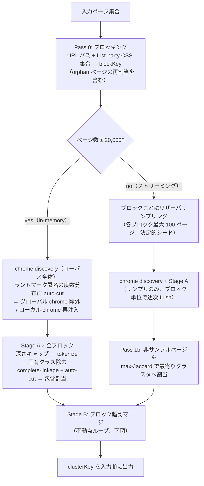
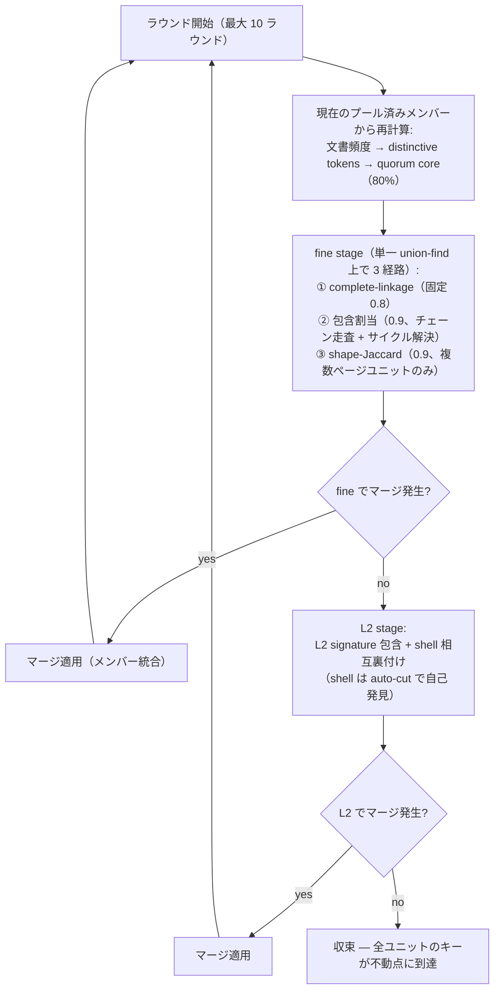

# @nitpicker/archive

`.nitpicker` アーカイブ（tar + SQLite）の読み書きを担う内部パッケージです。スキーマ定義・マイグレーション・`Archive` / `ArchiveAccessor`・tar 展開キャッシュ・concat / split・body hash・URL alias・技術スタック検出のロールアップ・テンプレート分類・スコープ判定・エラー分類を含みます。

ヘッドレスブラウザ（puppeteer / `@d-zero/beholder`）や `@d-zero/dealer` には依存しないため、読み取り専用の経路（[@nitpicker/query](../query/README.md)、viewer、mcp-server、report-\*）はクローラーを引き込まずにアーカイブを扱えます。クロール時の書き込みは [@nitpicker/crawler](../crawler/README.md) がこのパッケージ経由で行います。

## 使い方

公開 API は機能単位のサブパスで export しています（パッケージルート `.` の export はありません）。

```ts
import Archive from '@nitpicker/archive/archive';
import { classifyErrorKind } from '@nitpicker/archive/error-kind/classify-error-kind';

// `await using` が SQLite ハンドルを確実に閉じる
await using accessor = await Archive.openCached('/path/to/site.nitpicker');
const config = await accessor.getConfig();

console.log(classifyErrorKind('net::ERR_NAME_NOT_RESOLVED')); // 'dns'
```

利用可能なサブパスは `package.json` の `exports` を参照してください。

## テンプレート分類エンジン（page-cluster）

テンプレート分類（`src/template-classification/`）は、ページを DOM 構造の類似性でクラスタリングするエンジンを `src/template-classification/page-cluster/` に持ちます。エンジンの本番コードはこのディレクトリの外（`htmlparser2` と `@d-zero/shared` を除く）に依存せず、パッケージの `exports` にも載せていません。nitpicker からの入口は `resolve-page-cluster-keys.ts` の `resolvePageClusterKeys` だけで、呼び出しは `classify-page-templates.ts` / `create-page-cluster-factory.ts` / `create-content-root-hint.ts` に閉じています。エンジンの `clusterKey` は nitpicker 側で `templateKey` と呼び替えます。

### アルゴリズム概観

`clusterKey` がどう決まるかを知っておくと、分類結果の解釈（なぜこの 2 ページが同じ `templateKey` なのか）がしやすくなります。実装詳細の WHY は各ソースファイルの JSDoc が正です。

#### 全体パイプライン



- **Pass 0（ブロッキング）** — HTML を読まず、URL パスと first-party stylesheet 集合だけで粗く分割します。高価な構造比較を同一ブロック内に閉じ込め、コーパス全体の比較コストを O(n²) から劇的に減らします。stylesheet を持たない orphan ページは同一セクションの CSS ブロックへ再割当されます
- **chrome discovery** — 全ページのランドマーク署名の度数分布に auto-cut を当て、閾値以上を「グローバル chrome」（サイト共通のヘッダー等）として比較から除外し、閾値未満かつ 2 ページ以上に出現するものを「ローカル chrome」（セクション固有のナビ等）としてトークン再注入します
- **Stage A（ブロック内クラスタリング）** — ブロックごとに直線的に処理します。本文ルート（`contentRoot` → `<main>` → 内蔵リスト）の深さキャップ（候補深度 2〜10 を全走査して knee を探す自動選択）→ tokenize → **ページ固有クラスの除去**（ブロック内で 1 ページにしか現れないクラスは `<article class="outline">` のようなページ識別ラベルであってテンプレート構造ではないので、`allowedClasses` で除いて再 tokenize します。10 ページ以上のブロックのみ）→ complete-linkage 階層クラスタリング → max-gap auto-cut でカット高を決定 → 最後に包含関係にあるクラスタを吸収する包含割当（割当チェーンを辿り、循環はメンバー最大のクラスタをルートに選んで解決）
- **Pass 1b（ストリーミング時のみ）** — 20,000 ページ超では各ブロックをリザーバサンプリング（最大 100 ページ、ブロックキーをシードにした決定的乱数）で代表させ、サンプル外のページは Stage A 完了後に max-Jaccard で最寄りクラスタへ一括割当する（tokenize にはサンプルで学習した許可クラス集合を適用し、サンプル側と同じ規則で比較します）。メモリ使用量はコーパス全体ではなくサンプルサイズに比例します
- **Stage B（ブロック越えマージ）** — ブロック分割はあくまで比較コスト削減のためなので、最後に同一テンプレートがブロックを跨いで分かれていないか再統合します。これが唯一の反復処理です（次節）。収束後、`onClusterReason` が指定されていれば、確定した最終クラスタごとに `ClusterReason` を 1 回ずつ組み立てて通知します — 追加の全コーパススキャンではなく、Stage A/B が既に計算済みの中間データ（quorum core、landmark インスタンス、ブロッキング根拠）を再利用するだけなので、クラスタ数にしか比例しません

#### Stage B: ブロック越え統合の不動点ループ



マージが起きるとユニットのメンバー構成が変わり、文書頻度も quorum core も変わります。そのため毎ラウンド、統合後のプールから全指標を**再計算**してマージを再試行します。fine stage・L2 stage の両方でマージが 1 件も出なくなった時点で不動点に到達したとみなして収束します（安全弁として最大 10 ラウンド。実データでは 7 ラウンド以内に収束）。L2 stage は fine stage が空振りしたラウンドでしか実行されない最後の粗い経路で、誤マージ防止のために shell（ランドマーク由来トークン）の相互裏付けを要求します。

fine stage・L2 stage いずれの経路で提案されたマージも、適用前に**凝集度ガード**を通ります: 統合後の quorum core が統合前の core に対して一定比率を下回るなら、そのマージは破棄されます。個々の経路が「統合前のペア類似度」だけを見て提案する一方、複数ラウンドにわたる連鎖的な統合は「統合後に実際どれだけまとまっているか」を悪化させ得る（無関係なテンプレート同士が少しずつ吸収し合う catch-all 化）ため、経路をまたいだ単一のチェックポイントとして機能します。あわせて、L2 stage 自体もラウンド開始前に判別力を検査し、参加ユニット全体が同一の署名形状に潰れている（`main` 直下の浅い階層しか手がかりが残っていない等）場合は、そのラウンドの L2 比較を丸ごとスキップします。詳細は `merge-cross-block-clusters.ts` の `filterMergesByCohesion` / `hasDiscriminatingL2Signatures` の JSDoc を参照してください。

凝集度ガードの前に、Stage A が同一ブロック内で別クラスタと判定した（双方 3 ページ以上の）ユニット同士を、構造トークンに実質的な差がある限り統合しない**分離尊重ガード**も通ります。生の core では閾値に届かないが、クラス名を除くと骨格が一致する組（BEM 名だけが違う同一骨格）は対象外です。詳細は `filter-merges-by-stage-a-separation.ts` の JSDoc を参照してください。

#### Self-tuning

閾値の多くは **max-gap auto-cut**（度数分布の隣接ギャップ最大の中点を境界とする）でデータから自己発見されます。① Stage A のカット高、② Stage B の shell 判定、③ chrome discovery のグローバル/ローカル判定、④ Pass 0 の URL パス深さ選択、の 4 箇所で同一プリミティブを再利用しているので、サイトごとにハイパーパラメータをチューニングする必要はありません。詳細は `autoCutThreshold` の JSDoc を参照してください。例外的に Stage B fine stage の complete-linkage だけは固定閾値 0.8 を使います（理由は `merge-cross-block-clusters.ts` の JSDoc を参照）。

### 分類結果の事後検証

Stage A/B は「クラスタリング中に」正しい判断をしようとしますが、判断材料はその時点でのペア類似度に限られます。分類が終わった**あとで**、確定したパーティション同士を突き合わせて検証する方が、同じ種類の誤りをかえって見つけやすい場合があります。マージ中は局所的なペア情報とマージ順序しか持ちませんが、事後なら分割全体を一度に見られるためです。この事後検証は Stage A/B のアルゴリズムに一切依存しないので、`resolvePageClusterKeys` 以外で作られた分類結果（保存済みの `clusterKey` をアーカイブから読み戻した場合など）にも使えます。

3 つのチェックを行います。

- **クラスタ間重複検出**（`findCrossClusterDuplicates`） — 別クラスタに分かれているページ対のうち、構造トークン集合が完全一致するもの（軸の裏付けなしで確定）と、ミラー軸で裏付けられる近似一致のものを検出します
- **クラスタ内凝集度**（`computeClusterCohesion`） — クラスタ内のメンバー同士がどれだけ似ているかを中央値・10 パーセンタイル・最小値の分布として報告します。無関係なテンプレートが混ざったクラスタは、共通のシェル由来トークンだけが一致する形で `structuralCoreTokens` 自体は非空のまま残ることがあるため、core の有無だけでは過剰マージを検出できません
- **ミラー軸の自動発見**（`detectMirrorAxis`） — 言語ディレクトリのように、URL のあるセグメントだけを変えてサイトの一部をミラーしている構造を、言語コード等の事前知識なしに発見します。同じ値集合が何種類の異なるパス骨格にわたって反復するかを数え、`autoCutThreshold` で「たまたま値が 2 つ以上あるだけの兄弟ページ」と「サイト全体を貫く軸」を切り分けます

`validateClusterPartition` はこの 3 つをまとめて呼び出すエントリポイントです。`ClusterReason` と同じく、判断結果ではなく構造化データだけを返します — 検出された重複をどう扱うか（統合するかどうか、`suspicious` フラグをどう解釈するか）は呼び出し側の責務で、実際に統合を適用する場合は `mergeValidatedClusters` に確認済みのクラスタ対を渡します。`resolvePageClusterKeys` に `onPartitionReport` コールバックを渡すと、この検証が Stage B 完了直後に走り、安全な統合（完全一致、またはミラー軸による裏付けあり）が返り値の `clusterKey` に反映されます。

**nitpicker の分類（`classifyPageTemplates`）は `onPartitionReport` を渡していない**ため、アーカイブに保存される `templateKey` にはこの事後検証は適用されません。いずれの関数もエンジン内部のモジュールで、archive の `exports` には載っていません。

## 関連リンク

- [Nitpicker README](../../../README.md)
- [ARCHITECTURE.md](../../../ARCHITECTURE.md)

## ライセンス

Apache-2.0
